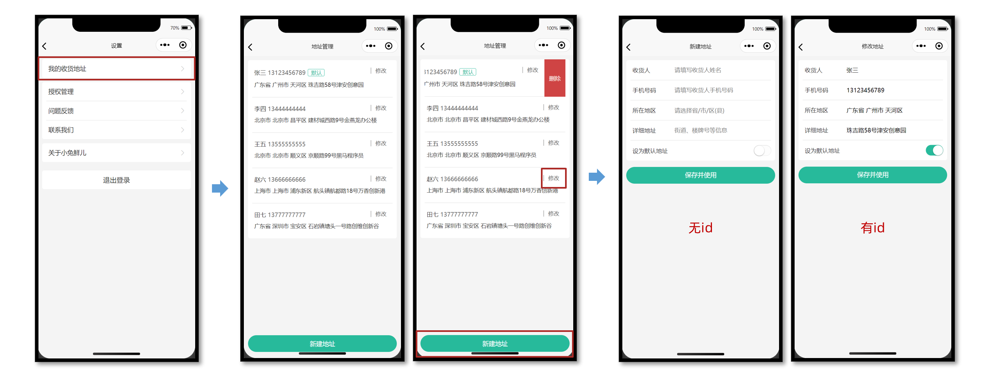
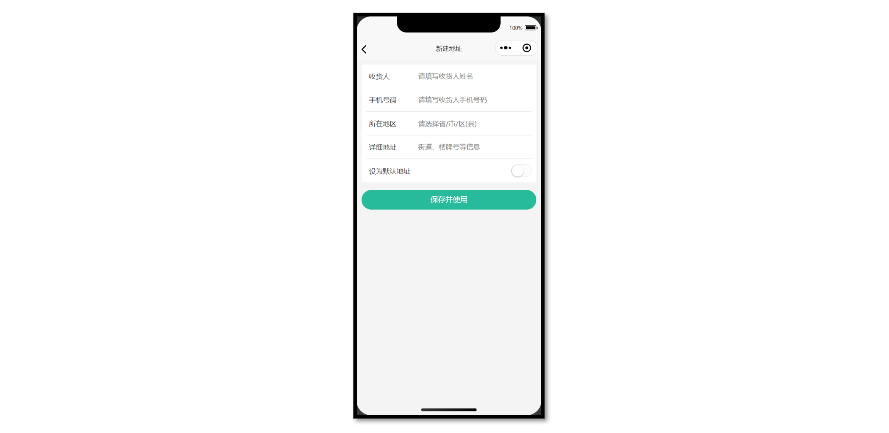
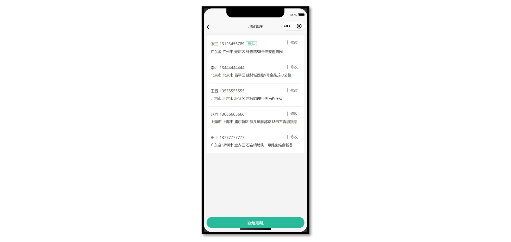
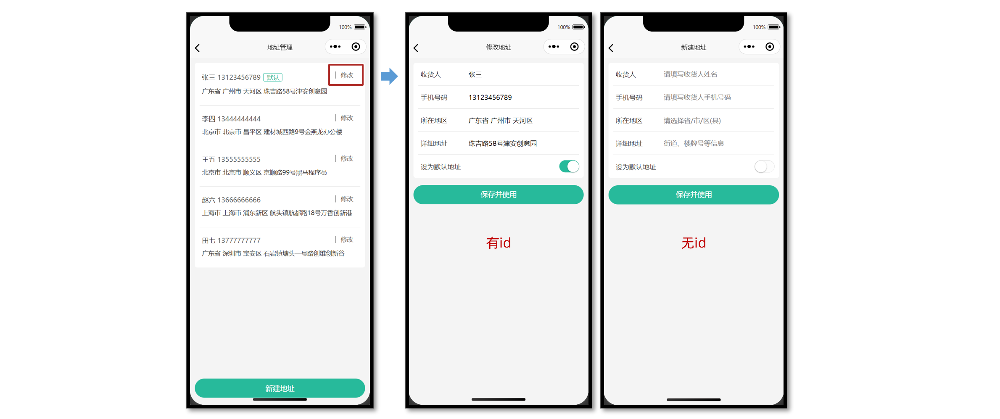
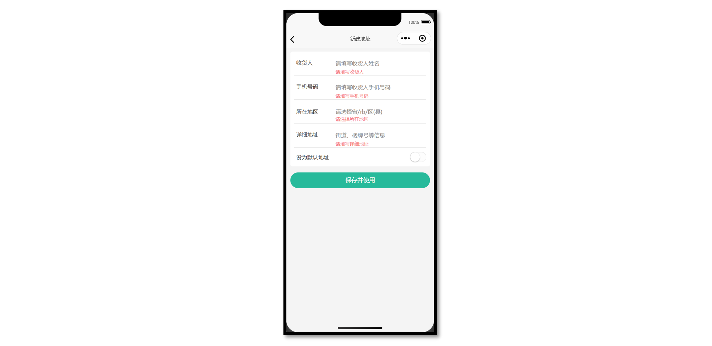
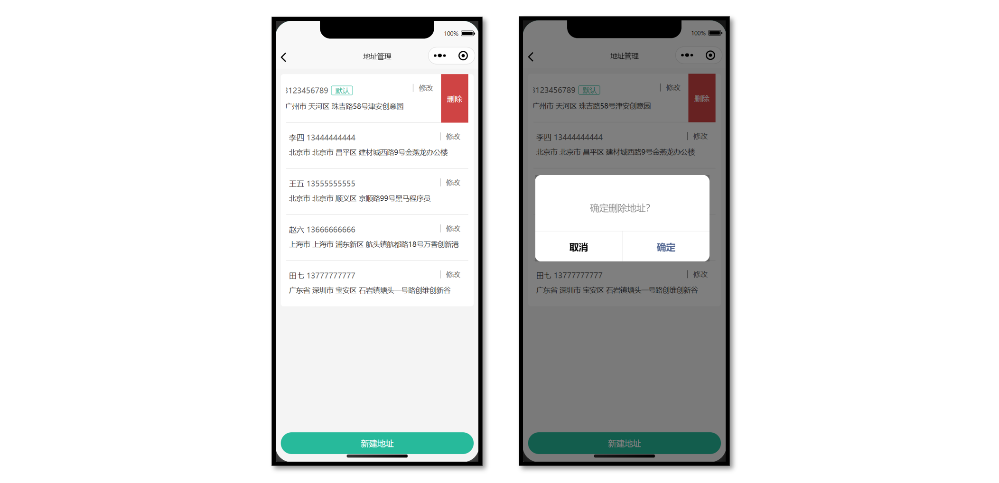

# 小兔鲜儿 - 地址模块

- 能够获取不同类型的表单数据
- 能够动态设置导航栏的标题
- 能够使用 uni-ui 组件库的组件
- 能够完成收货地址的增删改查的功能

## 准备工作

### 静态结构

地址模块共两个页面：地址管理页，地址表单页 ，划分到会员分包中。



#### 地址管理页

`src/pagesMember/address/address.vue`

```vue
<script setup lang="ts">
//
</script>

<template>
  <view class="viewport">
    <!-- 地址列表 -->
    <scroll-view class="scroll-view" scroll-y>
      <view v-if="true" class="address">
        <view class="address-list">
          <!-- 收货地址项 -->
          <view class="item">
            <view class="item-content">
              <view class="user">
                黑马小王子
                <text class="contact">13111111111</text>
                <text v-if="true" class="badge">默认</text>
              </view>
              <view class="locate">广东省 广州市 天河区 黑马程序员</view>
              <navigator
                class="edit"
                hover-class="none"
                :url="`/pagesMember/address-form/address-form?id=1`"
              >
                修改
              </navigator>
            </view>
          </view>
          <!-- 收货地址项 -->
          <view class="item">
            <view class="item-content">
              <view class="user">
                黑马小公主
                <text class="contact">13222222222</text>
                <text v-if="false" class="badge">默认</text>
              </view>
              <view class="locate">北京市 北京市 顺义区 黑马程序员</view>
              <navigator
                class="edit"
                hover-class="none"
                :url="`/pagesMember/address-form/address-form?id=2`"
              >
                修改
              </navigator>
            </view>
          </view>
        </view>
      </view>
      <view v-else class="blank">暂无收货地址</view>
    </scroll-view>
    <!-- 添加按钮 -->
    <view class="add-btn">
      <navigator hover-class="none" url="/pagesMember/address-form/address-form">
        新建地址
      </navigator>
    </view>
  </view>
</template>

<style lang="scss">
page {
  height: 100%;
  overflow: hidden;
}

/* 删除按钮 */
.delete-button {
  display: flex;
  justify-content: center;
  align-items: center;
  width: 50px;
  height: 100%;
  font-size: 28rpx;
  color: #fff;
  border-radius: 0;
  padding: 0;
  background-color: #cf4444;
}

.viewport {
  display: flex;
  flex-direction: column;
  height: 100%;
  background-color: #f4f4f4;

  .scroll-view {
    padding-top: 20rpx;
  }
}

.address {
  padding: 0 20rpx;
  margin: 0 20rpx;
  border-radius: 10rpx;
  background-color: #fff;

  .item-content {
    line-height: 1;
    padding: 40rpx 10rpx 38rpx;
    border-bottom: 1rpx solid #ddd;
    position: relative;

    .edit {
      position: absolute;
      top: 36rpx;
      right: 30rpx;
      padding: 2rpx 0 2rpx 20rpx;
      border-left: 1rpx solid #666;
      font-size: 26rpx;
      color: #666;
      line-height: 1;
    }
  }

  .item:last-child .item-content {
    border: none;
  }

  .user {
    font-size: 28rpx;
    margin-bottom: 20rpx;
    color: #333;

    .contact {
      color: #666;
    }

    .badge {
      display: inline-block;
      padding: 4rpx 10rpx 2rpx 14rpx;
      margin: 2rpx 0 0 10rpx;
      font-size: 26rpx;
      color: #27ba9b;
      border-radius: 6rpx;
      border: 1rpx solid #27ba9b;
    }
  }

  .locate {
    line-height: 1.6;
    font-size: 26rpx;
    color: #333;
  }
}

.blank {
  margin-top: 300rpx;
  text-align: center;
  font-size: 32rpx;
  color: #888;
}

.add-btn {
  height: 80rpx;
  text-align: center;
  line-height: 80rpx;
  margin: 30rpx 20rpx;
  color: #fff;
  border-radius: 80rpx;
  font-size: 30rpx;
  background-color: #27ba9b;
}
</style>
```

#### 地址表单页

`src/pagesMember/address-form/address-form.vue`

```vue
<script setup lang="ts">
import { ref } from 'vue'

// 表单数据
const form = ref({
  receiver: '', // 收货人
  contact: '', // 联系方式
  fullLocation: '', // 省市区(前端展示)
  provinceCode: '', // 省份编码(后端参数)
  cityCode: '', // 城市编码(后端参数)
  countyCode: '', // 区/县编码(后端参数)
  address: '', // 详细地址
  isDefault: 0, // 默认地址，1为是，0为否
})
</script>

<template>
  <view class="content">
    <form>
      <!-- 表单内容 -->
      <view class="form-item">
        <text class="label">收货人</text>
        <input class="input" placeholder="请填写收货人姓名" value="" />
      </view>
      <view class="form-item">
        <text class="label">手机号码</text>
        <input class="input" placeholder="请填写收货人手机号码" value="" />
      </view>
      <view class="form-item">
        <text class="label">所在地区</text>
        <picker class="picker" mode="region" value="">
          <view v-if="false">广东省 广州市 天河区</view>
          <view v-else class="placeholder">请选择省/市/区(县)</view>
        </picker>
      </view>
      <view class="form-item">
        <text class="label">详细地址</text>
        <input class="input" placeholder="街道、楼牌号等信息" value="" />
      </view>
      <view class="form-item">
        <label class="label">设为默认地址</label>
        <switch class="switch" color="#27ba9b" :checked="true" />
      </view>
    </form>
  </view>
  <!-- 提交按钮 -->
  <button class="button">保存并使用</button>
</template>

<style lang="scss">
page {
  background-color: #f4f4f4;
}

.content {
  margin: 20rpx 20rpx 0;
  padding: 0 20rpx;
  border-radius: 10rpx;
  background-color: #fff;

  .form-item,
  .uni-forms-item {
    display: flex;
    align-items: center;
    min-height: 96rpx;
    padding: 25rpx 10rpx;
    background-color: #fff;
    font-size: 28rpx;
    border-bottom: 1rpx solid #ddd;
    position: relative;
    margin-bottom: 0;

    // 调整 uni-forms 样式
    .uni-forms-item__content {
      display: flex;
    }

    .uni-forms-item__error {
      margin-left: 200rpx;
    }

    &:last-child {
      border: none;
    }

    .label {
      width: 200rpx;
      color: #333;
    }

    .input {
      flex: 1;
      display: block;
      height: 46rpx;
    }

    .switch {
      position: absolute;
      right: -20rpx;
      transform: scale(0.8);
    }

    .picker {
      flex: 1;
    }

    .placeholder {
      color: #808080;
    }
  }
}

.button {
  height: 80rpx;
  margin: 30rpx 20rpx;
  color: #fff;
  border-radius: 80rpx;
  font-size: 30rpx;
  background-color: #27ba9b;
}
</style>
```

### 动态设置标题

**新建地址** 和 **修改地址** 复用同一个地址表单页，需要根据页面参数 `id` 动态设置页面标题。

```vue
<script setup lang="ts">
// 获取页面参数
const query = defineProps<{
  id?: string
}>()

// 动态设置标题
uni.setNavigationBarTitle({ title: query.id ? '修改地址' : '新建地址' })
</script>
```

## 新建地址页

新用户没有收货地址，先完成新建地址，新建成功返回地址管理页。

主要功能：前端收集表单的数据，提交表单给后端。



### 接口封装

**接口调用**

接口地址：/member/address

请求方式：POST

登录权限: **是**

请求参数：

**Body**

| 字段名称     | 是否必须 | 类型   | 备注                           |
| ------------ | -------- | ------ | ------------------------------ |
| receiver     | 是       | string | 收货人姓名                     |
| contact      | 是       | string | 收货人联系方式                 |
| provinceCode | 是       | string | 省对应的 code                  |
| cityCode     | 是       | string | 市对应的 code                  |
| countyCode   | 是       | string | 区/县对应的 code               |
| address      | 是       | string | 收货人详细地址                 |
| isDefault    | 是       | number | 是否设置为默认地址（数值类型） |

**接口封装**

`src/services/address.ts`

```ts
import type { AddressParams } from '@/types/address'
import { http } from '@/utils/http'

/**
 * 添加收货地址
 * @param data 请求参数
 */
export const postMemberAddressAPI = (data: AddressParams) => {
  return http({
    method: 'POST',
    url: '/member/address',
    data,
  })
}
```

**类型声明**

`src/types/address.d.ts`

```ts
/** 添加收货地址: 请求参数 */
export type AddressParams = {
  /** 收货人姓名 */
  receiver: string
  /** 联系方式 */
  contact: string
  /** 省份编码 */
  provinceCode: string
  /** 城市编码 */
  cityCode: string
  /** 区/县编码 */
  countyCode: string
  /** 详细地址 */
  address: string
  /** 默认地址，1为是，0为否 */
  isDefault: number
}
```

### 参考代码

地址表单页，`input` 组件通过 `v-model` 获取数据，其他表单组件结合 `@change` 事件获取。

```vue {24,33-42,51,55,63,71,79,85}
<script setup lang="ts">
import { postMemberAddressAPI } from '@/services/address'
import { ref } from 'vue'

// 表单数据
const form = ref({
  receiver: '', // 收货人
  contact: '', // 联系方式
  fullLocation: '', // 省市区(前端展示)
  provinceCode: '', // 省份编码(后端参数)
  cityCode: '', // 城市编码(后端参数)
  countyCode: '', // 区/县编码(后端参数)
  address: '', // 详细地址
  isDefault: 0, // 默认地址，1为是，0为否
})

// 收集所在地区
const onRegionChange: UniHelper.RegionPickerOnChange = (ev) => {
  // 省市区(前端展示)
  form.value.fullLocation = ev.detail.value.join(' ')
  // 省市区(后端参数)
  const [provinceCode, cityCode, countyCode] = ev.detail.code!
  // 合并数据
  Object.assign(form.value, { provinceCode, cityCode, countyCode })
}

// 收集是否默认收货地址
const onSwitchChange: UniHelper.SwitchOnChange = (ev) => {
  form.value.isDefault = ev.detail.value ? 1 : 0
}

// 提交表单
const onSubmit = async () => {
  // 新建地址请求
  await postMemberAddressAPI(form.value)
  // 成功提示
  uni.showToast({ icon: 'success', title: '添加成功' })
  // 返回上一页
  setTimeout(() => {
    uni.navigateBack()
  }, 400)
}
</script>

<template>
  <view class="content">
    <form>
      <!-- 表单内容 -->
      <view class="form-item">
        <text class="label">收货人</text>
        <input class="input" placeholder="请填写收货人姓名" v-model="form.receiver" />
      </view>
      <view class="form-item">
        <text class="label">手机号码</text>
        <input class="input" placeholder="请填写收货人手机号码" v-model="form.contact" />
      </view>
      <view class="form-item">
        <text class="label">所在地区</text>
        <picker
          class="picker"
          mode="region"
          :value="form.fullLocation.split(' ')"
          @change="onRegionChange"
        >
          <view v-if="form.fullLocation">{{ form.fullLocation }}</view>
          <view v-else class="placeholder">请选择省/市/区(县)</view>
        </picker>
      </view>
      <view class="form-item">
        <text class="label">详细地址</text>
        <input class="input" placeholder="街道、楼牌号等信息" v-model="form.address" />
      </view>
      <view class="form-item">
        <label class="label">设为默认地址</label>
        <switch
          class="switch"
          color="#27ba9b"
          :checked="form.isDefault === 1"
          @change="onSwitchChange"
        />
      </view>
    </form>
  </view>
  <!-- 提交按钮 -->
  <button @tap="onSubmit" class="button">保存并使用</button>
</template>
```

## 地址管理页

为了能及时看到新建的收货地址，需在 `onShow` 生命周期中获取地址列表数据。



### 接口调用

接口地址：/member/address

请求方式：GET

登录权限: **是**

请求参数：无

**接口封装**

`src/types/address.ts`

```ts
/**
 * 获取收货地址列表
 */
export const getMemberAddressAPI = () => {
  return http<AddressItem[]>({
    method: 'GET',
    url: '/member/address',
  })
}
```

**类型声明**

`src/types/address.d.ts`

```ts
/** 收货地址项 */
export type AddressItem = {
  /** 收货人姓名 */
  receiver: string
  /** 联系方式 */
  contact: string
  /** 省份编码 */
  provinceCode: string
  /** 城市编码 */
  cityCode: string
  /** 区/县编码 */
  countyCode: string
  /** 详细地址 */
  address: string
  /** 默认地址，1为是，0为否 */
  isDefault: number
  /** 收货地址 id */
  id: string
  /** 省市区 */
  fullLocation: string
}
```

商品详情复用地址类型：`src/types/goods.d.ts`

```diff
+ import type { AddressItem } from './global'

- /** 地址信息 */
- export type AddressItem = {
-   receiver: string
-   contact: string
-   provinceCode: string
-   cityCode: string
-   countyCode: string
-   address: string
-   isDefault: number
-   id: string
-   fullLocation: string
- }
```

::: tip 温馨提示

用户登录后再访问**商品详情**，商品详情字段中包含用户收货地址列表，可以**复用收货地址类型**。

:::

### 参考代码

地址管理页

```vue {14-17}
<script setup lang="ts">
import { getMemberAddressAPI } from '@/services/address'
import type { AddressItem } from '@/types/address'
import { onShow } from '@dcloudio/uni-app'
import { ref } from 'vue'

// 获取收货地址列表数据
const addressList = ref<AddressItem[]>([])
const getMemberAddressData = async () => {
  const res = await getMemberAddressAPI()
  addressList.value = res.result
}

// 初始化调用(页面显示)
onShow(() => {
  getMemberAddressData()
})
</script>

<template>
  <view class="viewport">
    <!-- 地址列表 -->
    <scroll-view class="scroll-view" scroll-y>
      <view v-if="true" class="address">
        <view class="address-list">
          <!-- 收获地址项 -->
          <view class="item" v-for="item in addressList" :key="item.id">
            <view class="item-content">
              <view class="user">
                {{ item.receiver }}
                <text class="contact">{{ item.contact }}</text>
                <text v-if="item.isDefault" class="badge">默认</text>
              </view>
              <view class="locate">{{ item.fullLocation }} {{ item.address }}</view>
              <navigator
                class="edit"
                hover-class="none"
                :url="`/pagesMember/address-form/address-form?id=${item.id}`"
              >
                修改
              </navigator>
            </view>
          </view>
        </view>
      </view>
      <view v-else class="blank">暂无收货地址</view>
    </scroll-view>
    <!-- 添加按钮 -->
    <view class="add-btn">
      <navigator hover-class="none" url="/pagesMember/address-form/address-form">
        新建地址
      </navigator>
    </view>
  </view>
</template>
```

## 修改地址页

通过页面参数 `id` 来区分当前是**修改地址**还是**新建地址**。



### 数据回显

修改地址之前，需要先实现数据回显，用户再进行有针对性的修改。

**接口详情**

接口地址：/member/address/:id

请求方式：GET

登录权限: **是**

请求参数：

**路径参数**

| 字段名称 | 是否必须 | 默认值 | 备注        |
| -------- | -------- | ------ | ----------- |
| id       | 是       | 无     | 收货地址 ID |

**接口封装**

`src/services/address.ts`

```ts
/**
 * 获取收货地址详情
 * @param id 地址id(路径参数)
 */
export const getMemberAddressByIdAPI = (id: string) => {
  return http<AddressItem>({
    method: 'GET',
    url: `/member/address/${id}`,
  })
}
```

**参考代码**

页面初始化的时候根据 `id` 获取地址详情，把获取的数据合并到表单数据中，用于数据回显。

```vue
<script setup lang="ts">
// 获取收货地址详情数据
const getMemberAddressByIdData = async () => {
  // 有 id 才调用接口
  if (query.id) {
    // 发送请求
    const res = await getMemberAddressByIdAPI(query.id)
    // 把数据合并到表单中
    Object.assign(form.value, res.result)
  }
}

// 页面加载
onLoad(() => {
  getMemberAddressByIdData()
})
</script>
```

### 更新地址

将用户修改后的地址信息重新发送到服务端进行存储。

**接口详情**

接口地址：/member/address/:id

请求方式：PUT

登录权限: **是**

请求参数：

**路径参数**

| 字段名称 | 是否必须 | 默认值 | 备注        |
| -------- | -------- | ------ | ----------- |
| id       | 是       | 无     | 收货地址 ID |

**Body**

| 字段名称     | 是否必须 | 默认值 | 备注                           |
| ------------ | -------- | ------ | ------------------------------ |
| receiver     | 是       | 无     | 收货人姓名                     |
| contact      | 是       | 无     | 收货人联系方式                 |
| provinceCode | 是       | 无     | 行政省对应的 code              |
| cityCode     | 是       | 无     | 行政市对应的 code              |
| countyCode   | 是       | 无     | 行政区县对应的 code            |
| address      | 是       | 无     | 收货人详细地址                 |
| isDefault    | 是       | 无     | 是否设置为默认地址（数值类型） |

**接口封装**

```ts
/**
 * 修改收货地址
 * @param id 地址id(路径参数)
 * @param data 表单数据(请求体参数)
 */
export const putMemberAddressByIdAPI = (id: string, data: AddressParams) => {
  return http({
    method: 'PUT',
    url: `/member/address/${id}`,
    data,
  })
}
```

**参考代码**

根据是否有地址 id 来判断提交表单到底是新建地址还是更新地址。

```vue {5-11,13}
<script setup lang="ts">
// 提交表单
const onSubmit = async () => {
  // 判断当前页面是否有地址 id
  if (query.id) {
    // 修改地址请求
    await putMemberAddressByIdAPI(query.id, form.value)
  } else {
    // 新建地址请求
    await postMemberAddressAPI(form.value)
  }
  // 成功提示
  uni.showToast({ icon: 'success', title: query.id ? '修改成功' : '添加成功' })
  // 返回上一页
  setTimeout(() => {
    uni.navigateBack()
  }, 400)
}
</script>
```

## 表单校验

通过 `uni-ui` 组件库的 [uni-forms](https://uniapp.dcloud.net.cn/component/uniui/uni-swipe-action.html) 组件实现表单校验。



### 操作步骤

1. 定义校验规则
2. 修改表单结构
3. 绑定校验规则
4. 提交时校验表单

### 参考代码

```vue {3-19,51,53,56,57,65,66,77,78,81,91}
<script setup lang="ts">
// 定义校验规则
const rules: UniHelper.UniFormsRules = {
  receiver: {
    rules: [{ required: true, errorMessage: '请输入收货人姓名' }],
  },
  contact: {
    rules: [
      { required: true, errorMessage: '请输入联系方式' },
      { pattern: /^1[3-9]\d{9}$/, errorMessage: '手机号格式不正确' },
    ],
  },
  fullLocation: {
    rules: [{ required: true, errorMessage: '请选择所在地区' }],
  },
  address: {
    rules: [{ required: true, errorMessage: '请选择详细地址' }],
  },
}

// 获取表单组件实例，用于调用表单方法
const formRef = ref<UniHelper.UniFormsInstance>() // [!code ++]

// 提交表单
const onSubmit = async () => {
  try {
    // 表单校验
    await formRef.value?.validate?.() // [!code ++]
    // 校验通过后再发送请求
    if (query.id) {
      // 修改地址请求
      await putMemberAddressByIdAPI(query.id, form.value)
    } else {
      // 新建地址请求
      await postMemberAddressAPI(form.value)
    }
    // 成功提示
    uni.showToast({ icon: 'success', title: query.id ? '修改成功' : '添加成功' })
    // 返回上一页
    setTimeout(() => {
      uni.navigateBack()
    }, 400)
  } catch (error) {
    uni.showToast({ icon: 'error', title: '请填写完整信息' }) // [!code ++]
  }
}
</script>

<template>
  <view class="content">
    <uni-forms :rules="rules" :model="form" ref="formRef">
      <!-- 表单内容 -->
      <uni-forms-item name="receiver" class="form-item">
        <text class="label">收货人</text>
        <input class="input" placeholder="请填写收货人姓名" v-model="form.receiver" />
      </uni-forms-item>
      <uni-forms-item name="contact" class="form-item">
        <text class="label">手机号码</text>
        <input
          class="input"
          placeholder="请填写收货人手机号码"
          :maxlength="11"
          v-model="form.contact"
        />
      </uni-forms-item>
      <uni-forms-item name="fullLocation" class="form-item">
        <text class="label">所在地区</text>
        <picker
          @change="onRegionChange"
          class="picker"
          mode="region"
          :value="form.fullLocation.split(' ')"
        >
          <view v-if="form.fullLocation">{{ form.fullLocation }}</view>
          <view v-else class="placeholder">请选择省/市/区(县)</view>
        </picker>
      </uni-forms-item>
      <uni-forms-item name="address" class="form-item">
        <text class="label">详细地址</text>
        <input class="input" placeholder="街道、楼牌号等信息" v-model="form.address" />
      </uni-forms-item>
      <view class="form-item">
        <label class="label">设为默认地址</label>
        <switch
          @change="onSwitchChange"
          class="switch"
          color="#27ba9b"
          :checked="form.isDefault === 1"
        />
      </view>
    </uni-forms>
  </view>
  <!-- 提交按钮 -->
  <button @tap="onSubmit" class="button">保存并使用</button>
</template>
```

## 删除地址

通过 `uni-ui` 组件库的 [uni-swipe-action](https://uniapp.dcloud.net.cn/component/uniui/uni-swipe-action.html) 组件实现侧滑删除。



### 侧滑组件用法

```vue {3,5,9}
<template>
  <!-- 滑动操作分区 -->
  <uni-swipe-action>
    <!-- 滑动操作项 -->
    <uni-swipe-action-item>
      <!-- 默认插槽 -->
      <view>内容</view>
      <!-- 右侧插槽 -->
      <template #right>
        <button class="delete-button">删除</button>
      </template>
    </uni-swipe-action-item>
  </uni-swipe-action>
</template>
```

### 接口封装

**接口详情**

接口地址：/member/address/:id

请求方式：DELETE

登录权限: 是

请求参数：

**路径参数**

| 字段名称 | 是否必须 | 默认值 | 备注 |
| -------- | -------- | ------ | ---- |
| id       | 是       | 无     | ID   |

**接口封装**

```ts
/**
 * 删除收货地址
 * @param id 地址id(路径参数)
 */
export const deleteMemberAddressByIdAPI = (id: string) => {
  return http({
    method: 'DELETE',
    url: `/member/address/${id}`,
  })
}
```

### 参考代码

侧滑地址列表项，右侧显示删除按钮，删除地址前需二次确认。

```vue {24,26,42-47}
<script setup lang="ts">
// 删除收货地址
const onDeleteAddress = (id: string) => {
  // 二次确认
  uni.showModal({
    content: '删除地址?',
    success: async (res) => {
      if (res.confirm) {
        // 根据id删除收货地址
        await deleteMemberAddressByIdAPI(id)
        // 重新获取收货地址列表
        getMemberAddressData()
      }
    },
  })
}
</script>

<template>
  <view class="viewport">
    <!-- 地址列表 -->
    <scroll-view class="scroll-view" scroll-y>
      <view v-if="addressList.length" class="address">
        <uni-swipe-action class="address-list">
          <!-- 收货地址项 -->
          <uni-swipe-action-item class="item" v-for="item in addressList" :key="item.id">
            <view class="item-content">
              <view class="user">
                {{ item.receiver }}
                <text class="contact">{{ item.contact }}</text>
                <text v-if="item.isDefault" class="badge">默认</text>
              </view>
              <view class="locate">{{ item.fullLocation }} {{ item.address }}</view>
              <navigator
                class="edit"
                hover-class="none"
                :url="`/pagesMember/address-form/address-form?id=${item.id}`"
              >
                修改
              </navigator>
            </view>
            <!-- 右侧插槽 -->
            <template #right>
              <button @tap="onDeleteAddress(item.id)" class="delete-button">删除</button>
            </template>
          </uni-swipe-action-item>
        </uni-swipe-action>
      </view>
      <view v-else class="blank">暂无收货地址</view>
    </scroll-view>
    <!-- 添加按钮 -->
    <view class="add-btn">
      <navigator hover-class="none" url="/pagesMember/address-form/address-form">
        新建地址
      </navigator>
    </view>
  </view>
</template>
```
