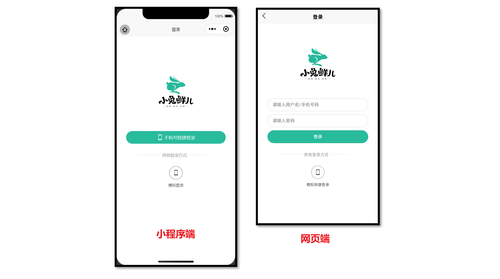

# 小兔鲜儿 - 项目打包

## 微信小程序端

把当前 uni-app 项目打包成微信小程序端，并发布上线。

### 核心步骤

1. 运行打包命令 `pnpm build:mp-weixin`
2. 预览和测试，微信开发者工具导入生成的 `/dist/build/mp-weixin` 目录
3. 上传小程序代码
4. 提交审核和发布

### 步骤图示

项目打包上线需要使用到多个工具，注意工具之间的职责。

```sh
VSCode ----> 微信开发者工具 ----> 微信公众平台
```

了解：开发者也可独立使用 [miniprogram-ci](https://developers.weixin.qq.com/miniprogram/dev/devtools/ci.html) 进行小程序代码的上传等操作。

::: tip 举一反三

打包成其他小程序端的步骤类似，只是更换了 **打包命令** 和 **开发者工具** 。

:::

## 条件编译

::: tip 常见问题

Q：按照 uni-app 规范开发可保证多平台兼容，但每个平台有自己的一些特性，该如何处理？

A：通过 [条件编译](https://uniapp.dcloud.net.cn/tutorial/platform.html#preprocessor)，让代码按条件编译到指定平台。

:::



**网页端不支持微信平台授权登录等功能**，可通过 [条件编译](https://uniapp.dcloud.net.cn/tutorial/platform.html#preprocessor)，实现不同端渲染不同的登录界面。

### 条件编译语法

通过特殊注释，以 **`#ifdef`** 或 **`#ifndef`** 加 **平台名称** 开头，以 **`#endif`** 结尾。

条件编译支持: vue, ts, js, scss, css, pages.json 等文件。

```vue {3,6,11,15,21,23}
<script setup lang="ts">
// 微信平台特有API，需要条件编译
// #ifdef MP-WEIXIN
wx.login()
wx.requestPayment()
// #endif
</script>

<template>
  <!-- 微信开发能力按钮，需要条件编译 -->
  <!-- #ifdef MP-WEIXIN -->
  <button open-type="openSetting">授权管理</button>
  <button open-type="feedback">问题反馈</button>
  <button open-type="contact">联系我们</button>
  <!-- #endif -->
</template>

<style>
/* 如果出现样式兼容，也可添加条件编译 */
page {
  /* #ifdef H5 */
  background-color: pink;
  /* #endif */
}
</style>
```

了解：`#ifdef H5 || MP-WEIXIN` 表示在 H5 平台 **或** 微信小程序平台存在的代码。

::: tip 开发技巧

可通过搜索 `wx.` 和 `open-type` 等平台关键词，快速查找需要添加编译模式的代码。

:::

## 打包为 H5 端

把当前 uni-app 项目打包成网页(H5)端，并配置路由基础路径。

### 核心步骤

1. 运行打包命令 `pnpm build:h5`
2. 预览和测试，使用浏览器打开 `/dist/build/h5` 目录下的 `index.html` 文件
3. 由运维部署到服务器

### 路由基础路径

默认的路由基础路径为 `/` 根路径，部分网站并不是部署到根路径，需要按运维要求调整。

```json
// manifest.json
{
  /* 网页端特有配置 */
  "h5": {
    "router": {
      // 基础路径：./ 为相对路径
      "base": "./"
    }
  } /* 小程序特有相关 */,
  "mp-weixin": {
    // …省略
  },
  "vueVersion": "3"
}
```

## 打包为 APP 端

[App 端](https://uniapp.dcloud.net.cn/tutorial/run/run-app.html) 的打包，预览、测试、发行，使用 `HBuilderX` 工具。
