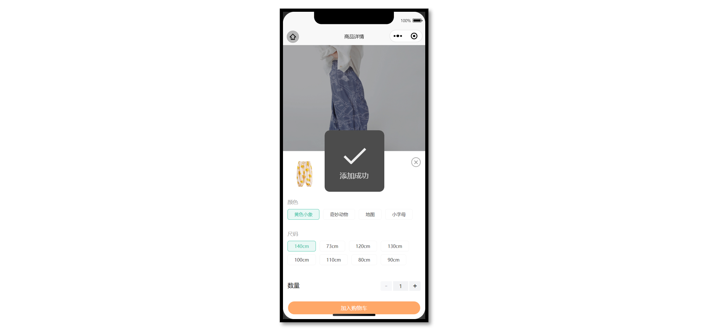
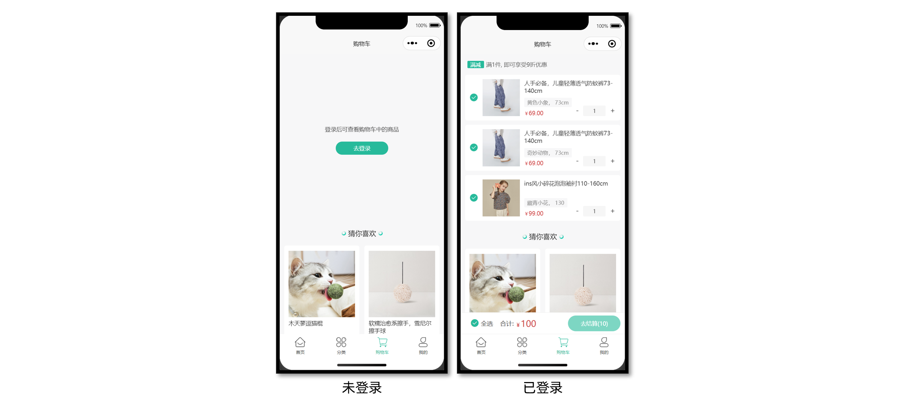
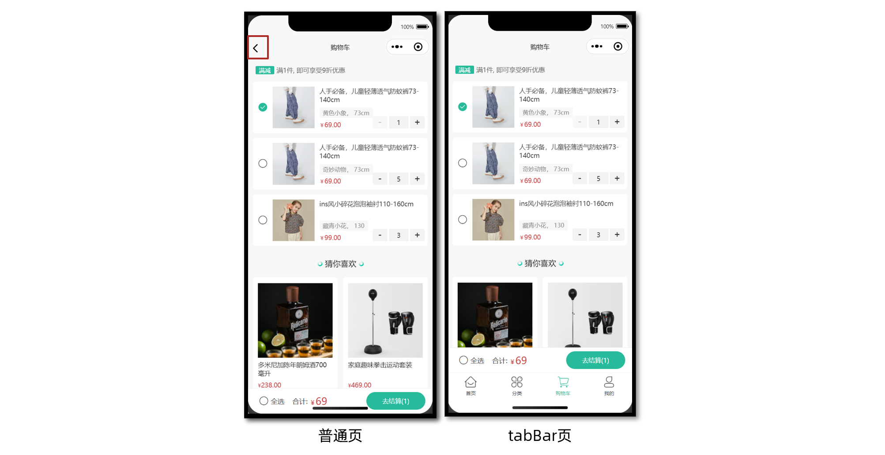

# 小兔鲜儿 - 购物车模块

完成加入购物车，购物车列表交互，计算结算金额等业务。

## 加入购物车

在商品详情页把 **选中规格后的商品(SKU)** 加入购物车。



### 接口相关

**接口详情**

接口地址：/member/cart

请求方式：POST

登录权限: **是**

请求参数：

**Body**

| 字段名称 | 是否必须 | 默认值 | 备注         |
| -------- | -------- | ------ | ------------ |
| skuId    | 是       | 无     | 商品库存单位 |
| count    | 是       | 无     | 购买商品数量 |

**接口封装**

`src/services/cart.ts`

```ts
import { http } from '@/utils/http'
/**
 * 加入购物车
 * @param data 请求体参数
 */
export const postMemberCartAPI = (data: { skuId: string; count: number }) => {
  return http({
    method: 'POST',
    url: '/member/cart',
    data,
  })
}
```

### 参考代码

通过 `SKU` 组件提供的 `add-cart` 事件，获取加入购物车时所需的参数。

```vue {3-7,15}
<script setup lang="ts">
// 加入购物车事件
const onAddCart = async (ev: SkuPopupEvent) => {
  await postMemberCartAPI({ skuId: ev._id, count: ev.buy_num })
  uni.showToast({ title: '添加成功' })
  isShowSku.value = false
}
</script>

<template>
  <!-- SKU弹窗组件 -->
  <vk-data-goods-sku-popup v-model="isShowSku" :localdata="localdata" @add-cart="onAddCart" />
</template>
```

## 购物车列表

购物车列表需要访问后才能登录。



### 静态结构

`src/pages/cart/cart.vue`

```vue
<script setup lang="ts">
//
</script>

<template>
  <scroll-view scroll-y class="scroll-view">
    <!-- 已登录: 显示购物车 -->
    <template v-if="true">
      <!-- 购物车列表 -->
      <view class="cart-list" v-if="true">
        <!-- 优惠提示 -->
        <view class="tips">
          <text class="label">满减</text>
          <text class="desc">满1件, 即可享受9折优惠</text>
        </view>
        <!-- 滑动操作分区 -->
        <uni-swipe-action>
          <!-- 滑动操作项 -->
          <uni-swipe-action-item v-for="item in 2" :key="item" class="cart-swipe">
            <!-- 商品信息 -->
            <view class="goods">
              <!-- 选中状态 -->
              <text class="checkbox" :class="{ checked: true }"></text>
              <navigator
                :url="`/pages/goods/goods?id=1435025`"
                hover-class="none"
                class="navigator"
              >
                <image
                  mode="aspectFill"
                  class="picture"
                  src="https://yanxuan-item.nosdn.127.net/da7143e0103304f0f3230715003181ee.jpg"
                ></image>
                <view class="meta">
                  <view class="name ellipsis">人手必备，儿童轻薄透气防蚊裤73-140cm</view>
                  <view class="attrsText ellipsis">黄色小象 140cm</view>
                  <view class="price">69.00</view>
                </view>
              </navigator>
              <!-- 商品数量 -->
              <view class="count">
                <text class="text">-</text>
                <input class="input" type="number" value="1" />
                <text class="text">+</text>
              </view>
            </view>
            <!-- 右侧删除按钮 -->
            <template #right>
              <view class="cart-swipe-right">
                <button class="button delete-button">删除</button>
              </view>
            </template>
          </uni-swipe-action-item>
        </uni-swipe-action>
      </view>
      <!-- 购物车空状态 -->
      <view class="cart-blank" v-else>
        <image src="/static/images/blank_cart.png" class="image" />
        <text class="text">购物车还是空的，快来挑选好货吧</text>
        <navigator url="/pages/index/index" hover-class="none">
          <button class="button">去首页看看</button>
        </navigator>
      </view>
      <!-- 吸底工具栏 -->
      <view class="toolbar">
        <text class="all" :class="{ checked: true }">全选</text>
        <text class="text">合计:</text>
        <text class="amount">100</text>
        <view class="button-grounp">
          <view class="button payment-button" :class="{ disabled: true }"> 去结算(10) </view>
        </view>
      </view>
    </template>
    <!-- 未登录: 提示登录 -->
    <view class="login-blank" v-else>
      <text class="text">登录后可查看购物车中的商品</text>
      <navigator url="/pages/login/login" hover-class="none">
        <button class="button">去登录</button>
      </navigator>
    </view>
    <!-- 猜你喜欢 -->
    <XtxGuess ref="guessRef"></XtxGuess>
    <!-- 底部占位空盒子 -->
    <view class="toolbar-height"></view>
  </scroll-view>
</template>

<style lang="scss">
// 根元素
:host {
  height: 100vh;
  display: flex;
  flex-direction: column;
  overflow: hidden;
  background-color: #f7f7f8;
}

// 滚动容器
.scroll-view {
  flex: 1;
}

// 购物车列表
.cart-list {
  padding: 0 20rpx;

  // 优惠提示
  .tips {
    display: flex;
    align-items: center;
    line-height: 1;
    margin: 30rpx 10rpx;
    font-size: 26rpx;
    color: #666;

    .label {
      color: #fff;
      padding: 7rpx 15rpx 5rpx;
      border-radius: 4rpx;
      font-size: 24rpx;
      background-color: #27ba9b;
      margin-right: 10rpx;
    }
  }

  // 购物车商品
  .goods {
    display: flex;
    padding: 20rpx 20rpx 20rpx 80rpx;
    border-radius: 10rpx;
    background-color: #fff;
    position: relative;

    .navigator {
      display: flex;
    }

    .checkbox {
      position: absolute;
      top: 0;
      left: 0;

      display: flex;
      align-items: center;
      justify-content: center;
      width: 80rpx;
      height: 100%;

      &::before {
        content: '\e6cd';
        font-family: 'erabbit' !important;
        font-size: 40rpx;
        color: #444;
      }

      &.checked::before {
        content: '\e6cc';
        color: #27ba9b;
      }
    }

    .picture {
      width: 170rpx;
      height: 170rpx;
    }

    .meta {
      flex: 1;
      display: flex;
      flex-direction: column;
      justify-content: space-between;
      margin-left: 20rpx;
    }

    .name {
      height: 72rpx;
      font-size: 26rpx;
      color: #444;
    }

    .attrsText {
      line-height: 1.8;
      padding: 0 15rpx;
      font-size: 24rpx;
      align-self: flex-start;
      border-radius: 4rpx;
      color: #888;
      background-color: #f7f7f8;
    }

    .price {
      line-height: 1;
      font-size: 26rpx;
      color: #444;
      margin-bottom: 2rpx;
      color: #cf4444;

      &::before {
        content: '￥';
        font-size: 80%;
      }
    }

    // 商品数量
    .count {
      position: absolute;
      bottom: 20rpx;
      right: 5rpx;

      display: flex;
      justify-content: space-between;
      align-items: center;
      width: 220rpx;
      height: 48rpx;

      .text {
        height: 100%;
        padding: 0 20rpx;
        font-size: 32rpx;
        color: #444;
      }

      .input {
        height: 100%;
        text-align: center;
        border-radius: 4rpx;
        font-size: 24rpx;
        color: #444;
        background-color: #f6f6f6;
      }
    }
  }

  .cart-swipe {
    display: block;
    margin: 20rpx 0;
  }

  .cart-swipe-right {
    display: flex;
    height: 100%;

    .button {
      display: flex;
      justify-content: center;
      align-items: center;
      width: 50px;
      padding: 6px;
      line-height: 1.5;
      color: #fff;
      font-size: 26rpx;
      border-radius: 0;
    }

    .delete-button {
      background-color: #cf4444;
    }
  }
}

// 空状态
.cart-blank,
.login-blank {
  display: flex;
  justify-content: center;
  align-items: center;
  flex-direction: column;
  height: 60vh;
  .image {
    width: 400rpx;
    height: 281rpx;
  }
  .text {
    color: #444;
    font-size: 26rpx;
    margin: 20rpx 0;
  }
  .button {
    width: 240rpx !important;
    height: 60rpx;
    line-height: 60rpx;
    margin-top: 20rpx;
    font-size: 26rpx;
    border-radius: 60rpx;
    color: #fff;
    background-color: #27ba9b;
  }
}

// 吸底工具栏
.toolbar {
  position: fixed;
  left: 0;
  right: 0;
  bottom: calc(var(--window-bottom));
  z-index: 1;

  height: 100rpx;
  padding: 0 20rpx;
  display: flex;
  align-items: center;
  border-top: 1rpx solid #ededed;
  border-bottom: 1rpx solid #ededed;
  background-color: #fff;

  .all {
    margin-left: 25rpx;
    font-size: 14px;
    color: #444;
    display: flex;
    align-items: center;
  }

  .all::before {
    font-family: 'erabbit' !important;
    content: '\e6cd';
    font-size: 40rpx;
    margin-right: 8rpx;
  }

  .checked::before {
    content: '\e6cc';
    color: #27ba9b;
  }

  .text {
    margin-right: 8rpx;
    margin-left: 32rpx;
    color: #444;
    font-size: 14px;
  }

  .amount {
    font-size: 20px;
    color: #cf4444;

    .decimal {
      font-size: 12px;
    }

    &::before {
      content: '￥';
      font-size: 12px;
    }
  }

  .button-grounp {
    position: absolute;
    right: 10rpx;
    top: 50%;

    display: flex;
    justify-content: space-between;
    text-align: center;
    line-height: 72rpx;
    font-size: 13px;
    color: #fff;
    transform: translateY(-50%);

    .button {
      width: 240rpx;
      margin: 0 10rpx;
      border-radius: 72rpx;
    }

    .payment-button {
      background-color: #27ba9b;

      &.disabled {
        opacity: 0.6;
      }
    }
  }
}
// 底部占位空盒子
.toolbar-height {
  height: 100rpx;
  box-sizing: content-box;
}
</style>
```

### 登录状态

已登录显示购物车列表，否则应引导用户去登录。

```vue {5,11}
<script setup lang="ts">
import { useMemberStore } from '@/stores'

// 获取会员Store
const memberStore = useMemberStore()
</script>

<template>
  <scroll-view scroll-y class="scroll-view">
    <!-- 已登录: 显示购物车 -->
    <template v-if="memberStore.profile">
      <!-- 购物车列表 -->
    </template>
    <!-- 未登录: 提示登录 -->
    <view class="login-blank" v-else>
      <text class="text">登录后可查看购物车中的商品</text>
      <navigator url="/pages/login/login" hover-class="none">
        <button class="button">去登录</button>
      </navigator>
    </view>
  </scroll-view>
</template>
```

### 列表渲染

调用接口获取当前登录用户购物车中的商品列表。

**接口信息**

接口地址：/member/cart

请求方式：GET

登录权限: **是**

请求参数：无

**接口封装**

`src/services/cart.ts`

```ts
/**
 * 获取购物车列表
 */
export const getMemberCartAPI = () => {
  return http<CartItem[]>({
    method: 'GET',
    url: '/member/cart',
  })
}
```

**类型声明**

`src/services/cart.d.ts`

```ts
/** 购物车类型 */
export type CartItem = {
  /** 商品 ID */
  id: string
  /** SKU ID */
  skuId: string
  /** 商品名称 */
  name: string
  /** 图片 */
  picture: string
  /** 数量 */
  count: number
  /** 加入时价格 */
  price: number
  /** 当前的价格 */
  nowPrice: number
  /** 库存 */
  stock: number
  /** 是否选中 */
  selected: boolean
  /** 属性文字 */
  attrsText: string
  /** 是否为有效商品 */
  isEffective: boolean
}
```

**参考代码**

在页面初始化的时候判断用户是否已登录，已登录获取购物车列表。

```vue {21-23}
<script setup lang="ts">
import { getMemberCartAPI } from '@/services/cart'
import { useMemberStore } from '@/stores'
import type { CartItem } from '@/types/cart'
import { onShow } from '@dcloudio/uni-app'
import { ref } from 'vue'

// 获取会员Store
const memberStore = useMemberStore()

// 获取购物车数据
const cartList = ref<CartItem[]>([])
const getMemberCartData = async () => {
  const res = await getMemberCartAPI()
  cartList.value = res.result
}

// 初始化调用: 页面显示触发
onShow(() => {
  // 用户已登录才允许调用
  if (memberStore.profile) {
    getMemberCartData()
  }
})
</script>
```

温馨提示：自行完成猜你喜欢分页加载。

## 删除购物车

通过侧滑删除购物车的商品，使用 [uni-swipe-action](https://uniapp.dcloud.net.cn/component/uniui/uni-swipe-action.html) 组件实现。

### 接口相关

**接口详情**

接口地址：/member/cart

请求方式：DELETE

登录权限: **是**

请求参数：

**Body**

| 字段名称 | 是否必须 | 类型     | 备注       |
| -------- | -------- | -------- | ---------- |
| ids      | 是       | string[] | SKUID 集合 |

**接口封装**

```ts
/**
 * 删除/清空购物车单品
 * @param data 请求体参数 ids SKUID 集合
 */
export const deleteMemberCartAPI = (data: { ids: string[] }) => {
  return http({
    method: 'DELETE',
    url: '/member/cart',
    data,
  })
}
```

### 参考代码

```vue
<script setup lang="ts">
// 点击删除按钮
const onDeleteCart = (skuId: string) => {
  // 弹窗二次确认
  uni.showModal({
    content: '是否删除',
    success: async (res) => {
      if (res.confirm) {
        // 后端删除单品
        await deleteMemberCartAPI({ ids: [skuId] })
        // 重新获取列表
        getMemberCartData()
      }
    },
  })
}
</script>

<template>
  <!-- 右侧删除按钮 -->
  <template #right>
    <view class="cart-swipe-right">
      <button @tap="onDeleteCart(item.skuId)" class="button delete-button">删除</button>
    </view>
  </template>
</template>
```

## 修改商品信息

修改购买数量，修改选中状态。

### 接口相关

**接口详情**

接口地址：/member/cart/:id

请求方式：PUT

登录权限: **是**

请求参数：

**路径参数**

| 字段名称 | 是否必须 | 默认值 | 备注         |
| -------- | -------- | ------ | ------------ |
| id       | 是       | 无     | 商品的 skuId |

**Body**

| 字段名称 | 是否必须 | 默认值 | 备注     |
| -------- | -------- | ------ | -------- |
| selected | 非必须   |        | 是否选中 |
| count    | 非必须   |        | 数量     |

**接口封装**

```ts
/**
 * 修改购物车单品
 * @param skuId SKUID
 * @param data selected 选中状态 count 商品数量
 */
export const putMemberCartBySkuIdAPI = (
  skuId: string,
  data: { selected?: boolean; count?: number },
) => {
  return http({
    method: 'PUT',
    url: `/member/cart/${skuId}`,
    data,
  })
}
```

### 修改商品数量

复用 `SKU` 插件中的 **步进器组件** 修改商品数量，补充**类型声明文件**让组件类型更安全。

**声明文件**

```typescript
import { Component } from '@uni-helper/uni-app-types'

/** 步进器 */
export type InputNumberBox = Component<InputNumberBoxProps>

/** 步进器实例 */
export type InputNumberBoxInstance = InstanceType<InputNumberBox>

/** 步进器属性 */
export type InputNumberBoxProps = {
  /** 输入框初始值（默认1） */
  modelValue: number
  /** 用户可输入的最小值（默认0） */
  min: number
  /** 用户可输入的最大值（默认99999） */
  max: number
  /**  步长，每次加或减的值（默认1） */
  step: number
  /** 是否禁用操作，包括输入框，加减按钮 */
  disabled: boolean
  /** 输入框宽度，单位rpx（默认80） */
  inputWidth: string | number
  /**  输入框和按钮的高度，单位rpx（默认50） */
  inputHeight: string | number
  /** 输入框和按钮的背景颜色（默认#F2F3F5） */
  bgColor: string
  /** 步进器标识符 */
  index: string
  /** 输入框内容发生变化时触发 */
  onChange: (event: InputNumberBoxEvent) => void
  /** 输入框失去焦点时触发 */
  onBlur: (event: InputNumberBoxEvent) => void
  /** 点击增加按钮时触发 */
  onPlus: (event: InputNumberBoxEvent) => void
  /** 点击减少按钮时触发 */
  onMinus: (event: InputNumberBoxEvent) => void
}

/** 步进器事件对象 */
export type InputNumberBoxEvent = {
  /** 输入框当前值 */
  value: number
  /** 步进器标识符 */
  index: string
}

/** 全局组件类型声明 */
declare module 'vue' {
  export interface GlobalComponents {
    'vk-data-input-number-box': InputNumberBox
  }
}
```

**参考代码**

```vue {5-7,13-19}
<script setup lang="ts">
import type { InputNumberBoxEvent } from '@/components/vk-data-input-number-box/vk-data-input-number-box'

// 修改商品数量
const onChangeCount = (ev: InputNumberBoxEvent) => {
  putMemberCartBySkuIdAPI(ev.index, { count: ev.value })
}
</script>

<template>
  <!-- 商品数量 -->
  <view class="count">
    <vk-data-input-number-box
      v-model="item.count"
      :min="1"
      :max="item.stock"
      :index="item.skuId"
      @change="onChangeCount"
    />
  </view>
</template>
```

### 修改商品选中/全选

修改单个商品选中会影响全选状态，修改全选状态同理。

**全选商品**

接口地址：/member/cart/selected

请求方式：PUT

登录权限: **是**

请求参数：

**路径参数**

| 字段名称 | 是否必须 | 默认值 | 备注  |
| -------- | -------- | ------ | ----- |
| id       | 是       | 无     | skuId |

**Body**

| 字段名称 | 是否必须 | 默认值 | 备注     |
| -------- | -------- | ------ | -------- |
| selected | 是       | 无     | 是否全选 |
| ids      | 否       | 无     | 商品集合 |

**接口封装**

```ts
/**
 * 购物车全选/取消全选
 * @param data selected 是否选中
 */
export const putMemberCartSelectedAPI = (data: { selected: boolean }) => {
  return http({
    method: 'PUT',
    url: '/member/cart/selected',
    data,
  })
}
```

**参考代码**

```vue {5,7,11-13,18,20-22,24,32,37}
<script setup lang="ts">
// 修改选中状态-单品修改
const onChangeSelected = (item: CartItem) => {
  // 前端数据更新-是否选中取反
  item.selected = !item.selected
  // 后端数据更新
  putMemberCartBySkuIdAPI(item.skuId, { selected: item.selected })
}

// 计算全选状态
const isSelectedAll = computed(() => {
  return cartList.value.length && cartList.value.every((v) => v.selected)
})

// 修改选中状态-全选修改
const onChangeSelectedAll = () => {
  // 全选状态取反
  const _isSelectedAll = !isSelectedAll.value
  // 前端数据更新
  cartList.value.forEach((item) => {
    item.selected = _isSelectedAll
  })
  // 后端数据更新
  putMemberCartSelectedAPI({ selected: _isSelectedAll })
}
</script>

<template>
  <!-- 商品信息 -->
  <view class="goods">
    <!-- 选中状态 -->
    <text @tap="onChangeSelected(item)" class="checkbox" :class="{ checked: item.selected }">
    </text>
  </view>
  <!-- 吸底工具栏 -->
  <view class="toolbar">
    <text @tap="onChangeSelectedAll" class="all" :class="{ checked: isSelectedAll }">全选</text>
  </view>
</template>
```

## 底部结算信息

### 计算总钱数(总金额)

计算并展示购物车中选中商品所要支付的总金额，在用户切换商品选中状态和改变购数量后总的金额也要相应的进行重新计算，要实现这个功能我们仍然借助计算属性来实现：

```vue {4,9,16-16,20-29}
<script setup lang="ts">
// 计算选中单品列表
const selectedCartList = computed(() => {
  return cartList.value.filter((v) => v.selected)
})

// 计算选中总件数
const selectedCartListCount = computed(() => {
  return selectedCartList.value.reduce((sum, item) => sum + item.count, 0)
})

// 计算选中总金额
const selectedCartListMoney = computed(() => {
  return selectedCartList.value
    .reduce((sum, item) => sum + item.count * item.nowPrice, 0)
    .toFixed(2)
})

// 结算按钮
const gotoPayment = () => {
  if (selectedCartListCount.value === 0) {
    return uni.showToast({
      icon: 'none',
      title: '请选择商品',
    })
  }
  // 跳转到结算页
  uni.navigateTo({ url: '/pagesOrder/create/create' })
}
</script>
```

## 带返回按钮的购物车

为了解决小程序 [tabBar 页面限制](https://developers.weixin.qq.com/miniprogram/dev/api/route/wx.switchTab.html) 导致无法返回上一页的问题，将购物车业务独立为组件，使其既可从底部 tabBar 访问，又可在商品详情页中**跳转并返回**。

这样就需要 **两个购物车页面** 实现该功能，其中一个页面为 tabBar 页，另一个为普通页。



目录结构如下：

```sh
pages/cart
├── components
│   └── CartMain.vue ...................................... 购物车业务组件
├── cart2.vue ............................................. 普通页
└── cart.vue   ............................................ TabBar页
```

把原本的购物车业务独立封装成组件，在两个购物车页面分别引入即可。

::: tip 温馨提示

**tabBar 页**：小程序跳转到 tabBar 页面时，会关闭其他所有非 tabBar 页面，所以小程序的 tabBar 页没有后退按钮。

:::
