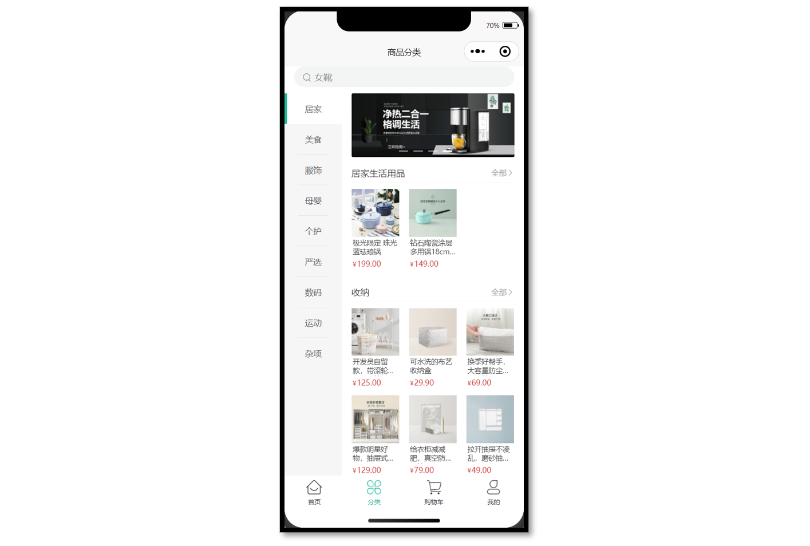
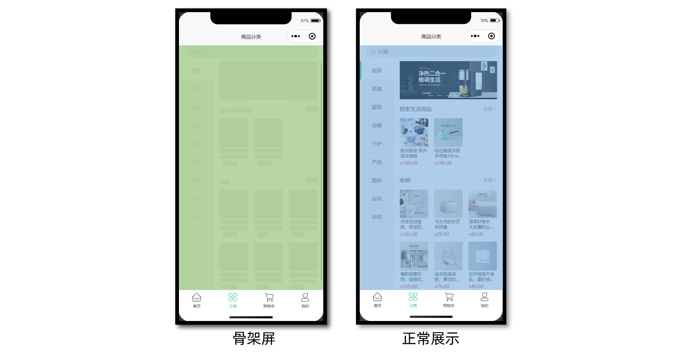

# 小兔鲜儿 - 分类模块

用户点击左菜单的一级分类，切换右侧对应的二级分类和商品。

## 准备工作

**参考效果**

商品分类页中的广告位，可复用之前定义的轮播图组件 `XtxSwiper`。



**静态结构**

商品分类页静态结构： `src/pages/category/category.vue`

```vue
<script setup lang="ts">
//
</script>

<template>
  <view class="viewport">
    <!-- 搜索框 -->
    <view class="search">
      <view class="input">
        <text class="icon-search">女靴</text>
      </view>
    </view>
    <!-- 分类 -->
    <view class="categories">
      <!-- 左侧：一级分类 -->
      <scroll-view class="primary" scroll-y>
        <view v-for="(item, index) in 10" :key="item" class="item" :class="{ active: index === 0 }">
          <text class="name"> 居家 </text>
        </view>
      </scroll-view>
      <!-- 右侧：二级分类 -->
      <scroll-view class="secondary" scroll-y>
        <!-- 焦点图 -->
        <XtxSwiper class="banner" :list="[]" />
        <!-- 内容区域 -->
        <view class="panel" v-for="item in 3" :key="item">
          <view class="title">
            <text class="name">宠物用品</text>
            <navigator class="more" hover-class="none">全部</navigator>
          </view>
          <view class="section">
            <navigator
              v-for="goods in 4"
              :key="goods"
              class="goods"
              hover-class="none"
              :url="`/pages/goods/goods?id=`"
            >
              <image
                class="image"
                src="https://yanxuan-item.nosdn.127.net/674ec7a88de58a026304983dd049ea69.jpg"
              ></image>
              <view class="name ellipsis">木天蓼逗猫棍</view>
              <view class="price">
                <text class="symbol">¥</text>
                <text class="number">16.00</text>
              </view>
            </navigator>
          </view>
        </view>
      </scroll-view>
    </view>
  </view>
</template>

<style lang="scss">
page {
  height: 100%;
  overflow: hidden;
}
.viewport {
  height: 100%;
  display: flex;
  flex-direction: column;
}
.search {
  padding: 0 30rpx 20rpx;
  background-color: #fff;
  .input {
    display: flex;
    align-items: center;
    justify-content: space-between;
    height: 64rpx;
    padding-left: 26rpx;
    color: #8b8b8b;
    font-size: 28rpx;
    border-radius: 32rpx;
    background-color: #f3f4f4;
  }
}
.icon-search {
  &::before {
    margin-right: 10rpx;
  }
}
/* 分类 */
.categories {
  flex: 1;
  min-height: 400rpx;
  display: flex;
}
/* 一级分类 */
.primary {
  overflow: hidden;
  width: 180rpx;
  flex: none;
  background-color: #f6f6f6;
  .item {
    display: flex;
    justify-content: center;
    align-items: center;
    height: 96rpx;
    font-size: 26rpx;
    color: #595c63;
    position: relative;
    &::after {
      content: '';
      position: absolute;
      left: 42rpx;
      bottom: 0;
      width: 96rpx;
      border-top: 1rpx solid #e3e4e7;
    }
  }
  .active {
    background-color: #fff;
    &::before {
      content: '';
      position: absolute;
      left: 0;
      top: 0;
      width: 8rpx;
      height: 100%;
      background-color: #27ba9b;
    }
  }
}
.primary .item:last-child::after,
.primary .active::after {
  display: none;
}
/* 二级分类 */
.secondary {
  background-color: #fff;
  .carousel {
    height: 200rpx;
    margin: 0 30rpx 20rpx;
    border-radius: 4rpx;
    overflow: hidden;
  }
  .panel {
    margin: 0 30rpx 0rpx;
  }
  .title {
    height: 60rpx;
    line-height: 60rpx;
    color: #333;
    font-size: 28rpx;
    border-bottom: 1rpx solid #f7f7f8;
    .more {
      float: right;
      padding-left: 20rpx;
      font-size: 24rpx;
      color: #999;
    }
  }
  .more {
    &::after {
      font-family: 'erabbit' !important;
      content: '\e6c2';
    }
  }
  .section {
    width: 100%;
    display: flex;
    flex-wrap: wrap;
    padding: 20rpx 0;
    .goods {
      width: 150rpx;
      margin: 0rpx 30rpx 20rpx 0;
      &:nth-child(3n) {
        margin-right: 0;
      }
      image {
        width: 150rpx;
        height: 150rpx;
      }
      .name {
        padding: 5rpx;
        font-size: 22rpx;
        color: #333;
      }
      .price {
        padding: 5rpx;
        font-size: 18rpx;
        color: #cf4444;
      }
      .number {
        font-size: 24rpx;
        margin-left: 2rpx;
      }
    }
  }
}
</style>
```

### 渲染轮播图

**接口调用**

渲染轮播图数据业务功能对于前端来说比较简单，只需调用后端提供的接口将获得的数据展现。

注意：传递参数 2 标识获取商品分类页广告。

接口地址：/home/banner

请求方式：GET

请求参数：

**Query:**

| 字段名称         | 是否必须 | 默认值 | 备注                                                     |
| ---------------- | -------- | ------ | -------------------------------------------------------- |
| distributionSite | 否       | 1      | 活动 banner 位置，1 代表首页，2 代表商品分类页，默认为 1 |

## 一级分类

### 获取数据

该接口同时包含一级分类和二级分类数据，二级分类数据需要先对数据进行处理，再进行渲染。

**接口调用**

接口地址：/category/top

请求方式：GET

请求参数：无

**请求封装**

```ts
// src/services/category.ts
/**
 * 分类列表-小程序
 */
export const getCategoryTopAPI = () => {
  return http<CategoryTopItem[]>({
    method: 'GET',
    url: '/category/top',
  })
}
```

**类型声明**

```ts
// src/types/category.d.ts
import type { GoodsItem } from './global'

/** 一级分类项 */
export type CategoryTopItem = {
  /** 二级分类集合[ 二级分类项 ] */
  children: CategoryChildItem[]
  /** 一级分类id */
  id: string
  /** 一级分类图片集[ 一级分类图片项 ] */
  imageBanners: string[]
  /** 一级分类名称 */
  name: string
  /** 一级分类图片 */
  picture: string
}

/** 二级分类项 */
export type CategoryChildItem = {
  /** 商品集合[ 商品项 ] */
  goods: GoodsItem[]
  /** 二级分类id */
  id: string
  /** 二级分类名称 */
  name: string
  /** 二级分类图片 */
  picture: string
}
```

接下来，先把一级分类数据结合模板语法渲染到页面中。

### Tab 交互

当用户点击一级分类时，需要高亮显示，即给它添加 `.active` 类名即可。

```vue {8-11,15,19,31-34,36}
<script setup lang="ts">
import { getCategoryTopAPI } from '@/services/category'
import type { CategoryTopItem } from '@/types/category'
import { onLoad } from '@dcloudio/uni-app'
import { ref } from 'vue'

// 获取分类列表数据
const categoryList = ref<CategoryTopItem[]>([])
const getCategoryTopData = async () => {
  const res = await getCategoryTopAPI()
  categoryList.value = res.result
}

// 高亮下标
const activeIndex = ref(0)

// 页面加载
onLoad(() => {
  getCategoryTopData()
})
</script>

<template>
  <view class="viewport">
    <!-- 分类 -->
    <view class="categories">
      <!-- 左侧：一级分类 -->
      <scroll-view class="primary" scroll-y>
        <view
          class="item"
          v-for="(item, index) in categoryList"
          :key="item.id"
          :class="{ active: index === activeIndex }"
          @tap="activeIndex = index"
        >
          {{ item.name }}
        </view>
      </scroll-view>
    </view>
  </view>
</template>
```

## 二级分类

商品二级分类是从属于某个一级分类的，通过 `computed` 配合**高亮下标**提取当前二级分类数据。

### 参考代码

```vue {7-9}
<script setup lang="ts">
import { computed } from 'vue'

// ...省略

// 提取当前二级分类数据
const subCategoryList = computed(() => {
  return categoryList.value[activeIndex.value]?.children || []
})
</script>

<template>
  <view class="viewport">
      <!-- ...省略 -->
      <!-- 右侧：二级分类 -->
      <scroll-view class="secondary" scroll-y>
        <!-- 焦点图 -->
        <XtxSwiper class="banner" :list="bannerList" />
        <!-- 内容区域 -->
        <view class="panel" v-for="item in subCategoryList" :key="item.id">
          <view class="title">
            <text class="name">{{ item.name }}</text>
            <navigator class="more" hover-class="none">全部</navigator>
          </view>
          <view class="section">
            <navigator
              v-for="goods in item.goods"
              :key="goods.id"
              class="goods"
              hover-class="none"
              :url="`/pages/goods/goods?id=${goods.id}`"
            >
              <image class="image" :src="goods.picture"></image>
              <view class="name ellipsis">{{ goods.name }}</view>
              <view class="price">
                <text class="symbol">¥</text>
                <text class="number">{{ goods.price }}</text>
              </view>
            </navigator>
          </view>
        </view>
      </scroll-view>
    </view>
  </view>
</template>
```

提取当前二级分类数据后，剩下的就是列表渲染。

## 骨架屏

**参考效果**

实现步骤参考首页的骨架屏。



## 代码参考(总)

商品分类页

```vue {26,30,40,94}
<script setup lang="ts">
import { getCategoryTopAPI } from '@/services/category'
import { getHomeBannerAPI } from '@/services/home'
import type { CategoryTopItem } from '@/types/category'
import type { BannerItem } from '@/types/home'
import { onLoad } from '@dcloudio/uni-app'
import { computed, ref } from 'vue'
import PageSkeleton from './components/PageSkeleton.vue'

// 获取轮播图数据
const bannerList = ref<BannerItem[]>([])
const getBannerData = async () => {
  const res = await getHomeBannerAPI(2)
  bannerList.value = res.result
}

// 获取分类列表数据
const categoryList = ref<CategoryTopItem[]>([])
const activeIndex = ref(0)
const getCategoryTopData = async () => {
  const res = await getCategoryTopAPI()
  categoryList.value = res.result
}

// 是否数据加载完毕
const isFinish = ref(false)
// 页面加载
onLoad(async () => {
  await Promise.all([getBannerData(), getCategoryTopData()])
  isFinish.value = true
})

// 提取当前二级分类数据
const subCategoryList = computed(() => {
  return categoryList.value[activeIndex.value]?.children || []
})
</script>

<template>
  <view class="viewport" v-if="isFinish">
    <!-- 搜索框 -->
    <view class="search">
      <view class="input">
        <text class="icon-search">女靴</text>
      </view>
    </view>
    <!-- 分类 -->
    <view class="categories">
      <!-- 左侧：一级分类 -->
      <scroll-view class="primary" scroll-y>
        <view
          v-for="(item, index) in categoryList"
          :key="item.id"
          class="item"
          :class="{ active: index === activeIndex }"
          @tap="activeIndex = index"
        >
          <text class="name">
            {{ item.name }}
          </text>
        </view>
      </scroll-view>
      <!-- 右侧：二级分类 -->
      <scroll-view class="secondary" scroll-y>
        <!-- 焦点图 -->
        <XtxSwiper class="banner" :list="bannerList" />
        <!-- 内容区域 -->
        <view class="panel" v-for="item in subCategoryList" :key="item.id">
          <view class="title">
            <text class="name">{{ item.name }}</text>
            <navigator class="more" hover-class="none">全部</navigator>
          </view>
          <view class="section">
            <navigator
              v-for="goods in item.goods"
              :key="goods.id"
              class="goods"
              hover-class="none"
              :url="`/pages/goods/goods?id=${goods.id}`"
            >
              <image class="image" :src="goods.picture"></image>
              <view class="name ellipsis">{{ goods.name }}</view>
              <view class="price">
                <text class="symbol">¥</text>
                <text class="number">{{ goods.price }}</text>
              </view>
            </navigator>
          </view>
        </view>
      </scroll-view>
    </view>
  </view>
  <!-- 骨架屏 -->
  <PageSkeleton v-else />
</template>
```
