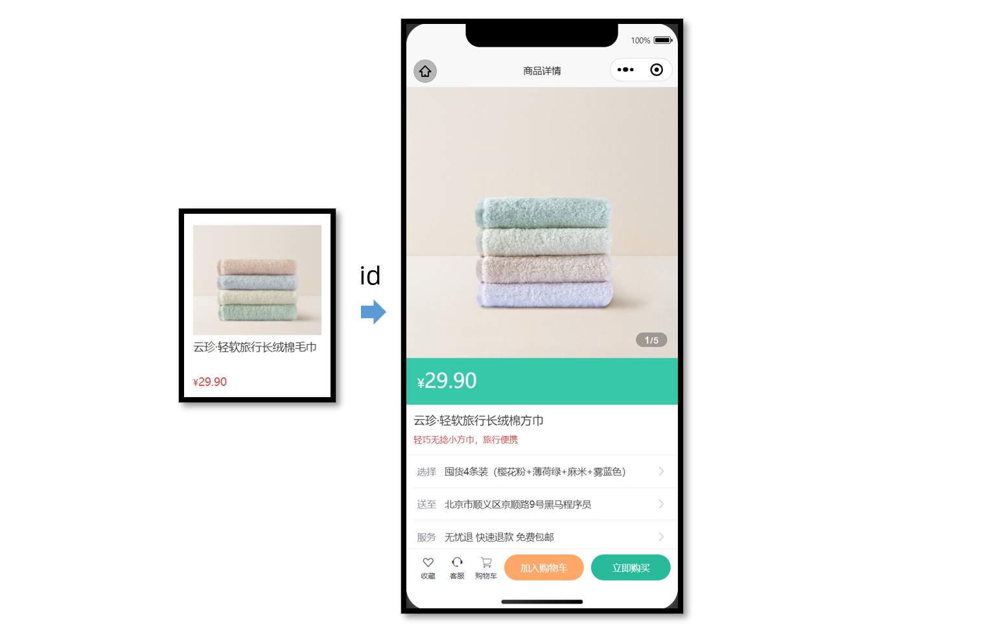
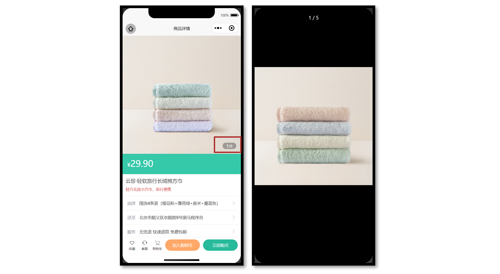
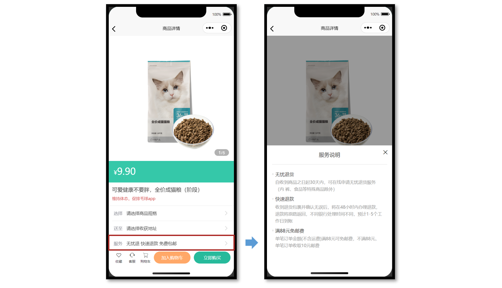
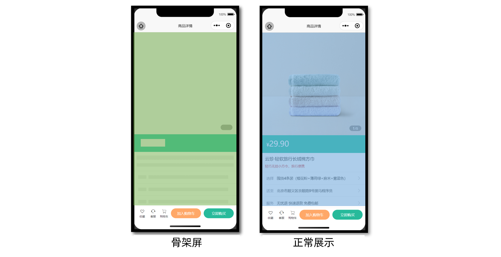

# 小兔鲜儿 - 商品详情(登录前)

商品详情页分为两部分讲解：

1. 登录前：展示商品信息，轮播图交互（当前模块）
2. 登录后：加入购物车，立即购买（SKU 模块）

## 准备工作

**参考效果**

用户点击商品列表，跳转到对应的商品详情页。



**静态结构**

新建商品详情页。

```vue
// src/pages/goods/goods.vue
<script setup lang="ts">
// 获取屏幕边界到安全区域距离
const { safeAreaInsets } = uni.getSystemInfoSync()
</script>

<template>
  <scroll-view scroll-y class="viewport">
    <!-- 基本信息 -->
    <view class="goods">
      <!-- 商品主图 -->
      <view class="preview">
        <swiper circular>
          <swiper-item>
            <image
              mode="aspectFill"
              src="https://yanxuan-item.nosdn.127.net/99c83709ca5f9fd5c5bb35d207ad7822.png"
            />
          </swiper-item>
          <swiper-item>
            <image
              mode="aspectFill"
              src="https://yanxuan-item.nosdn.127.net/f9107d47c08f0b99c097e30055c39e1a.png"
            />
          </swiper-item>
          <swiper-item>
            <image
              mode="aspectFill"
              src="https://yanxuan-item.nosdn.127.net/754c56785cc8c39f7414752f62d79872.png"
            />
          </swiper-item>
          <swiper-item>
            <image
              mode="aspectFill"
              src="https://yanxuan-item.nosdn.127.net/ef16f8127610ef56a2a10466d6dae157.jpg"
            />
          </swiper-item>
          <swiper-item>
            <image
              mode="aspectFill"
              src="https://yanxuan-item.nosdn.127.net/1f0c3f5d32b0e804deb9b3d56ea6c3b2.png"
            />
          </swiper-item>
        </swiper>
        <view class="indicator">
          <text class="current">1</text>
          <text class="split">/</text>
          <text class="total">5</text>
        </view>
      </view>

      <!-- 商品简介 -->
      <view class="meta">
        <view class="price">
          <text class="symbol">¥</text>
          <text class="number">29.90</text>
        </view>
        <view class="name ellipsis">云珍·轻软旅行长绒棉方巾 </view>
        <view class="desc"> 轻巧无捻小方巾，旅行便携 </view>
      </view>

      <!-- 操作面板 -->
      <view class="action">
        <view class="item arrow">
          <text class="label">选择</text>
          <text class="text ellipsis"> 请选择商品规格 </text>
        </view>
        <view class="item arrow">
          <text class="label">送至</text>
          <text class="text ellipsis"> 请选择收获地址 </text>
        </view>
        <view class="item arrow">
          <text class="label">服务</text>
          <text class="text ellipsis"> 无忧退 快速退款 免费包邮 </text>
        </view>
      </view>
    </view>

    <!-- 商品详情 -->
    <view class="detail panel">
      <view class="title">
        <text>详情</text>
      </view>
      <view class="content">
        <view class="properties">
          <!-- 属性详情 -->
          <view class="item">
            <text class="label">属性名</text>
            <text class="value">属性值</text>
          </view>
          <view class="item">
            <text class="label">属性名</text>
            <text class="value">属性值</text>
          </view>
        </view>
        <!-- 图片详情 -->
        <image
          mode="widthFix"
          src="https://yanxuan-item.nosdn.127.net/a8d266886d31f6eb0d7333c815769305.jpg"
        ></image>
        <image
          mode="widthFix"
          src="https://yanxuan-item.nosdn.127.net/a9bee1cb53d72e6cdcda210071cbd46a.jpg"
        ></image>
      </view>
    </view>

    <!-- 同类推荐 -->
    <view class="similar panel">
      <view class="title">
        <text>同类推荐</text>
      </view>
      <view class="content">
        <navigator
          v-for="item in 4"
          :key="item"
          class="goods"
          hover-class="none"
          :url="`/pages/goods/goods?id=`"
        >
          <image
            class="image"
            mode="aspectFill"
            src="https://yanxuan-item.nosdn.127.net/e0cea368f41da1587b3b7fc523f169d7.png"
          ></image>
          <view class="name ellipsis">简约山形纹全棉提花毛巾</view>
          <view class="price">
            <text class="symbol">¥</text>
            <text class="number">18.50</text>
          </view>
        </navigator>
      </view>
    </view>
  </scroll-view>

  <!-- 用户操作 -->
  <view class="toolbar" :style="{ paddingBottom: safeAreaInsets?.bottom + 'px' }">
    <view class="icons">
      <button class="icons-button"><text class="icon-heart"></text>收藏</button>
      <button class="icons-button" open-type="contact">
        <text class="icon-handset"></text>客服
      </button>
      <navigator class="icons-button" url="/pages/cart/cart" open-type="switchTab">
        <text class="icon-cart"></text>购物车
      </navigator>
    </view>
    <view class="buttons">
      <view class="addcart"> 加入购物车 </view>
      <view class="buynow"> 立即购买 </view>
    </view>
  </view>
</template>

<style lang="scss">
page {
  height: 100%;
  overflow: hidden;
  display: flex;
  flex-direction: column;
}

.viewport {
  background-color: #f4f4f4;
}

.panel {
  margin-top: 20rpx;
  background-color: #fff;
  .title {
    display: flex;
    justify-content: space-between;
    align-items: center;
    height: 90rpx;
    line-height: 1;
    padding: 30rpx 60rpx 30rpx 6rpx;
    position: relative;
    text {
      padding-left: 10rpx;
      font-size: 28rpx;
      color: #333;
      font-weight: 600;
      border-left: 4rpx solid #27ba9b;
    }
    navigator {
      font-size: 24rpx;
      color: #666;
    }
  }
}

.arrow {
  &::after {
    position: absolute;
    top: 50%;
    right: 30rpx;
    content: '\e6c2';
    color: #ccc;
    font-family: 'erabbit' !important;
    font-size: 32rpx;
    transform: translateY(-50%);
  }
}

/* 商品信息 */
.goods {
  background-color: #fff;
  .preview {
    height: 750rpx;
    position: relative;
    .indicator {
      height: 40rpx;
      padding: 0 24rpx;
      line-height: 40rpx;
      border-radius: 30rpx;
      color: #fff;
      font-family: Arial, Helvetica, sans-serif;
      background-color: rgba(0, 0, 0, 0.3);
      position: absolute;
      bottom: 30rpx;
      right: 30rpx;
      .current {
        font-size: 26rpx;
      }
      .split {
        font-size: 24rpx;
        margin: 0 1rpx 0 2rpx;
      }
      .total {
        font-size: 24rpx;
      }
    }
  }
  .meta {
    position: relative;
    border-bottom: 1rpx solid #eaeaea;
    .price {
      height: 130rpx;
      padding: 25rpx 30rpx 0;
      color: #fff;
      font-size: 34rpx;
      box-sizing: border-box;
      background-color: #35c8a9;
    }
    .number {
      font-size: 56rpx;
    }
    .brand {
      width: 160rpx;
      height: 80rpx;
      overflow: hidden;
      position: absolute;
      top: 26rpx;
      right: 30rpx;
    }
    .name {
      max-height: 88rpx;
      line-height: 1.4;
      margin: 20rpx;
      font-size: 32rpx;
      color: #333;
    }
    .desc {
      line-height: 1;
      padding: 0 20rpx 30rpx;
      font-size: 24rpx;
      color: #cf4444;
    }
  }
  .action {
    padding-left: 20rpx;
    .item {
      height: 90rpx;
      padding-right: 60rpx;
      border-bottom: 1rpx solid #eaeaea;
      font-size: 26rpx;
      color: #333;
      position: relative;
      display: flex;
      align-items: center;
      &:last-child {
        border-bottom: 0 none;
      }
    }
    .label {
      width: 60rpx;
      color: #898b94;
      margin: 0 16rpx 0 10rpx;
    }
    .text {
      flex: 1;
      -webkit-line-clamp: 1;
    }
  }
}

/* 商品详情 */
.detail {
  padding-left: 20rpx;
  .content {
    margin-left: -20rpx;
  }
  .properties {
    padding: 0 20rpx;
    margin-bottom: 30rpx;
    .item {
      display: flex;
      line-height: 2;
      padding: 10rpx;
      font-size: 26rpx;
      color: #333;
      border-bottom: 1rpx dashed #ccc;
    }
    .label {
      width: 200rpx;
    }
    .value {
      flex: 1;
    }
  }
}

/* 同类推荐 */
.similar {
  padding-left: 20rpx;
  .content {
    padding: 0 20rpx 20rpx;
    margin-left: -20rpx;
    background-color: #f4f4f4;
    overflow: hidden;
    navigator {
      width: 345rpx;
      padding: 24rpx 20rpx 20rpx;
      margin: 20rpx 20rpx 0 0;
      border-radius: 10rpx;
      background-color: #fff;
      float: left;
    }
    .image {
      height: 260rpx;
    }
    .name {
      height: 80rpx;
      margin: 10rpx 0;
      font-size: 26rpx;
      color: #262626;
    }
    .price {
      line-height: 1;
      font-size: 20rpx;
      color: #cf4444;
    }
    .number {
      font-size: 26rpx;
      margin-left: 2rpx;
    }
  }
  navigator {
    &:nth-child(even) {
      margin-right: 0;
    }
  }
}

/* 底部工具栏 */
.toolbar {
  background-color: #fff;
  height: 100rpx;
  padding: 0 20rpx;
  border-top: 1rpx solid #eaeaea;
  display: flex;
  justify-content: space-between;
  align-items: center;
  box-sizing: content-box;
  .buttons {
    display: flex;
    & > view {
      width: 220rpx;
      text-align: center;
      line-height: 72rpx;
      font-size: 26rpx;
      color: #fff;
      border-radius: 72rpx;
    }
    .addcart {
      background-color: #ffa868;
    }
    .buynow {
      background-color: #27ba9b;
      margin-left: 20rpx;
    }
  }
  .icons {
    padding-right: 10rpx;
    display: flex;
    align-items: center;
    flex: 1;
    .icons-button {
      flex: 1;
      text-align: center;
      line-height: 1.4;
      padding: 0;
      margin: 0;
      border-radius: 0;
      font-size: 20rpx;
      color: #333;
      background-color: #fff;
    }
    text {
      display: block;
      font-size: 34rpx;
    }
  }
}
</style>
```

### 获取数据

**获取页面参数**

根据商品的 id 查询到某个商品的详细信息，如图片、价格、型号等展示给用户。

```ts
// 接收页面参数
const query = defineProps<{
  id: string
}>()
```

**接口调用**

接口信息如下：

接口地址：/goods

请求方式：GET

请求参数：

**Query**

| 字段名称 | 是否必须 | 默认值 | 备注    |
| -------- | -------- | ------ | ------- |
| id       | 是       | 无     | 商品 id |

**请求封装**

```ts
/**
 * 商品详情
 * @param id 商品id
 */
export const getGoodsByIdAPI = (id: string) => {
  return http<GoodsResult>({
    method: 'GET',
    url: '/goods',
    data: { id },
  })
}
```

**类型声明**

```ts
import type { GoodsItem } from './global'

/** 商品信息 */
export type GoodsResult = {
  /** id */
  id: string
  /** 商品名称 */
  name: string
  /** 商品描述 */
  desc: string
  /** 当前价格 */
  price: number
  /** 原价 */
  oldPrice: number
  /** 商品详情: 包含详情属性 + 详情图片 */
  details: Details
  /** 主图图片集合[ 主图图片链接 ] */
  mainPictures: string[]
  /** 同类商品[ 商品信息 ] */
  similarProducts: GoodsItem[]
  /** sku集合[ sku信息 ] */
  skus: SkuItem[]
  /** 可选规格集合备注[ 可选规格信息 ] */
  specs: SpecItem[]
  /** 用户地址列表[ 地址信息 ] */
  userAddresses: AddressItem[]
}

/** 商品详情: 包含详情属性 + 详情图片 */
export type Details = {
  /** 商品属性集合[ 属性信息 ] */
  properties: DetailsPropertyItem[]
  /** 商品详情图片集合[ 图片链接 ] */
  pictures: string[]
}

/** 属性信息 */
export type DetailsPropertyItem = {
  /** 属性名称 */
  name: string
  /** 属性值 */
  value: string
}

/** sku信息 */
export type SkuItem = {
  /** id */
  id: string
  /** 库存 */
  inventory: number
  /** 原价 */
  oldPrice: number
  /** sku图片 */
  picture: string
  /** 当前价格 */
  price: number
  /** sku编码 */
  skuCode: string
  /** 规格集合[ 规格信息 ] */
  specs: SkuSpecItem[]
}

/** 规格信息 */
export type SkuSpecItem = {
  /** 规格名称 */
  name: string
  /** 可选值名称 */
  valueName: string
}

/** 可选规格信息 */
export type SpecItem = {
  /** 规格名称 */
  name: string
  /** 可选值集合[ 可选值信息 ] */
  values: SpecValueItem[]
}

/** 可选值信息 */
export type SpecValueItem = {
  /** 是否可售 */
  available: boolean
  /** 可选值备注 */
  desc: string
  /** 可选值名称 */
  name: string
  /** 可选值图片链接 */
  picture: string
}

/** 地址信息 */
export type AddressItem = {
  /** 收货人姓名 */
  receiver: string
  /** 联系方式 */
  contact: string
  /** 省份编码 */
  provinceCode: string
  /** 城市编码 */
  cityCode: string
  /** 区/县编码 */
  countyCode: string
  /** 详细地址 */
  address: string
  /** 默认地址，1为是，0为否 */
  isDefault: number
  /** 收货地址 id */
  id: string
  /** 省市区 */
  fullLocation: string
}
```

接下来，将获取到的数据结合模板语法渲染到页面中。

## 轮播图交互

**参考效果**

当轮播图滑动切换的时候更新**自定义下标**，当图片被点击的时候**大图预览**。



### 参考代码

商品详情页轮播图交互

```vue
<script setup lang="ts">
// 轮播图变化时
const currentIndex = ref(0)
const onChange: UniHelper.SwiperOnChange = (ev) => {
  currentIndex.value = ev.detail.current
}

// 点击图片时
const onTapImage = (url: string) => {
  // 大图预览
  uni.previewImage({
    current: url,
    urls: goods.value!.mainPictures,
  })
}
</script>

<template>
  <!-- 商品主图 -->
  <view class="preview">
    <swiper @change="onChange" circular>
      <swiper-item v-for="item in goods?.mainPictures" :key="item">
        <image @tap="onTapImage(item)" mode="aspectFill" :src="item" />
      </swiper-item>
    </swiper>
    <view class="indicator">
      <text class="current">{{ currentIndex + 1 }}</text>
      <text class="split">/</text>
      <text class="total">{{ goods?.mainPictures.length }}</text>
    </view>
  </view>
</template>
```

## 弹出层交互

**参考效果**

`uni-ui` 弹出层组件：[uni-popup](https://uniapp.dcloud.net.cn/component/uniui/uni-popup.html)



**静态结构**

提供 **服务说明** 和 **收获地址** 两个组件的静态结构，实现弹出层交互。

**组件 1：服务说明**

```vue
// ServicePanel.vue
<script setup lang="ts">
//
</script>

<template>
  <view class="service-panel">
    <!-- 关闭按钮 -->
    <text class="close icon-close"></text>
    <!-- 标题 -->
    <view class="title">服务说明</view>
    <!-- 内容 -->
    <view class="content">
      <view class="item">
        <view class="dt">无忧退货</view>
        <view class="dd">
          自收到商品之日起30天内，可在线申请无忧退货服务（食品等特殊商品除外）
        </view>
      </view>
      <view class="item">
        <view class="dt">快速退款</view>
        <view class="dd">
          收到退货包裹并确认无误后，将在48小时内办理退款，
          退款将原路返回，不同银行处理时间不同，预计1-5个工作日到账
        </view>
      </view>
      <view class="item">
        <view class="dt">满88元免邮费</view>
        <view class="dd">
          单笔订单金额(不含运费)满88元可免邮费，不满88元， 单笔订单收取10元邮费
        </view>
      </view>
    </view>
  </view>
</template>

<style lang="scss">
.service-panel {
  padding: 0 30rpx;
  border-radius: 10rpx 10rpx 0 0;
  position: relative;
  background-color: #fff;
}

.title {
  line-height: 1;
  padding: 40rpx 0;
  text-align: center;
  font-size: 32rpx;
  font-weight: normal;
  border-bottom: 1rpx solid #ddd;
  color: #444;
}

.close {
  position: absolute;
  right: 24rpx;
  top: 24rpx;
}

.content {
  padding: 20rpx 20rpx 100rpx 20rpx;

  .item {
    margin-top: 20rpx;
  }

  .dt {
    margin-bottom: 10rpx;
    font-size: 28rpx;
    color: #333;
    font-weight: 500;
    position: relative;

    &::before {
      content: '';
      width: 10rpx;
      height: 10rpx;
      border-radius: 50%;
      background-color: #eaeaea;
      transform: translateY(-50%);
      position: absolute;
      top: 50%;
      left: -20rpx;
    }
  }

  .dd {
    line-height: 1.6;
    font-size: 26rpx;
    color: #999;
  }
}
</style>
```

**组件 2：收获地址组件**

```vue
// AddressPanel.vue
<script setup lang="ts">
//
</script>

<template>
  <view class="address-panel">
    <!-- 关闭按钮 -->
    <text class="close icon-close"></text>
    <!-- 标题 -->
    <view class="title">配送至</view>
    <!-- 内容 -->
    <view class="content">
      <view class="item">
        <view class="user">李明 13824686868</view>
        <view class="address">北京市顺义区后沙峪地区安平北街6号院</view>
        <text class="icon icon-checked"></text>
      </view>
      <view class="item">
        <view class="user">王东 13824686868</view>
        <view class="address">北京市顺义区后沙峪地区安平北街6号院</view>
        <text class="icon icon-ring"></text>
      </view>
      <view class="item">
        <view class="user">张三 13824686868</view>
        <view class="address">北京市朝阳区孙河安平北街6号院</view>
        <text class="icon icon-ring"></text>
      </view>
    </view>
    <view class="footer">
      <view class="button primary"> 新建地址 </view>
      <view v-if="false" class="button primary">确定</view>
    </view>
  </view>
</template>

<style lang="scss">
.address-panel {
  padding: 0 30rpx;
  border-radius: 10rpx 10rpx 0 0;
  position: relative;
  background-color: #fff;
}

.title {
  line-height: 1;
  padding: 40rpx 0;
  text-align: center;
  font-size: 32rpx;
  font-weight: normal;
  border-bottom: 1rpx solid #ddd;
  color: #444;
}

.close {
  position: absolute;
  right: 24rpx;
  top: 24rpx;
}

.content {
  min-height: 300rpx;
  max-height: 540rpx;
  overflow: auto;
  padding: 20rpx;
  .item {
    padding: 30rpx 50rpx 30rpx 60rpx;
    background-size: 40rpx;
    background-repeat: no-repeat;
    background-position: 0 center;
    background-image: url(https://pcapi-xiaotuxian-front-devtest.itheima.net/miniapp/images/locate.png);
    position: relative;
  }
  .icon {
    color: #999;
    font-size: 40rpx;
    transform: translateY(-50%);
    position: absolute;
    top: 50%;
    right: 0;
  }
  .icon-checked {
    color: #27ba9b;
  }
  .icon-ring {
    color: #444;
  }
  .user {
    font-size: 28rpx;
    color: #444;
    font-weight: 500;
  }
  .address {
    font-size: 26rpx;
    color: #666;
  }
}

.footer {
  display: flex;
  justify-content: space-between;
  padding: 20rpx 0 40rpx;
  font-size: 28rpx;
  color: #444;

  .button {
    flex: 1;
    height: 72rpx;
    text-align: center;
    line-height: 72rpx;
    margin: 0 20rpx;
    color: #fff;
    border-radius: 72rpx;
  }

  .primary {
    color: #fff;
    background-color: #27ba9b;
  }

  .secondary {
    background-color: #ffa868;
  }
}
</style>
```

### 参考代码

商品详情页：通过组件 `ref` 获取弹出层组件实例，调用打开弹出层方法。

```vue {5-9,17,28,32,38-41}
<script setup lang="ts">
import AddressPanel from './components/AddressPanel.vue'
import ServicePanel from './components/ServicePanel.vue'

// uni-ui 弹出层组件 ref
const popup = ref<{
  open: (type?: UniHelper.UniPopupType) => void
  close: () => void
}>()

// 弹出层条件渲染
const popupName = ref<'address' | 'service'>()
const openPopup = (name: typeof popupName.value) => {
  // 修改弹出层名称
  popupName.value = name
  // 打开弹出层
  popup.value?.open()
}
</script>

<template>
  <!-- 操作面板 -->
  <view class="action">
    <view class="item arrow">
      <text class="label">选择</text>
      <text class="text ellipsis"> 请选择商品规格 </text>
    </view>
    <view @tap="openPopup('address')" class="item arrow">
      <text class="label">送至</text>
      <text class="text ellipsis"> 请选择收获地址 </text>
    </view>
    <view @tap="openPopup('service')" class="item arrow">
      <text class="label">服务</text>
      <text class="text ellipsis"> 无忧退 快速退款 免费包邮 </text>
    </view>
  </view>
  <!-- uni-ui 弹出层 -->
  <uni-popup ref="popup" type="bottom" background-color="#fff">
    <AddressPanel v-if="popupName === 'address'" @close="popup?.close()" />
    <ServicePanel v-if="popupName === 'service'" @close="popup?.close()" />
  </uni-popup>
</template>
```

**服务说明** 和 **收获地址** 组件通讯：通过子调父，关闭弹出层。

```vue
<script setup lang="ts">
// 子调父
const emit = defineEmits<{
  (event: 'close'): void
}>()
</script>

<template>
  <view class="service-panel">
    <!-- 关闭按钮 -->
    <text class="close icon-close" @tap="emit('close')"></text>
    ...省略
  </view>
</template>
```

## 骨架屏

**参考效果**

课后练习，大家自主独立完成。



## 参考代码(总)

商品详情页

```vue
<script setup lang="ts">
import { getGoodsByIdAPI } from '@/services/goods'
import type { GoodsResult } from '@/types/goods'
import { onLoad } from '@dcloudio/uni-app'
import { ref } from 'vue'
import AddressPanel from './components/AddressPanel.vue'
import ServicePanel from './components/ServicePanel.vue'

// 获取屏幕边界到安全区域距离
const { safeAreaInsets } = uni.getSystemInfoSync()

// 接收页面参数
const query = defineProps<{
  id: string
}>()

// 获取商品详情信息
const goods = ref<GoodsResult>()
const getGoodsByIdData = async () => {
  const res = await getGoodsByIdAPI(query.id)
  goods.value = res.result
}

// 页面加载
onLoad(() => {
  getGoodsByIdData()
})

// 轮播图变化时
const currentIndex = ref(0)
const onChange: UniHelper.SwiperOnChange = (ev) => {
  currentIndex.value = ev.detail!.current
}

// 点击图片时
const onTapImage = (url: string) => {
  // 大图预览
  uni.previewImage({
    current: url,
    urls: goods.value!.mainPictures,
  })
}

// uni-ui 弹出层组件 ref
const popup = ref<{
  open: (type?: UniHelper.UniPopupType) => void
  close: () => void
}>()

// 弹出层条件渲染
const popupName = ref<'address' | 'service'>()
const openPopup = (name: typeof popupName.value) => {
  // 修改弹出层名称
  popupName.value = name
  popup.value?.open()
}
</script>

<template>
  <scroll-view scroll-y class="viewport">
    <!-- 基本信息 -->
    <view class="goods">
      <!-- 商品主图 -->
      <view class="preview">
        <swiper @change="onChange" circular>
          <swiper-item v-for="item in goods?.mainPictures" :key="item">
            <image @tap="onTapImage(item)" mode="aspectFill" :src="item" />
          </swiper-item>
        </swiper>
        <view class="indicator">
          <text class="current">{{ currentIndex + 1 }}</text>
          <text class="split">/</text>
          <text class="total">{{ goods?.mainPictures.length }}</text>
        </view>
      </view>

      <!-- 商品简介 -->
      <view class="meta">
        <view class="price">
          <text class="symbol">¥</text>
          <text class="number">{{ goods?.price }}</text>
        </view>
        <view class="name ellipsis">{{ goods?.name }}</view>
        <view class="desc"> {{ goods?.desc }} </view>
      </view>

      <!-- 操作面板 -->
      <view class="action">
        <view class="item arrow">
          <text class="label">选择</text>
          <text class="text ellipsis"> 请选择商品规格 </text>
        </view>
        <view @tap="openPopup('address')" class="item arrow">
          <text class="label">送至</text>
          <text class="text ellipsis"> 请选择收获地址 </text>
        </view>
        <view @tap="openPopup('service')" class="item arrow">
          <text class="label">服务</text>
          <text class="text ellipsis"> 无忧退 快速退款 免费包邮 </text>
        </view>
      </view>
    </view>

    <!-- 商品详情 -->
    <view class="detail panel">
      <view class="title">
        <text>详情</text>
      </view>
      <view class="content">
        <view class="properties">
          <!-- 属性详情 -->
          <view class="item" v-for="item in goods?.details.properties" :key="item.name">
            <text class="label">{{ item.name }}</text>
            <text class="value">{{ item.value }}</text>
          </view>
        </view>
        <!-- 图片详情 -->
        <image
          v-for="item in goods?.details.pictures"
          :key="item"
          mode="widthFix"
          :src="item"
        ></image>
      </view>
    </view>

    <!-- 同类推荐 -->
    <view class="similar panel">
      <view class="title">
        <text>同类推荐</text>
      </view>
      <view class="content">
        <navigator
          v-for="item in goods?.similarProducts"
          :key="item.id"
          class="goods"
          hover-class="none"
          :url="`/pages/goods/goods?id=${item.id}`"
        >
          <image class="image" mode="aspectFill" :src="item.picture"></image>
          <view class="name ellipsis">{{ item.name }}</view>
          <view class="price">
            <text class="symbol">¥</text>
            <text class="number">{{ item.price }}</text>
          </view>
        </navigator>
      </view>
    </view>
  </scroll-view>

  <!-- 用户操作 -->
  <view class="toolbar" :style="{ paddingBottom: safeAreaInsets?.bottom + 'px' }">
    <view class="icons">
      <button class="icons-button"><text class="icon-heart"></text>收藏</button>
      <button class="icons-button" open-type="contact">
        <text class="icon-handset"></text>客服
      </button>
      <navigator class="icons-button"><text class="icon-cart"></text>购物车</navigator>
    </view>
    <view class="buttons">
      <view class="addcart"> 加入购物车 </view>
      <view class="payment"> 立即购买 </view>
    </view>
  </view>

  <!-- uni-ui 弹出层 -->
  <uni-popup ref="popup" type="bottom" background-color="#fff">
    <AddressPanel v-if="popupName === 'address'" @close="popup?.close()" />
    <ServicePanel v-if="popupName === 'service'" @close="popup?.close()" />
  </uni-popup>
</template>

<style lang="scss">
page {
  height: 100%;
  overflow: hidden;
  display: flex;
  flex-direction: column;
}

.viewport {
  background-color: #f4f4f4;
}

.panel {
  margin-top: 20rpx;
  background-color: #fff;
  .title {
    display: flex;
    justify-content: space-between;
    align-items: center;
    height: 90rpx;
    line-height: 1;
    padding: 30rpx 60rpx 30rpx 6rpx;
    position: relative;
    text {
      padding-left: 10rpx;
      font-size: 28rpx;
      color: #333;
      font-weight: 600;
      border-left: 4rpx solid #27ba9b;
    }
    navigator {
      font-size: 24rpx;
      color: #666;
    }
  }
}

.arrow {
  &::after {
    position: absolute;
    top: 50%;
    right: 30rpx;
    content: '\e6c2';
    color: #ccc;
    font-family: 'erabbit' !important;
    font-size: 32rpx;
    transform: translateY(-50%);
  }
}

/* 商品信息 */
.goods {
  background-color: #fff;
  .preview {
    height: 750rpx;
    position: relative;
    .indicator {
      height: 40rpx;
      padding: 0 24rpx;
      line-height: 40rpx;
      border-radius: 30rpx;
      color: #fff;
      font-family: Arial, Helvetica, sans-serif;
      background-color: rgba(0, 0, 0, 0.3);
      position: absolute;
      bottom: 30rpx;
      right: 30rpx;
      .current {
        font-size: 26rpx;
      }
      .split {
        font-size: 24rpx;
        margin: 0 1rpx 0 2rpx;
      }
      .total {
        font-size: 24rpx;
      }
    }
  }
  .meta {
    position: relative;
    border-bottom: 1rpx solid #eaeaea;
    .price {
      height: 130rpx;
      padding: 25rpx 30rpx 0;
      color: #fff;
      font-size: 34rpx;
      box-sizing: border-box;
      background-color: #35c8a9;
    }
    .number {
      font-size: 56rpx;
    }
    .brand {
      width: 160rpx;
      height: 80rpx;
      overflow: hidden;
      position: absolute;
      top: 26rpx;
      right: 30rpx;
    }
    .name {
      max-height: 88rpx;
      line-height: 1.4;
      margin: 20rpx;
      font-size: 32rpx;
      color: #333;
    }
    .desc {
      line-height: 1;
      padding: 0 20rpx 30rpx;
      font-size: 24rpx;
      color: #cf4444;
    }
  }
  .action {
    padding-left: 20rpx;
    .item {
      height: 90rpx;
      padding-right: 60rpx;
      border-bottom: 1rpx solid #eaeaea;
      font-size: 26rpx;
      color: #333;
      position: relative;
      display: flex;
      align-items: center;
      &:last-child {
        border-bottom: 0 none;
      }
    }
    .label {
      width: 60rpx;
      color: #898b94;
      margin: 0 16rpx 0 10rpx;
    }
    .text {
      flex: 1;
      -webkit-line-clamp: 1;
    }
  }
}

/* 商品详情 */
.detail {
  padding-left: 20rpx;
  .content {
    margin-left: -20rpx;
  }
  .properties {
    padding: 0 20rpx;
    margin-bottom: 30rpx;
    .item {
      display: flex;
      line-height: 2;
      padding: 10rpx;
      font-size: 26rpx;
      color: #333;
      border-bottom: 1rpx dashed #ccc;
    }
    .label {
      width: 200rpx;
    }
    .value {
      flex: 1;
    }
  }
}

/* 同类推荐 */
.similar {
  padding-left: 20rpx;
  .content {
    padding: 0 20rpx 20rpx;
    margin-left: -20rpx;
    background-color: #f4f4f4;
    overflow: hidden;
    navigator {
      width: 345rpx;
      padding: 24rpx 20rpx 20rpx;
      margin: 20rpx 20rpx 0 0;
      border-radius: 10rpx;
      background-color: #fff;
      float: left;
    }
    .image {
      height: 260rpx;
    }
    .name {
      height: 80rpx;
      margin: 10rpx 0;
      font-size: 26rpx;
      color: #262626;
    }
    .price {
      line-height: 1;
      font-size: 20rpx;
      color: #cf4444;
    }
    .number {
      font-size: 26rpx;
      margin-left: 2rpx;
    }
  }
  navigator {
    &:nth-child(even) {
      margin-right: 0;
    }
  }
}

/* 底部工具栏 */
.toolbar {
  background-color: #fff;
  height: 100rpx;
  padding: 0 20rpx;
  border-top: 1rpx solid #eaeaea;
  display: flex;
  justify-content: space-between;
  align-items: center;
  box-sizing: content-box;
  .buttons {
    display: flex;
    & > view {
      width: 220rpx;
      text-align: center;
      line-height: 72rpx;
      font-size: 26rpx;
      color: #fff;
      border-radius: 72rpx;
    }
    .addcart {
      background-color: #ffa868;
    }
    .payment {
      background-color: #27ba9b;
      margin-left: 20rpx;
    }
  }
  .icons {
    padding-right: 10rpx;
    display: flex;
    align-items: center;
    flex: 1;
    .icons-button {
      flex: 1;
      text-align: center;
      line-height: 1.4;
      padding: 0;
      margin: 0;
      border-radius: 0;
      font-size: 20rpx;
      color: #333;
      background-color: #fff;
    }
    text {
      display: block;
      font-size: 34rpx;
    }
  }
}
</style>
```
