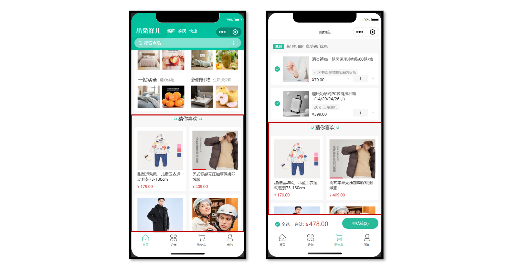

# 小兔鲜儿 - 首页模块

涉及知识点：组件通信、组件自动导入、数据渲染、触底分页加载、下拉刷新等。

## 自定义导航栏

**参考效果**：自定义导航栏的样式需要适配不同的机型。


**操作步骤**

1. 准备组件

2. 隐藏默认导航栏，修改文字颜色

3. 样式适配 -> 安全区域

**静态结构**

新建业务组件：`src/pages/index/componets/CustomNavbar.vue`

```vue
<script setup lang="ts">
//
</script>

<template>
  <view class="navbar">
    <!-- logo文字 -->
    <view class="logo">
      <image class="logo-image" src="@/static/images/logo.png"></image>
      <text class="logo-text">新鲜 · 亲民 · 快捷</text>
    </view>
    <!-- 搜索条 -->
    <view class="search">
      <text class="icon-search">搜索商品</text>
      <text class="icon-scan"></text>
    </view>
  </view>
</template>

<style lang="scss">
/* 自定义导航条 */
.navbar {
  background-image: url(@/static/images/navigator_bg.png);
  background-size: cover;
  position: relative;
  display: flex;
  flex-direction: column;
  padding-top: 20px;
  .logo {
    display: flex;
    align-items: center;
    height: 64rpx;
    padding-left: 30rpx;
    .logo-image {
      width: 166rpx;
      height: 39rpx;
    }
    .logo-text {
      flex: 1;
      line-height: 28rpx;
      color: #fff;
      margin: 2rpx 0 0 20rpx;
      padding-left: 20rpx;
      border-left: 1rpx solid #fff;
      font-size: 26rpx;
    }
  }
  .search {
    display: flex;
    align-items: center;
    justify-content: space-between;
    padding: 0 10rpx 0 26rpx;
    height: 64rpx;
    margin: 16rpx 20rpx;
    color: #fff;
    font-size: 28rpx;
    border-radius: 32rpx;
    background-color: rgba(255, 255, 255, 0.5);
  }
  .icon-search {
    &::before {
      margin-right: 10rpx;
    }
  }
  .icon-scan {
    font-size: 30rpx;
    padding: 15rpx;
  }
}
</style>
```

### 安全区域

不同手机的安全区域不同，适配安全区域能防止页面重要内容被遮挡。

可通过 `uni.getSystemInfoSync()` 获取屏幕边界到安全区的距离。


### 核心代码参考

自定义导航配置

```json
// src/pages.json
{
  "path": "pages/index/index",
  "style": {
    "navigationStyle": "custom", // 隐藏默认导航
    "navigationBarTextStyle": "white",
    "navigationBarTitleText": "首页"
  }
}
```

组件安全区适配

```vue
<!-- src/pages/index/componets/CustomNavbar.vue -->
<script>
// 获取屏幕边界到安全区域距离
const { safeAreaInsets } = uni.getSystemInfoSync()
</script>

<template>
  <!-- 顶部占位 -->
  <view class="navbar" :style="{ paddingTop: safeAreaInsets?.top + 'px' }">
    <!-- ...省略 -->
  </view>
</template>
```

## 通用轮播组件

**参考效果**

小兔鲜儿项目中总共有两处广告位，分别位于【首页】和【商品分类页】。

轮播图组件需要在首页和分类页使用，需要封装成通用组件。


**静态结构**

首页广告布局为独立的组件 `XtxSwiper` ，位于的 `src/components` 目录中。

该组件定义了 `list` 属性接收外部传入的数据，内部通过小程序内置组件 `swiper` 展示首页广告的数据。

**轮播图组件**

静态结构：`src/components/XtxSwiper.vue`

```vue
<script setup lang="ts">
import { ref } from 'vue'

const activeIndex = ref(0)
</script>

<template>
  <view class="carousel">
    <swiper :circular="true" :autoplay="false" :interval="3000">
      <swiper-item>
        <navigator url="/pages/index/index" hover-class="none" class="navigator">
          <image
            mode="aspectFill"
            class="image"
            src="https://pcapi-xiaotuxian-front-devtest.itheima.net/miniapp/uploads/slider_1.jpg"
          ></image>
        </navigator>
      </swiper-item>
      <swiper-item>
        <navigator url="/pages/index/index" hover-class="none" class="navigator">
          <image
            mode="aspectFill"
            class="image"
            src="https://pcapi-xiaotuxian-front-devtest.itheima.net/miniapp/uploads/slider_2.jpg"
          ></image>
        </navigator>
      </swiper-item>
      <swiper-item>
        <navigator url="/pages/index/index" hover-class="none" class="navigator">
          <image
            mode="aspectFill"
            class="image"
            src="https://pcapi-xiaotuxian-front-devtest.itheima.net/miniapp/uploads/slider_3.jpg"
          ></image>
        </navigator>
      </swiper-item>
    </swiper>
    <!-- 指示点 -->
    <view class="indicator">
      <text
        v-for="(item, index) in 3"
        :key="item"
        class="dot"
        :class="{ active: index === activeIndex }"
      ></text>
    </view>
  </view>
</template>

<style lang="scss">
:host {
  display: block;
  height: 280rpx;
}
/* 轮播图 */
.carousel {
  height: 100%;
  position: relative;
  overflow: hidden;
  transform: translateY(0);
  background-color: #efefef;
  .indicator {
    position: absolute;
    left: 0;
    right: 0;
    bottom: 16rpx;
    display: flex;
    justify-content: center;
    .dot {
      width: 30rpx;
      height: 6rpx;
      margin: 0 8rpx;
      border-radius: 6rpx;
      background-color: rgba(255, 255, 255, 0.4);
    }
    .active {
      background-color: #fff;
    }
  }
  .navigator,
  .image {
    width: 100%;
    height: 100%;
  }
}
</style>
```

**自动导入全局组件**

参考配置

```json
{
  // 组件自动引入规则
  "easycom": {
    // 是否开启自动扫描 @/components/$1/$1.vue 组件
    "autoscan": true,
    // 以正则方式自定义组件匹配规则
    "custom": {
      // uni-ui 规则如下配置
      "^uni-(.*)": "@dcloudio/uni-ui/lib/uni-$1/uni-$1.vue",
      // 以 Xtx 开头的组件，在 components 目录中查找
      "^Xtx(.*)": "@/components/Xtx$1.vue"
    }
  }
}
```

**全局组件类型声明**

Volor 插件说明：[Vue Language Tools](https://github.com/vuejs/language-tools)

```ts
// src/types/components.d.ts
import XtxSwiper from './XtxSwiper.vue’
declare module '@vue/runtime-core' {
  export interface GlobalComponents {
    XtxSwiper: typeof XtxSwiper
  }
}
```

### 获取数据

**接口调用**

该业务功能对于前端来说比较简单，只需调用后端提供的接口将获得的数据展现，结合运营人员的营销策略跳转到对应的链接地址即可。

接口地址：/home/banner

请求方式：GET

请求参数：

**Query:**

| 字段名           | 必须 | 默认值 | 备注                                                     |
| ---------------- | ---- | ------ | -------------------------------------------------------- |
| distributionSite | 否   | 1      | 活动 banner 位置，1 代表首页，2 代表商品分类页，默认为 1 |

**请求封装**

```ts
// 存放路径: src/services/home.ts
import type { BannerItem } from '@/types/home'

/**
 * 首页-广告区域-小程序
 * @param distributionSite 广告区域展示位置（投放位置 投放位置，1为首页，2为分类商品页） 默认是1
 */
export const getHomeBannerAPI = (distributionSite = 1) => {
  return http<BannerItem[]>({
    method: 'GET',
    url: '/home/banner',
    data: {
      distributionSite,
    },
  })
}
```

**类型声明**

存放路径：`src/types/home.d.ts`

```ts
/** 首页-广告区域数据类型 */
export type BannerItem = {
  /** 跳转链接 */
  hrefUrl: string
  /** id */
  id: string
  /** 图片链接 */
  imgUrl: string
  /** 跳转类型 */
  type: number
}
```

最后，将获得的数据结合模板语法渲染到页面中。

### 参考代码

轮播图组件：`src\components\XtxSwiper.vue`

```vue
<script setup lang="ts">
import type { BannerItem } from '@/types/home'
import { ref } from 'vue'

const activeIndex = ref(0)

// 当 swiper 下标发生变化时触发
const onChange: UniHelper.SwiperOnChange = (ev) => {
  // ! 非空断言，主观上排除掉空值情况
  activeIndex.value = ev.detail!.current
}
// 定义 props 接收
defineProps<{
  list: BannerItem[]
}>()
</script>

<template>
  <view class="carousel">
    <swiper :circular="true" :autoplay="false" :interval="3000" @change="onChange">
      <swiper-item v-for="item in list" :key="item.id">
        <navigator url="/pages/index/index" hover-class="none" class="navigator">
          <image mode="aspectFill" class="image" :src="item.imgUrl"></image>
        </navigator>
      </swiper-item>
    </swiper>
    <!-- 指示点 -->
    <view class="indicator">
      <text
        v-for="(item, index) in list"
        :key="item.id"
        class="dot"
        :class="{ active: index === activeIndex }"
      ></text>
    </view>
  </view>
</template>
```

## 首页分类

**参考效果**


**准备工作**

1. 准备组件，只有首页使用
2. 导入并使用组件
3. 设置首页底色为 `#F7F7F7`

**静态结构**

前台类目布局为独立的组件 `CategoryPanel`属于首页的业务组件，存放到首页的 `components` 目录中。

```vue
<script setup lang="ts">
//
</script>

<template>
  <view class="category">
    <navigator
      class="category-item"
      hover-class="none"
      url="/pages/index/index"
      v-for="item in 10"
      :key="item"
    >
      <image
        class="icon"
        src="https://pcapi-xiaotuxian-front-devtest.itheima.net/miniapp/images/nav_icon_1.png"
      ></image>
      <text class="text">居家</text>
    </navigator>
  </view>
</template>

<style lang="scss">
/* 前台类目 */
.category {
  margin: 20rpx 0 0;
  padding: 10rpx 0;
  display: flex;
  flex-wrap: wrap;
  min-height: 328rpx;

  .category-item {
    width: 150rpx;
    display: flex;
    justify-content: center;
    flex-direction: column;
    align-items: center;
    box-sizing: border-box;

    .icon {
      width: 100rpx;
      height: 100rpx;
    }
    .text {
      font-size: 26rpx;
      color: #666;
    }
  }
}
</style>
```

### 获取数据

**接口调用**

该业务功能对于前端来说比较简单，只需调用后端提供的接口将获得的数据展现。

接口地址：/home/category/mutli

请求方式：GET

请求参数：无

**请求封装**

```ts
// services/home.ts
/**
 * 首页-前台分类-小程序
 */
export const getHomeCategoryAPI = () => {
  return http<CategoryItem[]>({
    method: 'GET',
    url: '/home/category/mutli',
  })
}
```

**数据类型**

```typescript
/** 首页-前台类目数据类型 */
export type CategoryItem = {
  /** 图标路径 */
  icon: string
  /** id */
  id: string
  /** 分类名称 */
  name: string
}
```

最后，将获得的数据结合模板语法渲染到页面中。

### 参考代码

`src\pages\index\components\CategoryPanel.vue`

```vue
<script setup lang="ts">
import type { CategoryItem } from '@/types/home'

// 定义 props 接收数据
defineProps<{
  list: CategoryItem[]
}>()
</script>

<template>
  <view class="category">
    <navigator
      class="category-item"
      hover-class="none"
      url="/pages/index/index"
      v-for="item in list"
      :key="item.id"
    >
      <image class="icon" :src="item.icon"></image>
      <text class="text">{{ item.name }}</text>
    </navigator>
  </view>
</template>
```

## 热门推荐

热门推荐功能，后端根据用户的消费习惯等信息向用户推荐的一系列商品，前端负责展示这些商品展示给用户。

**参考效果**


**静态结构**

热门推荐布局为独立的组件 `HotPanel`，属于首页的业务组件，存放到首页的 `components` 目录中。

```vue
<script setup lang="ts">
//
</script>

<template>
  <!-- 推荐专区 -->
  <view class="panel hot">
    <view class="item" v-for="item in 4" :key="item">
      <view class="title">
        <text class="title-text">特惠推荐</text>
        <text class="title-desc">精选全攻略</text>
      </view>
      <navigator hover-class="none" url="/pages/hot/hot" class="cards">
        <image
          class="image"
          mode="aspectFit"
          src="https://pcapi-xiaotuxian-front-devtest.itheima.net/miniapp/uploads/goods_small_1.jpg"
        ></image>
        <image
          class="image"
          mode="aspectFit"
          src="https://pcapi-xiaotuxian-front-devtest.itheima.net/miniapp/uploads/goods_small_2.jpg"
        ></image>
      </navigator>
    </view>
  </view>
</template>

<style lang="scss">
/* 热门推荐 */
.hot {
  display: flex;
  flex-wrap: wrap;
  min-height: 508rpx;
  margin: 20rpx 20rpx 0;
  border-radius: 10rpx;
  background-color: #fff;

  .title {
    display: flex;
    align-items: center;
    padding: 24rpx 24rpx 0;
    font-size: 32rpx;
    color: #262626;
    position: relative;
    .title-desc {
      font-size: 24rpx;
      color: #7f7f7f;
      margin-left: 18rpx;
    }
  }

  .item {
    display: flex;
    flex-direction: column;
    width: 50%;
    height: 254rpx;
    border-right: 1rpx solid #eee;
    border-top: 1rpx solid #eee;
    .title {
      justify-content: start;
    }
    &:nth-child(2n) {
      border-right: 0 none;
    }
    &:nth-child(-n + 2) {
      border-top: 0 none;
    }
    .image {
      width: 150rpx;
      height: 150rpx;
    }
  }
  .cards {
    flex: 1;
    padding: 15rpx 20rpx;
    display: flex;
    justify-content: space-between;
    align-items: center;
  }
}
</style>
```

### 获取数据

**接口调用**

该业务功能对于前端来说比较简单，只需调用后端提供的接口将获得的数据展现。

接口地址：/home/hot/mutli

请求方式：GET

请求参数：

**Headers:**

| 字段名称      | 是否必须 | 默认值 | 备注                                         |
| ------------- | -------- | ------ | -------------------------------------------- |
| source-client | 是       | 无     | 后端程序区分接口调用者，miniapp 代表小程序端 |

成功响应结果：

| 字段名称 | 数据类型      | 备注                 |
| -------- | ------------- | -------------------- |
| id       | string        | ID                   |
| title    | string        | 推荐标题             |
| type     | number        | 推荐类型             |
| alt      | string        | 推荐说明             |
| pictures | array[string] | 图片集合[ 图片路径 ] |

**类型声明**

```ts
/** 首页-热门推荐数据类型 */
export type HotItem = {
  /** 说明 */
  alt: string
  /** id */
  id: string
  /** 图片集合[ 图片路径 ] */
  pictures: string[]
  /** 跳转地址 */
  target: string
  /** 标题 */
  title: string
  /** 推荐类型 */
  type: string
}
```

**接口封装**

```ts
// services/home.ts
/**
 * 首页-热门推荐-小程序
 */
export const getHomeHotAPI = () => {
  return http<HotItem[]>({
    method: 'GET',
    url: '/home/hot/mutli',
  })
}
```

最后将获得的数据结合模板语法渲染到页面中。

### 参考代码

`src\pages\index\components\HotPanel.vue`

```vue
<script setup lang="ts">
import type { HotItem } from '@/types/home'

// 定义 props 接收数据
defineProps<{
  list: HotItem[]
}>()
</script>

<template>
  <!-- 推荐专区 -->
  <view class="panel hot">
    <view class="item" v-for="item in list" :key="item.id">
      <view class="title">
        <text class="title-text">{{ item.title }}</text>
        <text class="title-desc">{{ item.alt }}</text>
      </view>
      <navigator hover-class="none" :url="`/pages/hot/hot?type=${item.type}`" class="cards">
        <image
          v-for="src in item.pictures"
          :key="src"
          class="image"
          mode="aspectFit"
          :src="src"
        ></image>
      </navigator>
    </view>
  </view>
</template>
```

## 猜你喜欢(重点难点)

**参考效果**

猜你喜欢功能，后端根据用户的浏览记录等信息向用户随机推荐的一系列商品，前端负责把商品在**多个页面中展示**。



**准备工作**

1. 准备组件 (通用组件，多页面使用)

2. 定义组件类型

3. 准备 `scroll-view` 滚动容器

4. 设置 `page` 和 `scroll-view` 样式

**静态结构**

猜你喜欢是一个通用组件 `XtxGuess`，多个页面会用到该组件，存放到 `src/components` 目录中。

```vue
<script setup lang="ts">
//
</script>

<template>
  <!-- 猜你喜欢 -->
  <view class="caption">
    <text class="text">猜你喜欢</text>
  </view>
  <view class="guess">
    <navigator
      class="guess-item"
      v-for="item in 10"
      :key="item"
      :url="`/pages/goods/goods?id=4007498`"
    >
      <image
        class="image"
        mode="aspectFill"
        src="https://pcapi-xiaotuxian-front-devtest.itheima.net/miniapp/uploads/goods_big_1.jpg"
      ></image>
      <view class="name"> 德国THORE男表 超薄手表男士休闲简约夜光石英防水直径40毫米 </view>
      <view class="price">
        <text class="small">¥</text>
        <text>899.00</text>
      </view>
    </navigator>
  </view>
  <view class="loading-text"> 正在加载... </view>
</template>

<style lang="scss">
:host {
  display: block;
}
/* 分类标题 */
.caption {
  display: flex;
  justify-content: center;
  line-height: 1;
  padding: 36rpx 0 40rpx;
  font-size: 32rpx;
  color: #262626;
  .text {
    display: flex;
    justify-content: center;
    align-items: center;
    padding: 0 28rpx 0 30rpx;

    &::before,
    &::after {
      content: '';
      width: 20rpx;
      height: 20rpx;
      background-image: url(@/static/images/bubble.png);
      background-size: contain;
      margin: 0 10rpx;
    }
  }
}

/* 猜你喜欢 */
.guess {
  display: flex;
  flex-wrap: wrap;
  justify-content: space-between;
  padding: 0 20rpx;
  .guess-item {
    width: 345rpx;
    padding: 24rpx 20rpx 20rpx;
    margin-bottom: 20rpx;
    border-radius: 10rpx;
    overflow: hidden;
    background-color: #fff;
  }
  .image {
    width: 304rpx;
    height: 304rpx;
  }
  .name {
    height: 75rpx;
    margin: 10rpx 0;
    font-size: 26rpx;
    color: #262626;
    overflow: hidden;
    text-overflow: ellipsis;
    display: -webkit-box;
    -webkit-line-clamp: 2;
    -webkit-box-orient: vertical;
  }
  .price {
    line-height: 1;
    padding-top: 4rpx;
    color: #cf4444;
    font-size: 26rpx;
  }
  .small {
    font-size: 80%;
  }
}
// 加载提示文字
.loading-text {
  text-align: center;
  font-size: 28rpx;
  color: #666;
  padding: 20rpx 0;
}
</style>
```

**全局组件类型**

```ts {3,8,12,13}
// types/components.d.ts
import XtxSwiper from '@/components/XtxSwiper.vue'
import XtxGuess from '@/components/XtxGuess.vue'

declare module '@vue/runtime-core' {
  export interface GlobalComponents {
    XtxSwiper: typeof XtxSwiper
    XtxGuess: typeof XtxGuess
  }
}

// 组件实例类型
export type XtxGuessInstance = InstanceType<typeof XtxGuess>
```

### 获取数据

**接口调用**

该业务功能对于前端来说比较简单，只需调用后端提供的接口将获得的数据展现。

接口地址：/home/goods/guessLike

请求方式：GET

请求参数：

**Query:**

| 字段名称 | 是否必须 | 默认值 | 备注           |
| -------- | -------- | ------ | -------------- |
| page     | 否       | 1      | 分页的页码     |
| pageSize | 否       | 10     | 每页数据的条数 |

**请求封装**

```ts
// src/services/home.ts
/**
 * 猜你喜欢-小程序
 */
export const getHomeGoodsGuessLikeAPI = (data?: PageParams) => {
  return http<PageResult<GuessItem>>({
    method: 'GET',
    url: '/home/goods/guessLike',
    data,
  })
}
```

**类型声明**

通用分页结果类型如下，新建 `src/types/global.d.ts` 文件：

```ts
/** 通用分页结果类型 */
export type PageResult<T> = {
  /** 列表数据 */
  items: T[]
  /** 总条数 */
  counts: number
  /** 当前页数 */
  page: number
  /** 总页数 */
  pages: number
  /** 每页条数 */
  pageSize: number
}
```

猜你喜欢-商品类型如下，存放到 `src/types/home.d.ts` 文件：

```typescript
/** 猜你喜欢-商品类型 */
export type GuessItem = {
  /** 商品描述 */
  desc: string
  /** 商品折扣 */
  discount: number
  /** id */
  id: string
  /** 商品名称 */
  name: string
  /** 商品已下单数量 */
  orderNum: number
  /** 商品图片 */
  picture: string
  /** 商品价格 */
  price: number
}
```

通用分页参数类型如下，存放到 `src/types/global.d.ts` 文件：

```ts
/** 通用分页参数类型 */
export type PageParams = {
  /** 页码：默认值为 1 */
  page?: number
  /** 页大小：默认值为 10 */
  pageSize?: number
}
```

### 核心业务

1. 子组件内部获取数据
2. 父滚动触底需加载分页
3. 组件通讯，子调父

### 参考代码

项目首页

```vue {6,9-11,18,21}
// pages/index/index.vue
<script setup lang="ts">
import type { XtxGuessInstance } from '@/types/components'
import { ref } from 'vue'
// 获取猜你喜欢组件实例
const guessRef = ref<XtxGuessInstance>()

// 滚动触底事件
const onScrolltolower = () => {
  guessRef.value?.getMore()
}
</script>

<template>
  <!-- 滚动容器 -->
  <scroll-view scroll-y @scrolltolower="onScrolltolower">
    <!-- 猜你喜欢 -->
    <XtxGuess ref="guessRef" />
  </scroll-view>
</template>
```

猜你喜欢组件

```vue
// src/components/XtxGuess.vue
<script setup lang="ts">
import { getHomeGoodsGuessLikeAPI } from '@/services/home'
import type { PageParams } from '@/types/global'
import type { GuessItem } from '@/types/home'
import { onMounted, ref } from 'vue'

// 分页参数
const pageParams: Required<PageParams> = {
  page: 1,
  pageSize: 10,
}
// 猜你喜欢的列表
const guessList = ref<GuessItem[]>([])
// 已结束标记
const finish = ref(false)
// 获取猜你喜欢数据
const getHomeGoodsGuessLikeData = async () => {
  // 退出分页判断
  if (finish.value === true) {
    return uni.showToast({ icon: 'none', title: '没有更多数据~' })
  }
  const res = await getHomeGoodsGuessLikeAPI(pageParams)
  // 数组追加
  guessList.value.push(...res.result.items)
  // 分页条件
  if (pageParams.page < res.result.pages) {
    // 页码累加
    pageParams.page++
  } else {
    finish.value = true
  }
}
// 重置数据
const resetData = () => {
  pageParams.page = 1
  guessList.value = []
  finish.value = false
}
// 组件挂载完毕
onMounted(() => {
  getHomeGoodsGuessLikeData()
})
// 暴露方法
defineExpose({
  resetData,
  getMore: getHomeGoodsGuessLikeData,
})
</script>

<template>
  <!-- 猜你喜欢 -->
  <view class="caption">
    <text class="text">猜你喜欢</text>
  </view>
  <view class="guess">
    <navigator
      class="guess-item"
      v-for="item in guessList"
      :key="item.id"
      :url="`/pages/goods/goods`"
    >
      <image class="image" mode="aspectFill" :src="item.picture"></image>
      <view class="name"> {{ item.name }} </view>
      <view class="price">
        <text class="small">¥</text>
        <text>{{ item.price }}</text>
      </view>
    </navigator>
  </view>
  <view class="loading-text">
    {{ finish ? '没有更多数据~' : '正在加载...' }}
  </view>
</template>
```

## 下拉刷新

下拉刷新实际上是在用户操作下拉交互时**重新调用接口**，然后将新获取的数据再次渲染到页面中。

**操作步骤**

基于 `scroll-view` 组件实现下拉刷新，需要通过以下方式来实现下拉刷新的功能。

- 配置 `refresher-enabled` 属性，开启下拉刷新交互
- 监听 `@refresherrefresh` 事件，判断用户是否执行了下拉操作
- 配置 `refresher-triggered` 属性，关闭下拉状态

### 参考代码

猜你喜欢组件定义重置数据的方法

```ts
// src/components/XtxGuess.vue
// 重置数据
const resetData = () => {
  pageParams.page = 1
  guessList.value = []
  finish.value = false
}
// 暴露方法
defineExpose({
  resetData,
})
```

首页触发下拉刷新

```vue
// src/pages/index/index.vue
<script setup lang="ts">
// 下拉刷新状态
const isTriggered = ref(false)
// 自定义下拉刷新被触发
const onRefresherrefresh = async () => {
  // 开启动画
  isTriggered.value = true
  // 重置猜你喜欢组件数据
  guessRef.value?.resetData() // 加载数据
  await Promise.all([getHomeBannerData(), getHomeCategoryData(), getHomeHotData()]) // 关闭动画
  isTriggered.value = false
}
</script>

<!-- 滚动容器 -->
<scroll-view
  refresher-enabled
  @refresherrefresh="onRefresherrefresh"
  :refresher-triggered="isTriggered"
  class="scroll-view"
  scroll-y
>
  …省略
</scroll-view>
```

## 骨架屏

骨架屏是页面的一个空白版本，通常会在页面完全渲染之前，通过一些灰色的区块大致勾勒出轮廓，待数据加载完成后，再替换成真实的内容。

**参考效果**

骨架屏作用是缓解用户等待时的焦虑情绪，属于用户体验优化方案。


**生成骨架屏**

微信开发者工具提供了自动生成骨架屏代码的能力，使用时需要把自动生成的 `xxx.skeleton.vue` 和 `xxx.skeleton.wxss` 封装成 `vue` 组件。


