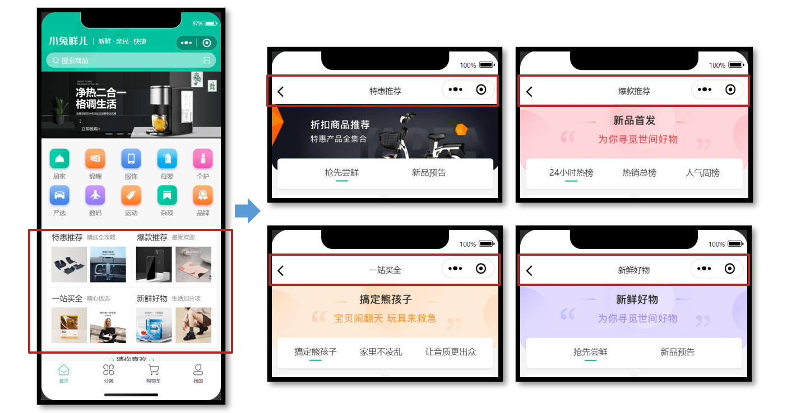

# 小兔鲜儿 - 推荐模块{#hot}

主要实现 Tabs 交互、多 Tabs 列表分页加载数据。

## 动态获取数据{#get-hot}

**参考效果**

推荐模块的布局结构是相同的，因此我们可以复用相同的页面及交互，只是所展示的数据不同。



**静态结构**

新建热门推荐页面文件，并在 `pages.json` 中添加路由（VS Code 插件自动完成）。

```vue
// /src/pages/hot/hot.vue
<script setup lang="ts">
// 热门推荐页 标题和url
const hotMap = [
  { type: '1', title: '特惠推荐', url: '/hot/preference' },
  { type: '2', title: '爆款推荐', url: '/hot/inVogue' },
  { type: '3', title: '一站买全', url: '/hot/oneStop' },
  { type: '4', title: '新鲜好物', url: '/hot/new' },
]
</script>

<template>
  <view class="viewport">
    <!-- 推荐封面图 -->
    <view class="cover">
      <image
        src="http://yjy-xiaotuxian-dev.oss-cn-beijing.aliyuncs.com/picture/2021-05-20/84abb5b1-8344-49ae-afc1-9cb932f3d593.jpg"
      ></image>
    </view>
    <!-- 推荐选项 -->
    <view class="tabs">
      <text class="text active">抢先尝鲜</text>
      <text class="text">新品预告</text>
    </view>
    <!-- 推荐列表 -->
    <scroll-view scroll-y class="scroll-view">
      <view class="goods">
        <navigator
          hover-class="none"
          class="navigator"
          v-for="goods in 10"
          :key="goods"
          :url="`/pages/goods/goods?id=`"
        >
          <image
            class="thumb"
            src="https://yanxuan-item.nosdn.127.net/5e7864647286c7447eeee7f0025f8c11.png"
          ></image>
          <view class="name ellipsis">不含酒精，使用安心爽肤清洁湿巾</view>
          <view class="price">
            <text class="symbol">¥</text>
            <text class="number">29.90</text>
          </view>
        </navigator>
      </view>
      <view class="loading-text">正在加载...</view>
    </scroll-view>
  </view>
</template>

<style lang="scss">
page {
  height: 100%;
  background-color: #f4f4f4;
}
.viewport {
  display: flex;
  flex-direction: column;
  height: 100%;
  padding: 180rpx 0 0;
  position: relative;
}
.cover {
  width: 750rpx;
  height: 225rpx;
  border-radius: 0 0 40rpx 40rpx;
  overflow: hidden;
  position: absolute;
  left: 0;
  top: 0;
}
.scroll-view {
  flex: 1;
}
.tabs {
  display: flex;
  justify-content: space-evenly;
  height: 100rpx;
  line-height: 90rpx;
  margin: 0 20rpx;
  font-size: 28rpx;
  border-radius: 10rpx;
  box-shadow: 0 4rpx 5rpx rgba(200, 200, 200, 0.3);
  color: #333;
  background-color: #fff;
  position: relative;
  z-index: 9;
  .text {
    margin: 0 20rpx;
    position: relative;
  }
  .active {
    &::after {
      content: '';
      width: 40rpx;
      height: 4rpx;
      transform: translate(-50%);
      background-color: #27ba9b;
      position: absolute;
      left: 50%;
      bottom: 24rpx;
    }
  }
}
.goods {
  display: flex;
  flex-wrap: wrap;
  justify-content: space-between;
  padding: 0 20rpx 20rpx;
  .navigator {
    width: 345rpx;
    padding: 20rpx;
    margin-top: 20rpx;
    border-radius: 10rpx;
    background-color: #fff;
  }
  .thumb {
    width: 305rpx;
    height: 305rpx;
  }
  .name {
    height: 88rpx;
    font-size: 26rpx;
  }
  .price {
    line-height: 1;
    color: #cf4444;
    font-size: 30rpx;
  }
  .symbol {
    font-size: 70%;
  }
  .decimal {
    font-size: 70%;
  }
}

.loading-text {
  text-align: center;
  font-size: 28rpx;
  color: #666;
  padding: 20rpx 0 50rpx;
}
</style>
```

### 获取页面参数{#get-query}

热门推荐页要根据页面参数区分需要获取的是哪种类型的推荐列表，然后再去调用相应的接口，来获取不同的数据，再渲染到页面当中。

项目首页（传递参数）

```vue
// src/pages/index/components/HotPanel.vue
<navigator :url="`/pages/hot/hot?type=${item.type}`">
  …省略  
</navigator>
```

热门推荐页（获取参数）

```vue
// src/pages/hot/hot.vue
<script setup lang="ts">
// 热门推荐页 标题和url
const hotMap = [
  { type: '1', title: '特惠推荐', url: '/hot/preference' },
  { type: '2', title: '爆款推荐', url: '/hot/inVogue' },
  { type: '3', title: '一站买全', url: '/hot/oneStop' },
  { type: '4', title: '新鲜好物', url: '/hot/new' },
]
// uniapp 获取页面参数
const query = defineProps<{
  type: string
}>()
// console.log(query)
const currHot = hotMap.find((v) => v.type === query.type)
// 动态设置标题
uni.setNavigationBarTitle({ title: currHot!.title })
</script>
```

传递不同的页面参数，动态设置推荐页标题。

### 获取数据{#get-hot-data}

**地址参数**

不同类型的推荐，需要调用不同的 API 接口：

| type | 推荐类型 | 接口路径        |
| ---- | -------- | --------------- |
| 1    | 特惠推荐 | /hot/preference |
| 2    | 爆款推荐 | /hot/inVogue    |
| 3    | 一站买全 | /hot/oneStop    |
| 4    | 新鲜好物 | /hot/new        |

**接口调用**

调用接口获取推荐商品列表的数据，然后再将这些数据渲染出来。

接口地址：见上表

请求方式：GET

请求参数：

**Query:**

| 字段名称 | 是否必须 | 默认值 | 备注                 |
| -------- | -------- | ------ | -------------------- |
| subType  | 否       | 无     | 推荐列表 Tab 项的 id |
| page     | 否       | 1      | 页码                 |
| pageSize | 否       | 10     | 每页商品数量         |

**请求封装**

经过分析，尽管不同类型推荐的请求 url 不同，但请求参数及响应格式都具有一致性，因此可以将接口的调用进行封装，参考代码如下所示：

```ts
import { http } from '@/utils/http'
import type { PageParams } from '@/types/global'

type HotParams = PageParams & {
  /** Tab 项的 id，默认查询全部 Tab 项的第 1 页数据 */
  subType?: string
}
/**
 * 通用热门推荐类型
 * @param url 请求地址
 * @param data 请求参数
 */
export const getHotRecommendAPI = (url: string, data?: HotParams) => {
  return http<HotResult>({
    method: 'GET',
    url,
    data,
  })
}
```

**类型声明**

电商项目较为常见商品展示，商品的类型是可复用的，封装到 `src/types/global.d.ts` 文件中：

```ts
// src/types/global.d.ts
/** 通用商品类型 */
export type GoodsItem = {
  /** 商品描述 */
  desc: string
  /** 商品折扣 */
  discount: number
  /** id */
  id: string
  /** 商品名称 */
  name: string
  /** 商品已下单数量 */
  orderNum: number
  /** 商品图片 */
  picture: string
  /** 商品价格 */
  price: number
}
```

其实猜你喜欢的商品类型也相同，可复用通用商品类型，封装到 `src/services/home.ts` 文件中：

```ts
// src/services/home.ts
import type { GoodsItem } from '@/types/global'

// GuessItem 和 GoodsItem 类型相同
export type GuessItem = GoodsItem
```

热门推荐类型如下，新建 `src/types/hot.d.ts` 文件：

```ts
import type { PageResult, GoodsItem } from './global'

/** 热门推荐 */
export type HotResult = {
  /** id信息 */
  id: string
  /** 活动图片 */
  bannerPicture: string
  /** 活动标题 */
  title: string
  /** 子类选项 */
  subTypes: SubTypeItem[]
}

/** 热门推荐-子类选项 */
export type SubTypeItem = {
  /** 子类id */
  id: string
  /** 子类标题 */
  title: string
  /** 子类对应的商品集合 */
  goodsItems: PageResult<GoodsItem>
}
```

最后，把获取到的数据结合模板语法渲染到页面中。

## 多 Tabs 分页加载{#tabs}

需要根据当前用户选中的 Tabs 加载对应的列表数据。


### Tabs 交互基础{#tabs-base}

当用户点击页面中的 Tab 后，切换展示相应的商品列表，功能相对简单，快速实现即可。

参考代码

```vue {2,3,13,14,25}
<script setup lang="ts">
// 高亮的下标
const activeIndex = ref(0)
</script>

<template>
  <!-- 推荐选项 -->
  <view class="tabs">
    <text
      class="text"
      v-for="(item, index) in subTypes"
      :key="item.id"
      :class="{ active: index === activeIndex }"
      @tap="activeIndex = index"
    >
      {{ item.title }}
    </text>
  </view>
  <!-- 推荐列表 -->
  <scroll-view
    scroll-y
    class="scroll-view"
    v-for="(item, index) in subTypes"
    :key="item.id"
    v-show="activeIndex === index"
  >
    ...省略
  </scroll-view>
</template>
```

### 加载选中 Tabs 分页数据{#tabs-load-mode}

根据当前用户选中的 Tabs 加载对应的列表数据。

**操作流程**

1. 根据高亮下标，获取对应列表数据
2. 提取列表的分页参数，用于发送请求
3. 滚动触底事件，页码累加，数组追加，退出判断等业务和常规分页基本一致

## 参考代码(总){#hot-code}

热门推荐页

```vue
<script setup lang="ts">
import { getHotRecommendAPI } from '@/services/hot'
import type { SubTypeItem } from '@/types/hot'
import { onLoad } from '@dcloudio/uni-app'
import { ref } from 'vue'

// 热门推荐页 标题和url
const hotMap = [
  { type: '1', title: '特惠推荐', url: '/hot/preference' },
  { type: '2', title: '爆款推荐', url: '/hot/inVogue' },
  { type: '3', title: '一站买全', url: '/hot/oneStop' },
  { type: '4', title: '新鲜好物', url: '/hot/new' },
]

// uniapp 获取页面参数
const query = defineProps<{
  type: string
}>()
// 获取当前推荐信息
const currHot = hotMap.find((v) => v.type === query.type)
// 动态设置标题
uni.setNavigationBarTitle({ title: currHot!.title })

// 推荐封面图
const bannerPicture = ref('')
// 推荐选项
const subTypes = ref<(SubTypeItem & { finish?: boolean })[]>([])
// 高亮的下标
const activeIndex = ref(0)
// 获取热门推荐数据
const getHotRecommendData = async () => {
  const res = await getHotRecommendAPI(currHot!.url, {
    // 技巧：环境变量，开发环境，修改初始页面方便测试分页结束
    page: import.meta.env.DEV ? 30 : 1,
    pageSize: 10,
  })
  // 保存封面
  bannerPicture.value = res.result.bannerPicture
  // 保存列表
  subTypes.value = res.result.subTypes
}

// 页面加载
onLoad(() => {
  getHotRecommendData()
})

// 滚动触底
const onScrolltolower = async () => {
  // 获取当前选项
  const currsubTypes = subTypes.value[activeIndex.value]
  // 分页条件
  if (currsubTypes.goodsItems.page < currsubTypes.goodsItems.pages) {
    // 当前页码累加
    currsubTypes.goodsItems.page++
  } else {
    // 标记已结束
    currsubTypes.finish = true
    // 退出并轻提示
    return uni.showToast({ icon: 'none', title: '没有更多数据了~' })
  }

  // 调用API传参
  const res = await getHotRecommendAPI(currHot!.url, {
    subType: currsubTypes.id,
    page: currsubTypes.goodsItems.page,
    pageSize: currsubTypes.goodsItems.pageSize,
  })
  // 新的列表选项
  const newsubTypes = res.result.subTypes[activeIndex.value]
  // 数组追加
  currsubTypes.goodsItems.items.push(...newsubTypes.goodsItems.items)
}
</script>

<template>
  <view class="viewport">
    <!-- 推荐封面图 -->
    <view class="cover">
      <image :src="bannerPicture"></image>
    </view>
    <!-- 推荐选项 -->
    <view class="tabs">
      <text
        v-for="(item, index) in subTypes"
        :key="item.id"
        class="text"
        :class="{ active: index === activeIndex }"
        @tap="activeIndex = index"
        >{{ item.title }}</text
      >
    </view>
    <!-- 推荐列表 -->
    <scroll-view
      v-for="(item, index) in subTypes"
      :key="item.id"
      v-show="activeIndex === index"
      scroll-y
      class="scroll-view"
      @scrolltolower="onScrolltolower"
    >
      <view class="goods">
        <navigator
          hover-class="none"
          class="navigator"
          v-for="goods in item.goodsItems.items"
          :key="goods.id"
          :url="`/pages/goods/goods?id=${goods.id}`"
        >
          <image class="thumb" :src="goods.picture"></image>
          <view class="name ellipsis">{{ goods.name }}</view>
          <view class="price">
            <text class="symbol">¥</text>
            <text class="number">{{ goods.price }}</text>
          </view>
        </navigator>
      </view>
      <view class="loading-text">
        {{ item.finish ? '没有更多数据了~' : '正在加载...' }}
      </view>
    </scroll-view>
  </view>
</template>
```
