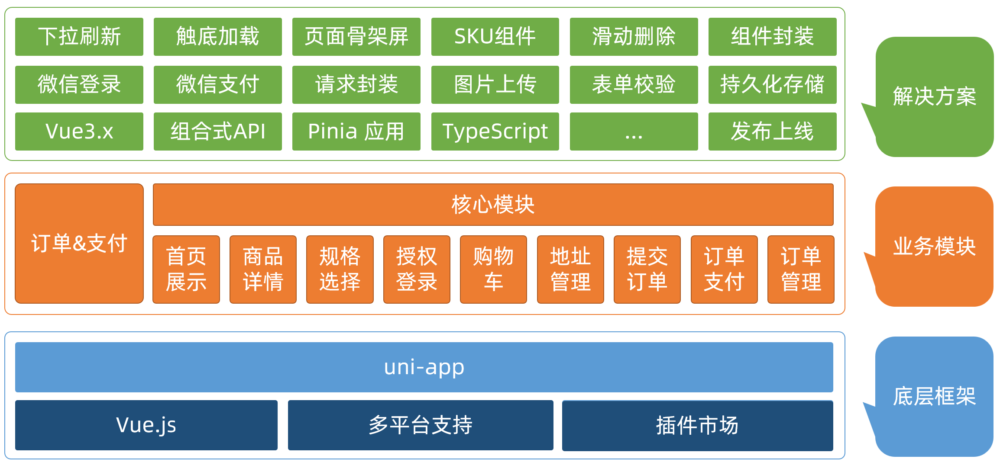
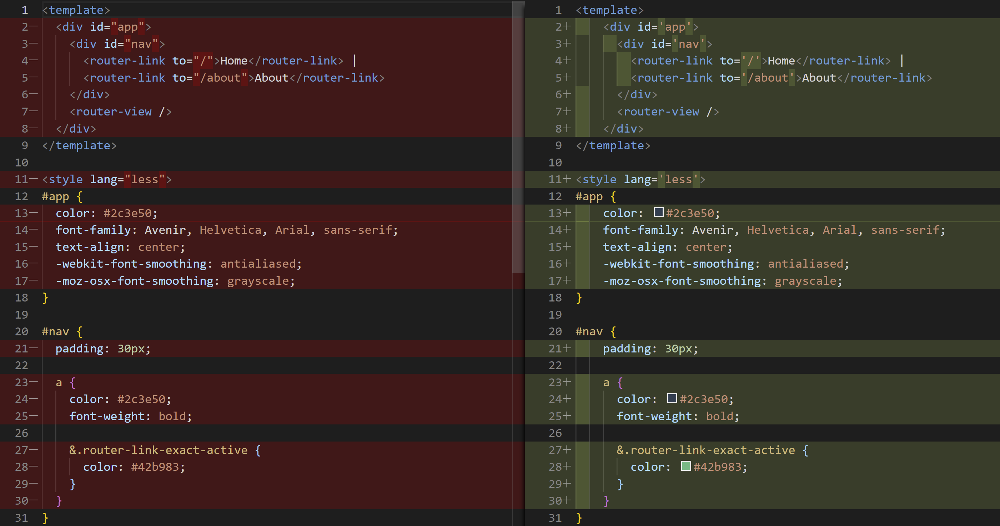

# 小兔鲜儿 - 项目起步

## 效果预览

<table>
  <tr>
    <td>体验小程序端</td>
    <td><a target="_blank" href="https://megasu.gitee.io/uniapp-shop-vue3-ts/">体验 H5 端</a></td>
    <td><a target="_blank" href="https://gitee.com/Megasu/uniapp-shop-vue3-ts/releases/download/v1.0.0/heima-shop.apk">体验 App 端(安卓)</a></td>
  </tr>
  <tr>
    <td></td>
    <td></td>
    <td></td>
  </tr>
</table>

## 资料说明

### 📀 视频学习

[https://www.bilibili.com/video/BV1Bp4y1379L/](https://www.bilibili.com/video/BV1Bp4y1379L/?share_source=copy_web&vd_source=2ac50d29193927b3c8597537dc4bc81d)

### 📗 接口文档

[https://www.apifox.cn/apidoc/shared-0e6ee326-d646-41bd-9214-29dbf47648fa/](https://www.apifox.cn/apidoc/shared-0e6ee326-d646-41bd-9214-29dbf47648fa/)

### ✏️ 在线笔记

[https://megasu.gitee.io/uni-app-shop-note/](https://megasu.gitee.io/uni-app-shop-note/)

### 📦 项目源码

[https://gitee.com/Megasu/uniapp-shop-vue3-ts/](https://gitee.com/Megasu/uniapp-shop-vue3-ts/)

## 项目架构

### 项目架构图



## 拉取项目模板代码

项目模板包含：目录结构，项目素材，代码风格。

### 模板地址

```sh
git clone http://git.itcast.cn/heimaqianduan/erabbit-uni-app-vue3-ts.git heima-shop
```

::: tip 注意事项
小程序真机预览需在 `manifest.json` 中添加微信小程序的 `appid`
:::

## 引入 uni-ui 组件库

### 操作步骤

安装 [uni-ui 组件库](https://uniapp.dcloud.net.cn/component/uniui/quickstart.html#npm安装)

```sh
pnpm i @dcloudio/uni-ui
```

**配置自动导入组件**

```json
// pages.json
{
  // 组件自动导入
  "easycom": {
    "autoscan": true,
    "custom": {
      // uni-ui 规则如下配置  // [!code ++]
      "^uni-(.*)": "@dcloudio/uni-ui/lib/uni-$1/uni-$1.vue" // [!code ++]
    }
  },
  "pages": [
    // …省略
  ]
}
```

**安装类型声明文件**

```sh
pnpm i -D @uni-helper/uni-ui-types
```

**配置类型声明文件**

```json
// tsconfig.json
{
  "compilerOptions": {
    // ...
    "types": [
      "@dcloudio/types", // uni-app API 类型
      "miniprogram-api-typings", // 原生微信小程序类型
      "@uni-helper/uni-app-types", // uni-app 组件类型
      "@uni-helper/uni-ui-types" // uni-ui 组件类型  // [!code ++]
    ]
  },
  // vue 编译器类型，校验标签类型
  "vueCompilerOptions": {
    "nativeTags": ["block", "component", "template", "slot"]
  }
}
```

## 小程序端 Pinia 持久化

说明：`Pinia` 用法与 `Vue3` 项目完全一致，`uni-app` 项目仅需解决**持久化插件兼容性**问题。

### 持久化存储插件

安装持久化存储插件： [pinia-plugin-persistedstate](https://prazdevs.github.io/pinia-plugin-persistedstate/zh/guide/config.html#storage)

```sh
pnpm i pinia-plugin-persistedstate
```

插件默认使用 `localStorage` 实现持久化，小程序端不兼容，需要替换持久化 API。

### 基本用法

::: code-group

```ts {28-31} [stores/modules/member.ts]
import { defineStore } from 'pinia'
import { ref } from 'vue'

// 定义 Store
export const useMemberStore = defineStore(
  'member',
  () => {
    // 会员信息
    const profile = ref<any>()

    // 保存会员信息，登录时使用
    const setProfile = (val: any) => {
      profile.value = val
    }

    // 清理会员信息，退出时使用
    const clearProfile = () => {
      profile.value = undefined
    }

    // 记得 return
    return {
      profile,
      setProfile,
      clearProfile,
    }
  },
  // TODO: 持久化
  {
    persist: true,
  },
)
```

```ts {2,7} [stores/index.ts]
import { createPinia } from 'pinia'
import persist from 'pinia-plugin-persistedstate'

// 创建 pinia 实例
const pinia = createPinia()
// 使用持久化存储插件
pinia.use(persist)

// 默认导出，给 main.ts 使用
export default pinia

// 模块统一导出
export * from './modules/member'
```

```ts {2,8} [main.ts]
import { createSSRApp } from 'vue'
import pinia from './stores'

import App from './App.vue'
export function createApp() {
  const app = createSSRApp(App)

  app.use(pinia)
  return {
    app,
  }
}
```

:::

### 多端兼容

**网页端持久化 API**

```ts
// 网页端API
localStorage.setItem()
localStorage.getItem()
```

**多端持久化 API**

```ts
// 兼容多端API
uni.setStorageSync()
uni.getStorageSync()
```

**参考代码**

```ts {7-20}
// stores/modules/member.ts
export const useMemberStore = defineStore(
  'member',
  () => {
    //…省略
  },
  {
    // 配置持久化
    persist: {
      // 调整为兼容多端的API
      storage: {
        setItem(key, value) {
          uni.setStorageSync(key, value) // [!code warning]
        },
        getItem(key) {
          return uni.getStorageSync(key) // [!code warning]
        },
      },
    },
  },
)
```

## uni.request 请求封装

### 请求和上传文件拦截器

**uniapp 拦截器**： [uni.addInterceptor](https://uniapp.dcloud.net.cn/api/interceptor.html)

**接口说明**：[接口文档](https://www.apifox.cn/apidoc/shared-0e6ee326-d646-41bd-9214-29dbf47648fa/doc-1521513)

::: tip 实现需求

1. 拼接基础地址
2. 设置超时时间
3. 添加请求头标识
4. 添加 token
   :::

**参考代码**

```ts
// src/utils/http.ts

// 请求基地址
const baseURL = 'https://pcapi-xiaotuxian-front-devtest.itheima.net'

// 拦截器配置
const httpInterceptor = {
  // 拦截前触发
  invoke(options: UniApp.RequestOptions) {
    // 1. 非 http 开头需拼接地址
    if (!options.url.startsWith('http')) {
      options.url = baseURL + options.url
    }
    // 2. 请求超时
    options.timeout = 10000
    // 3. 添加小程序端请求头标识
    options.header = {
      'source-client': 'miniapp',
      ...options.header,
    }
    // 4. 添加 token 请求头标识
    const memberStore = useMemberStore()
    const token = memberStore.profile?.token
    if (token) {
      options.header.Authorization = token
    }
  },
}

// 拦截 request 请求
uni.addInterceptor('request', httpInterceptor)
// 拦截 uploadFile 文件上传
uni.addInterceptor('uploadFile', httpInterceptor)
```

::: warning 注意事项

微信小程序端，需登录 [微信公众平台](https://mp.weixin.qq.com) 配置合法域名 👇

`https://pcapi-xiaotuxian-front-devtest.itheima.net`

:::

### 封装 Promise 请求函数

::: tip 实现需求

1. 返回 Promise 对象，用于处理返回值类型
2. 成功 resolve
   1. 提取数据
   2. 添加泛型
3. 失败 reject
   1. 401 错误
   2. 其他错误
   3. 网络错误

:::

**参考代码**

```ts
/**
 * 请求函数
 * @param  UniApp.RequestOptions
 * @returns Promise
 *  1. 返回 Promise 对象，用于处理返回值类型
 *  2. 获取数据成功
 *    2.1 提取核心数据 res.data
 *    2.2 添加类型，支持泛型
 *  3. 获取数据失败
 *    3.1 401错误  -> 清理用户信息，跳转到登录页
 *    3.2 其他错误 -> 根据后端错误信息轻提示
 *    3.3 网络错误 -> 提示用户换网络
 */
type Data<T> = {
  code: string
  msg: string
  result: T
}
// 2.2 添加类型，支持泛型
export const http = <T>(options: UniApp.RequestOptions) => {
  // 1. 返回 Promise 对象
  return new Promise<Data<T>>((resolve, reject) => {
    uni.request({
      ...options,
      // 响应成功
      success(res) {
        // 状态码 2xx，参考 axios 的设计
        if (res.statusCode >= 200 && res.statusCode < 300) {
          // 2.1 提取核心数据 res.data
          resolve(res.data as Data<T>)
        } else if (res.statusCode === 401) {
          // 401错误  -> 清理用户信息，跳转到登录页
          const memberStore = useMemberStore()
          memberStore.clearProfile()
          uni.navigateTo({ url: '/pages/login/login' })
          reject(res)
        } else {
          // 其他错误 -> 根据后端错误信息轻提示
          uni.showToast({
            icon: 'none',
            title: (res.data as Data<T>).msg || '请求错误',
          })
          reject(res)
        }
      },
      // 响应失败
      fail(err) {
        uni.showToast({
          icon: 'none',
          title: '网络错误，换个网络试试',
        })
        reject(err)
      },
    })
  })
}
```

## 【拓展】代码规范

**为什么需要代码规范**

如果没有统一代码风格，团队协作不便于查看代码提交时所做的修改。



### 统一代码风格

- 安装 `eslint` + `prettier`

```sh
pnpm i -D eslint prettier eslint-plugin-vue @vue/eslint-config-prettier @vue/eslint-config-typescript @rushstack/eslint-patch @vue/tsconfig
```

- 新建 `.eslintrc.cjs` 文件，添加以下 `eslint` 配置

```js
/* eslint-env node */
require('@rushstack/eslint-patch/modern-module-resolution')

module.exports = {
  root: true,
  extends: [
    'plugin:vue/vue3-essential',
    'eslint:recommended',
    '@vue/eslint-config-typescript',
    '@vue/eslint-config-prettier',
  ],
  // 小程序全局变量
  globals: {
    uni: true,
    wx: true,
    WechatMiniprogram: true,
    getCurrentPages: true,
    getApp: true,
    UniApp: true,
    UniHelper: true,
    App: true,
    Page: true,
    Component: true,
    AnyObject: true,
  },
  parserOptions: {
    ecmaVersion: 'latest',
  },
  rules: {
    'prettier/prettier': [
      'warn',
      {
        singleQuote: true,
        semi: false,
        printWidth: 100,
        trailingComma: 'all',
        endOfLine: 'auto',
      },
    ],
    'vue/multi-word-component-names': ['off'],
    'vue/no-setup-props-destructure': ['off'],
    'vue/no-deprecated-html-element-is': ['off'],
    '@typescript-eslint/no-unused-vars': ['off'],
  },
}
```

- 配置 `package.json`

```json
{
  "script": {
    // ... 省略 ...
    "lint": "eslint . --ext .vue,.js,.ts --fix --ignore-path .gitignore"
  }
}
```

- 运行

```sh
pnpm lint
```

::: tip 温馨提示
到此，你已完成 `eslint` + `prettier` 的配置。
:::

### Git 工作流规范

- 安装并初始化 `husky`

::: code-group

```sh [pnpx]
pnpm dlx husky-init
```

```sh [npx]
npx husky-init
```

:::

- 安装 `lint-staged`

```sh
pnpm i -D lint-staged
```

- 配置 `package.json`

```json
{
  "script": {
    // ... 省略 ...
  },
  "lint-staged": {
    "*.{vue,ts,js}": ["eslint --fix"]
  }
}
```

- 修改 `.husky/pre-commit` 文件

```diff
npm test   // [!code --]
npm run lint-staged     // [!code ++]
```

::: tip 温馨提示
到此，你已完成 `husky` + `lint-staged` 的配置。
:::
