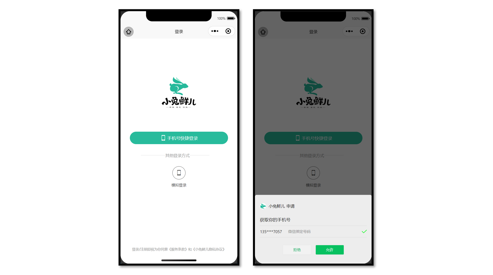
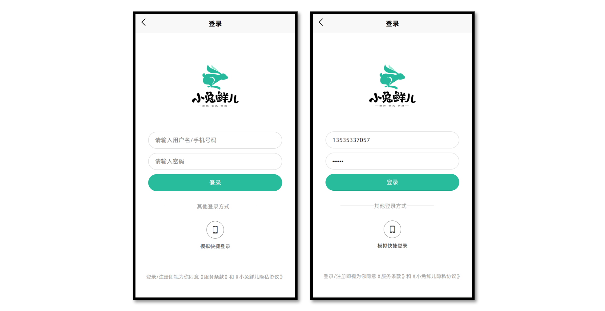

# 小兔鲜儿 - 微信登录

涉及知识点：微信授权登录，文件上传，Store 状态管理等。

## 微信登录

微信小程序的**开放能力**，允许开发者获取微信用户的基本信息（昵称、性别、手机号码等），开发者常用来实现注册/登录的功能。

### 登录方式

常见登录/注册方式：

1. 用户名/手机号 + 密码
2. 手机号 + 验证码
3. 授权登录

实际开发过程中常常需要实现以上的一种或多种方式，我们的项目主要实现**授权登录**。

**微信授权登录**

用户在使用小程序时，其实已登录微信，其本质上就是：**微信授权给小程序读取微信用户信息**。



**传统登录方式**

传统登录方式，一般是通过输入密码或者手机验证码实现登录。



温馨提示：接口文档中提供练习使用的登录接口，大家可在课后自行完成。

### 静态结构

登录页

```vue
// src/pages/login/login.vue

<script setup lang="ts">
//
</script>

<template>
  <view class="viewport">
    <view class="logo">
      <image
        src="https://pcapi-xiaotuxian-front-devtest.itheima.net/miniapp/images/logo_icon.png"
      ></image>
    </view>
    <view class="login">
      <button class="button phone">
        <text class="icon icon-phone"></text>
        手机号快捷登录
      </button>
      <view class="extra">
        <view class="caption">
          <text>其他登录方式</text>
        </view>
        <view class="options">
          <button>
            <text class="icon icon-phone">模拟快捷登录</text>
          </button>
        </view>
      </view>
      <view class="tips">登录/注册即视为你同意《服务条款》和《小兔鲜儿隐私协议》</view>
    </view>
  </view>
</template>

<style lang="scss">
page {
  height: 100%;
}

.viewport {
  display: flex;
  flex-direction: column;
  height: 100%;
  padding: 20rpx 40rpx;
}

.logo {
  flex: 1;
  text-align: center;
  image {
    width: 220rpx;
    height: 220rpx;
    margin-top: 15vh;
  }
}

.login {
  display: flex;
  flex-direction: column;
  height: 60vh;
  padding: 40rpx 20rpx 20rpx;

  .button {
    display: flex;
    align-items: center;
    justify-content: center;
    width: 100%;
    height: 80rpx;
    font-size: 28rpx;
    border-radius: 72rpx;
    color: #fff;
    .icon {
      font-size: 40rpx;
      margin-right: 6rpx;
    }
  }

  .phone {
    background-color: #28bb9c;
  }

  .wechat {
    background-color: #06c05f;
  }

  .extra {
    flex: 1;
    padding: 70rpx 70rpx 0;
    .caption {
      width: 440rpx;
      line-height: 1;
      border-top: 1rpx solid #ddd;
      font-size: 26rpx;
      color: #999;
      position: relative;
      text {
        transform: translate(-40%);
        background-color: #fff;
        position: absolute;
        top: -12rpx;
        left: 50%;
      }
    }

    .options {
      display: flex;
      justify-content: center;
      align-items: center;
      margin-top: 70rpx;
      button {
        padding: 0;
        background-color: transparent;
      }
    }

    .icon {
      font-size: 24rpx;
      color: #444;
      display: flex;
      flex-direction: column;
      align-items: center;

      &::before {
        display: flex;
        align-items: center;
        justify-content: center;
        width: 80rpx;
        height: 80rpx;
        margin-bottom: 6rpx;
        font-size: 40rpx;
        border: 1rpx solid #444;
        border-radius: 50%;
      }
    }
    .icon-weixin::before {
      border-color: #06c05f;
      color: #06c05f;
    }
  }
}

.tips {
  position: absolute;
  bottom: 80rpx;
  left: 20rpx;
  right: 20rpx;
  font-size: 22rpx;
  color: #999;
  text-align: center;
}
</style>
```

### 获取登录凭证{#get-code}

前端：调用 [wx.login()](https://developers.weixin.qq.com/miniprogram/dev/api/open-api/login/wx.login.html) 接口获取登录凭证（code）。

后端：通过凭证（code）向微信服务器换取用户登录态信息。

```vue{7}
<script setup lang="ts">
import { onLoad } from '@dcloudio/uni-app'

// 获取 code 登录凭证
let code = ''
onLoad(async () => {
  const res = await wx.login()
  code = res.code
})
</script>
```

::: warning 注意
code 的获取**不要**在 getphonenumber 事件回调函数调用，否则可能会出现错误！！！
:::

::: tip 温馨提示
用户登录态信息，不包含用户昵称、性别、手机号码等信息，作用是用于[后端服务器与微信服务器通讯](https://developers.weixin.qq.com/miniprogram/dev/framework/open-ability/login.html)。
:::

### 获取手机号码{#get-phonenumber}

出于安全限制，小程序【规定】想获取用户的手机号，必须由用户主动【点击按钮】并【允许申请】才可获取加密的手机号信息。


前端：提供 `open-type` 按钮，在事件处理函数中获取加密的手机号信息。

后端：解密手机号信息，把手机号和用户登录态关联在一起。

```vue{3-5,13-14}
<script setup lang="ts">
// 获取用户手机号码
const onGetphonenumber: UniHelper.ButtonOnGetphonenumber = (ev) => {
  console.log(ev)
}
</script>

<template>
  <view class="viewport">
    <view class="login">
      <button
        class="button phone"
        open-type="getPhoneNumber"
        @getphonenumber="onGetphonenumber"
      >
        <text class="icon icon-phone"></text>
        手机号快捷登录
      </button>
    </view>
  </view>
</template>
```

::: warning 常见问题：

Q：为什么我无法唤起获取手机号的界面？

A：获取手机号功能**目前针对非个人开发者**，所以个人开发者无法唤起获取手机号界面，[详见文档](https://developers.weixin.qq.com/miniprogram/dev/framework/open-ability/getPhoneNumber.html)。

:::

项目提供了[模拟登录 API ](https://apifox.com/apidoc/shared-0e6ee326-d646-41bd-9214-29dbf47648fa/api-43426851) 用于练习。

### 微信登录接口(生产环境){#get-login-api}

**接口调用**

接口地址：/login/wxMin

请求方式：POST

请求参数：

**Body**

| 字段名称      | 是否必须 | 默认值 | 备注                        |
| ------------- | -------- | ------ | --------------------------- |
| code          | 是       | 无     | wx.login 获取               |
| iv            | 是       | 无     | getphonenumber 事件回调获取 |
| encryptedData | 是       | 无     | getphonenumber 事件回调获取 |

**请求封装**

```ts
// src/services/login.ts

import type { LoginResult } from '@/types/member'
import { http } from '@/utils/http'

type LoginParams = {
  code: string
  encryptedData: string
  iv: string
}
/**
 * 小程序登录
 * @param data 请求参数
 */
export const postLoginWxMinAPI = (data: LoginParams) => {
  return http<LoginResult>({
    method: 'POST',
    url: '/login/wxMin',
    data,
  })
}
```

**类型声明**

```ts
// src/types/member.d.ts

/** 小程序登录 登录用户信息 */
export type LoginResult = {
  /** 用户ID */
  id: number
  /** 头像  */
  avatar: string
  /** 账户名  */
  account: string
  /** 昵称 */
  nickname?: string
  /** 手机号 */
  mobile: string
  /** 登录凭证 */
  token: string
}
```

**参考代码**

小兔鲜儿项目采用常见的 **登录凭证 + 手机号** 实现授权登录。

```vue{10,31,32}
// src/pages/login/login.vue

<script setup lang="ts">
import { postLoginWxMinAPI } from '@/services/login'
import { onLoad } from '@dcloudio/uni-app'

// 获取 code 登录凭证
let code = ''
onLoad(async () => {
  const res = await wx.login()
  code = res.code
})

// 获取用户手机号码
const onGetphonenumber: UniHelper.ButtonOnGetphonenumber = async (ev) => {
  // 获取参数
  const encryptedData = ev.detail.encryptedData!
  const iv = ev.detail.iv!
  // 登录请求
  await postLoginWxMinAPI({code, encryptedData, iv})
  // 成功提示
  uni.showToast({ icon: 'none', title: '登录成功' })
}
</script>

<template>
  <view class="viewport">
    <view class="login">
      <button
        class="button phone"
        open-type="getPhoneNumber"
        @getphonenumber="onGetphonenumber"
      >
        <text class="icon icon-phone"></text>
        手机号快捷登录
      </button>
    </view>
  </view>
</template>
```

### 模拟手机登录(开发环境){#login-simle}

获取手机号功能，**目前针对非个人开发者，且完成了认证的小程序开放**，[详见文档](https://developers.weixin.qq.com/miniprogram/dev/framework/open-ability/getPhoneNumber.html)。

::: tip 温馨提示
为了更好实现登录后续的业务，后端提供了一个内部测试用的接口，只需要传手机号即可实现快捷登录。
:::

**请求接口**

接口地址：/login/wxMin/simple

请求方式：POST

请求参数：

**Body**

| 字段名称    | 是否必须 | 默认值 | 备注         |
| ----------- | -------- | ------ | ------------ |
| phoneNumber | 是       | 无     | 模拟的手机号 |

该接口跟微信登录接口返回的数据格式是相同的。

**请求封装**

```ts
/**
 * 小程序登录_内测版
 * @param phoneNumber 模拟手机号码
 */
export const postLoginWxMinSimpleAPI = (phoneNumber: string) => {
  return http<LoginResult>({
    method: 'POST',
    url: '/login/wxMin/simple',
    data: {
      phoneNumber,
    },
  })
}
```

### 用户信息持久化存储

Pinia 的持久化存储插件在 [项目起步](/rabbit-shop/#pinia-persist) 模块已经搭建完成，现在只需要在用户登录成功后，补充 TS 类型声明并保存用户信息即可。

**参考代码**

Store

```ts{3,12,15}
// src/stores/modules/member.ts

import type { LoginResult } from '@/types/member'
import { defineStore } from 'pinia'
import { ref } from 'vue'

// 定义 Store
export const useMemberStore = defineStore(
  'member',
  () => {
    // 会员信息
    const profile = ref<LoginResult>()  // [!code ++]

    // 保存会员信息，登录时使用
    const setProfile = (val: LoginResult) => {  // [!code ++]
      profile.value = val
    }

    // 清理会员信息，退出时使用
    const clearProfile = () => {
      profile.value = undefined
    }

    // 记得 return
    return { profile, setProfile, clearProfile }
  },
  {
    // 小程序端配置
    persist: {
      storage: {
        getItem(key) {
          return uni.getStorageSync(key)
        },
        setItem(key, value) {
          uni.setStorageSync(key, value)
        },
      },
    },
  },
)
```

登录页

```vue{3,30,31}
<script setup lang="ts">
import { postLoginWxMinAPI, postLoginWxMinSimpleAPI } from '@/services/login'
import { useMemberStore } from '@/stores'
import type { LoginResult } from '@/types/member'
import { onLoad } from '@dcloudio/uni-app'

// 获取 code 登录凭证
let code = ''
onLoad(async () => {
  const res = await wx.login()
  code = res.code
})

// 获取用户手机号码（企业中写法）
const onGetphonenumber: UniHelper.ButtonOnGetphonenumber = async (ev) => {
  const encryptedData = ev.detail!.encryptedData!
  const iv = ev.detail!.iv!
  const res = await postLoginWxMinAPI({ code, encryptedData, iv })
  loginSuccess(res.result)
}

// 模拟手机号码快捷登录（开发练习）
const onGetphonenumberSimple = async () => {
  const res = await postLoginWxMinSimpleAPI('13123456789')
  loginSuccess(res.result)
}

const loginSuccess = (profile: LoginResult) => {
  // 保存会员信息
  const memberStore = useMemberStore()  // [!code ++]
  memberStore.setProfile(profile)  // [!code ++]
  // 成功提示
  uni.showToast({ icon: 'success', title: '登录成功' })
  setTimeout(() => {
    // 页面跳转
    uni.switchTab({ url: '/pages/my/my' })
  }, 500)
}
</script>
```

到此，微信登录模块已经完成，接下来进入到用户模块。
