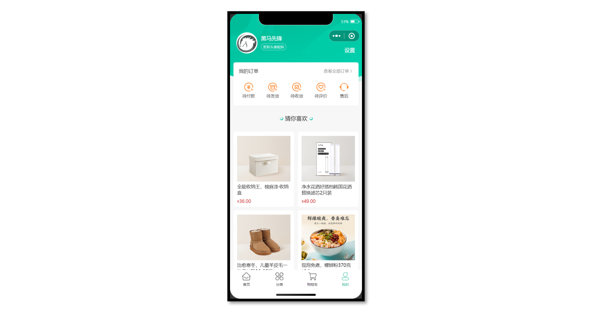
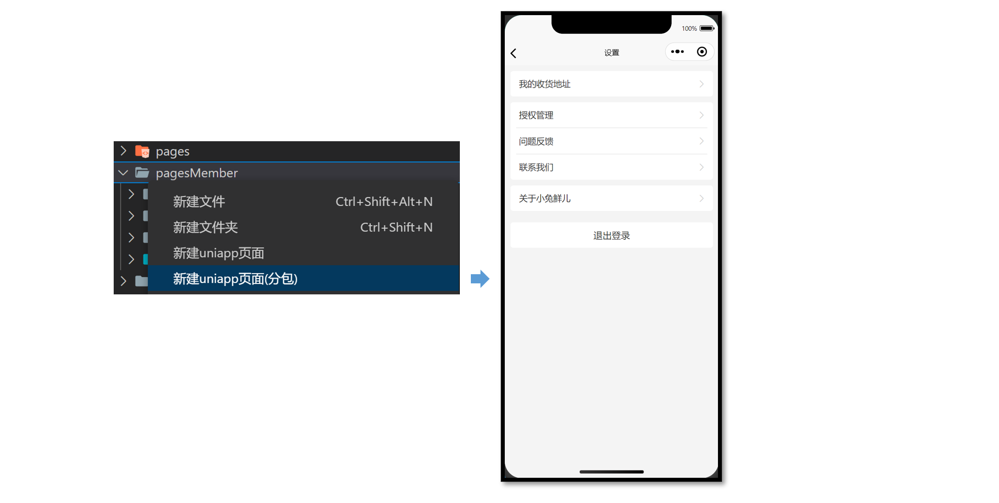
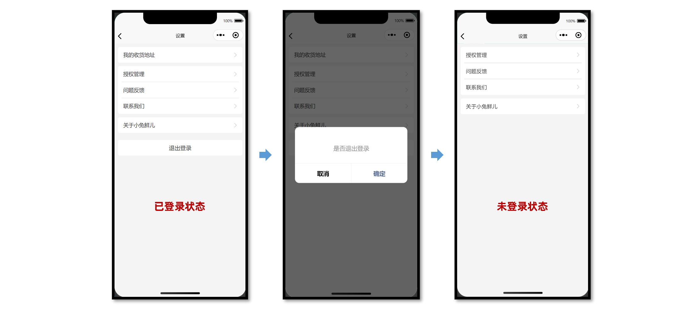
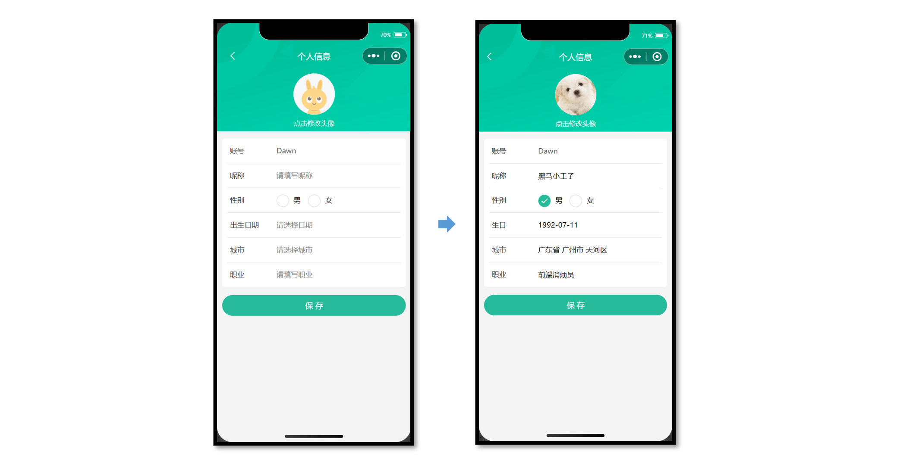
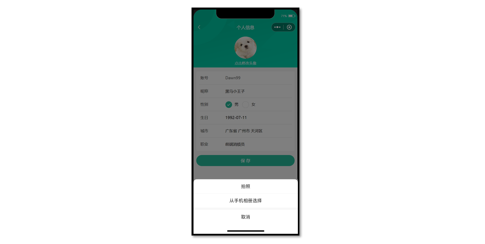

# 小兔鲜儿 - 用户模块

在用户登录/注册成功后，展示会员信息，更新会员信息。

## 会员中心页(我的)

主要实现两部分业务：

1. 渲染当前登录会员的昵称和头像，从 Store 中获取。
2. 猜你喜欢分页加载，可封装成**组合式函数**实现复用逻辑。



### 静态结构

会员中心页，替换掉原本的练习代码。

```vue
// src/pages/my/my.vue

<script setup lang="ts">
// 获取屏幕边界到安全区域距离
const { safeAreaInsets } = uni.getSystemInfoSync()
// 订单选项
const orderTypes = [
  { type: 1, text: '待付款', icon: 'icon-currency' },
  { type: 2, text: '待发货', icon: 'icon-gift' },
  { type: 3, text: '待收货', icon: 'icon-check' },
  { type: 4, text: '待评价', icon: 'icon-comment' },
]
</script>

<template>
  <scroll-view class="viewport" scroll-y enable-back-to-top>
    <!-- 个人资料 -->
    <view class="profile" :style="{ paddingTop: safeAreaInsets!.top + 'px' }">
      <!-- 情况1：已登录 -->
      <view class="overview" v-if="false">
        <navigator url="/pagesMember/profile/profile" hover-class="none">
          <image
            class="avatar"
            mode="aspectFill"
            src="https://pcapi-xiaotuxian-front-devtest.itheima.net/miniapp/uploads/avatar_3.jpg"
          ></image>
        </navigator>
        <view class="meta">
          <view class="nickname"> 黑马程序员 </view>
          <navigator class="extra" url="/pagesMember/profile/profile" hover-class="none">
            <text class="update">更新头像昵称</text>
          </navigator>
        </view>
      </view>
      <!-- 情况2：未登录 -->
      <view class="overview" v-else>
        <navigator url="/pages/login/login" hover-class="none">
          <image
            class="avatar gray"
            mode="aspectFill"
            src="http://yjy-xiaotuxian-dev.oss-cn-beijing.aliyuncs.com/picture/2021-04-06/db628d42-88a7-46e7-abb8-659448c33081.png"
          ></image>
        </navigator>
        <view class="meta">
          <navigator url="/pages/login/login" hover-class="none" class="nickname">
            未登录
          </navigator>
          <view class="extra">
            <text class="tips">点击登录账号</text>
          </view>
        </view>
      </view>
      <navigator class="settings" url="/pagesMember/settings/settings" hover-class="none">
        设置
      </navigator>
    </view>
    <!-- 我的订单 -->
    <view class="orders">
      <view class="title">
        我的订单
        <navigator class="navigator" url="/pagesOrder/list/list?type=0" hover-class="none">
          查看全部订单<text class="icon-right"></text>
        </navigator>
      </view>
      <view class="section">
        <!-- 订单 -->
        <navigator
          v-for="item in orderTypes"
          :key="item.type"
          :class="item.icon"
          :url="`/pagesOrder/list/list?type=${item.type}`"
          class="navigator"
          hover-class="none"
        >
          {{ item.text }}
        </navigator>
        <!-- 客服 -->
        <button class="contact icon-handset" open-type="contact">售后</button>
      </view>
    </view>
    <!-- 猜你喜欢 -->
    <view class="guess">
      <XtxGuess ref="guessRef" />
    </view>
  </scroll-view>
</template>

<style lang="scss">
page {
  height: 100%;
  overflow: hidden;
  background-color: #f7f7f8;
}

.viewport {
  height: 100%;
  background-repeat: no-repeat;
  background-image: url(https://pcapi-xiaotuxian-front-devtest.itheima.net/miniapp/images/center_bg.png);
  background-size: 100% auto;
}

/* 用户信息 */
.profile {
  margin-top: 20rpx;
  position: relative;

  .overview {
    display: flex;
    height: 120rpx;
    padding: 0 36rpx;
    color: #fff;
  }

  .avatar {
    width: 120rpx;
    height: 120rpx;
    border-radius: 50%;
    background-color: #eee;
  }

  .gray {
    filter: grayscale(100%);
  }

  .meta {
    display: flex;
    flex-direction: column;
    justify-content: center;
    align-items: flex-start;
    line-height: 30rpx;
    padding: 16rpx 0;
    margin-left: 20rpx;
  }

  .nickname {
    max-width: 350rpx;
    margin-bottom: 16rpx;
    font-size: 30rpx;

    overflow: hidden;
    text-overflow: ellipsis;
    white-space: nowrap;
  }

  .extra {
    display: flex;
    font-size: 20rpx;
  }

  .tips {
    font-size: 22rpx;
  }

  .update {
    padding: 3rpx 10rpx 1rpx;
    color: rgba(255, 255, 255, 0.8);
    border: 1rpx solid rgba(255, 255, 255, 0.8);
    margin-right: 10rpx;
    border-radius: 30rpx;
  }

  .settings {
    position: absolute;
    bottom: 0;
    right: 40rpx;
    font-size: 30rpx;
    color: #fff;
  }
}

/* 我的订单 */
.orders {
  position: relative;
  z-index: 99;
  padding: 30rpx;
  margin: 50rpx 20rpx 0;
  background-color: #fff;
  border-radius: 10rpx;
  box-shadow: 0 4rpx 6rpx rgba(240, 240, 240, 0.6);

  .title {
    height: 40rpx;
    line-height: 40rpx;
    font-size: 28rpx;
    color: #1e1e1e;

    .navigator {
      font-size: 24rpx;
      color: #939393;
      float: right;
    }
  }

  .section {
    width: 100%;
    display: flex;
    justify-content: space-between;
    padding: 40rpx 20rpx 10rpx;
    .navigator,
    .contact {
      text-align: center;
      font-size: 24rpx;
      color: #333;
      &::before {
        display: block;
        font-size: 60rpx;
        color: #ff9545;
      }
    }
    .contact {
      padding: 0;
      margin: 0;
      border: 0;
      background-color: transparent;
      line-height: inherit;
    }
  }
}

/* 猜你喜欢 */
.guess {
  background-color: #f7f7f8;
  margin-top: 20rpx;
}
</style>
```

### 参考代码

封装猜你喜欢组合式函数

```ts
// src/composables/index.ts

import type { XtxGuessInstance } from '@/types/components'
import { ref } from 'vue'

/**
 * 猜你喜欢组合式函数
 */
export const useGuessList = () => {
  // 获取猜你喜欢组件实例
  const guessRef = ref<XtxGuessInstance>()

  // 滚动触底事件
  const onScrolltolower = () => {
    guessRef.value?.getMore()
  }

  // 返回 ref 和事件处理函数
  return { guessRef, onScrolltolower }
}
```

会员中心页(我的)：渲染用户头像，昵称，完善猜你喜欢分页加载。

```vue {7,10,18,23,25,29,43}
// src/pages/my/my.vue

<script setup lang="ts">
import { useMemberStore } from '@/stores'

// 获取会员信息
const memberStore = useMemberStore() // [!code ++]

// 猜你喜欢组合式函数
const { guessRef, onScrolltolower } = useGuessList() // [!code ++]
</script>

<template>
  <scroll-view class="viewport" scroll-y enable-back-to-top @scrolltolower="onScrolltolower">
    <!-- 个人资料 -->
    <view class="profile" :style="{ paddingTop: safeAreaInsets!.top + 'px' }">
      <!-- 情况1：已登录 -->
      <view class="overview" v-if="memberStore.profile">
        <navigator url="/pagesMember/profile/profile" hover-class="none">
          <image class="avatar" :src="memberStore.profile.avatar" mode="aspectFill"></image>
        </navigator>
        <view class="meta">
          <view class="nickname">
            {{ memberStore.profile.nickname || memberStore.profile.account }}
          </view>
          <navigator class="extra" url="/pagesMember/profile/profile" hover-class="none">
            <text class="update">更新头像昵称</text>
          </navigator>
        </view>
      </view>
      <!-- 情况2：未登录 -->
      <view class="overview" v-else> ...省略 </view>
    </view>
    <!-- 猜你喜欢 -->
    <view class="guess">
      <XtxGuess ref="guessRef" />
    </view>
  </scroll-view>
</template>
```

## 会员设置页

会员模块的二级页面，按模块处理成分包页面，有以下好处：

1. 按模块管理页面，方便项目维护。
2. 减少主包体积，用到的时候再加载分包，属于**性能优化**解决方案。



::: tip 温馨提示

通过 VS Code 插件 [uni-create-view](https://marketplace.visualstudio.com/items?itemName=mrmaoddxxaa.create-uniapp-view) 可以快速新建分包页面，自动配置分包路由。

:::

### 分包预下载

当用户进入【我的】页面时，由框架自动预下载【会员模块】的分包，提升进入后续分包页面时的启动速度。

```json {22-27}
// src/pages.json

{
  // ...省略
  // 分包加载规则
  "subPackages": [
    {
      // 子包的根目录
      "root": "pagesMember",
      // 页面路径和窗口表现
      "pages": [
        {
          "path": "settings/settings",
          "style": {
            "navigationBarTitleText": "设置"
          }
        }
      ]
    }
  ],
  // 分包预下载规则
  "preloadRule": {
    "pages/my/my": {
      "network": "all", // [!code ++]
      "packages": ["pagesMember"] // [!code ++]
    }
  }
}
```

### 静态结构

设置页：`src/pagesMember/settings/settings.vue`

```vue
<script setup lang="ts">
//
</script>

<template>
  <view class="viewport">
    <!-- 列表1 -->
    <view class="list" v-if="true">
      <navigator url="/pagesMember/address/address" hover-class="none" class="item arrow">
        我的收货地址
      </navigator>
    </view>
    <!-- 列表2 -->
    <view class="list">
      <button hover-class="none" class="item arrow" open-type="openSetting">授权管理</button>
      <button hover-class="none" class="item arrow" open-type="feedback">问题反馈</button>
      <button hover-class="none" class="item arrow" open-type="contact">联系我们</button>
    </view>
    <!-- 列表3 -->
    <view class="list">
      <navigator hover-class="none" class="item arrow" url=" ">关于小兔鲜儿</navigator>
    </view>
    <!-- 操作按钮 -->
    <view class="action">
      <view class="button">退出登录</view>
    </view>
  </view>
</template>

<style lang="scss">
page {
  background-color: #f4f4f4;
}

.viewport {
  padding: 20rpx;
}

/* 列表 */
.list {
  padding: 0 20rpx;
  background-color: #fff;
  margin-bottom: 20rpx;
  border-radius: 10rpx;
  .item {
    line-height: 90rpx;
    padding-left: 10rpx;
    font-size: 30rpx;
    color: #333;
    border-top: 1rpx solid #ddd;
    position: relative;
    text-align: left;
    border-radius: 0;
    background-color: #fff;
    &::after {
      width: auto;
      height: auto;
      left: auto;
      border: none;
    }
    &:first-child {
      border: none;
    }
    &::after {
      right: 5rpx;
    }
  }
  .arrow::after {
    content: '\e6c2';
    position: absolute;
    top: 50%;
    color: #ccc;
    font-family: 'erabbit' !important;
    font-size: 32rpx;
    transform: translateY(-50%);
  }
}

/* 操作按钮 */
.action {
  text-align: center;
  line-height: 90rpx;
  margin-top: 40rpx;
  font-size: 32rpx;
  color: #333;
  .button {
    background-color: #fff;
    margin-bottom: 20rpx;
    border-radius: 10rpx;
  }
}
</style>
```

### 退出登录

设置页需实现以下业务：

1. 退出登录，清理用户信息，返回上一页。
2. 根据登录状态，按需展示页面内容。

**参考效果**



**参考代码**

```vue {6,15,17,27,43}
// src/pagesMember/settings/settings.vue

<script setup lang="ts">
import { useMemberStore } from '@/stores'

const memberStore = useMemberStore()
// 退出登录
const onLogout = () => {
  // 模态弹窗
  uni.showModal({
    content: '是否退出登录？',
    success: (res) => {
      if (res.confirm) {
        // 清理用户信息
        memberStore.clearProfile()
        // 返回上一页
        uni.navigateBack()
      }
    },
  })
}
</script>

<template>
  <view class="viewport">
    <!-- 列表1 -->
    <view class="list" v-if="memberStore.profile">
      <navigator url="./address/address" hover-class="none" class="item arrow">
        我的收货地址
      </navigator>
    </view>
    <!-- 列表2 -->
    <view class="list">
      <button hover-class="none" class="item arrow" open-type="openSetting">授权管理</button>
      <button hover-class="none" class="item arrow" open-type="feedback">问题反馈</button>
      <button hover-class="none" class="item arrow" open-type="contact">联系我们</button>
    </view>
    <!-- 列表3 -->
    <view class="list">
      <navigator hover-class="none" class="item arrow" url=" ">关于小兔鲜儿</navigator>
    </view>
    <!-- 操作按钮 -->
    <view class="action" v-if="memberStore.profile">
      <view @tap="onLogout" class="button">退出登录</view>
    </view>
  </view>
</template>
```

## 会员信息页

用户可以对会员信息进行更新操作，涉及到表单数据提交、图片读取、文件上传等知识点。



### 静态结构

会员信息页，处理成分包页面：`src/pagesMember/profile/profile.vue`

```vue
<script setup lang="ts">
// 获取屏幕边界到安全区域距离
const { safeAreaInsets } = uni.getSystemInfoSync()
</script>

<template>
  <view class="viewport">
    <!-- 导航栏 -->
    <view class="navbar" :style="{ paddingTop: safeAreaInsets?.top + 'px' }">
      <navigator open-type="navigateBack" class="back icon-left" hover-class="none"></navigator>
      <view class="title">个人信息</view>
    </view>
    <!-- 头像 -->
    <view class="avatar">
      <view class="avatar-content">
        <image class="image" src=" " mode="aspectFill" />
        <text class="text">点击修改头像</text>
      </view>
    </view>
    <!-- 表单 -->
    <view class="form">
      <!-- 表单内容 -->
      <view class="form-content">
        <view class="form-item">
          <text class="label">账号</text>
          <text class="account">账号名</text>
        </view>
        <view class="form-item">
          <text class="label">昵称</text>
          <input class="input" type="text" placeholder="请填写昵称" value="" />
        </view>
        <view class="form-item">
          <text class="label">性别</text>
          <radio-group>
            <label class="radio">
              <radio value="男" color="#27ba9b" :checked="true" />
              男
            </label>
            <label class="radio">
              <radio value="女" color="#27ba9b" :checked="false" />
              女
            </label>
          </radio-group>
        </view>
        <view class="form-item">
          <text class="label">生日</text>
          <picker
            class="picker"
            mode="date"
            start="1900-01-01"
            :end="new Date()"
            value="2000-01-01"
          >
            <view v-if="false">2000-01-01</view>
            <view class="placeholder" v-else>请选择日期</view>
          </picker>
        </view>
        <view class="form-item">
          <text class="label">城市</text>
          <picker class="picker" mode="region" :value="['广东省', '广州市', '天河区']">
            <view v-if="false">广东省广州市天河区</view>
            <view class="placeholder" v-else>请选择城市</view>
          </picker>
        </view>
        <view class="form-item">
          <text class="label">职业</text>
          <input class="input" type="text" placeholder="请填写职业" value="" />
        </view>
      </view>
      <!-- 提交按钮 -->
      <button class="form-button">保 存</button>
    </view>
  </view>
</template>

<style lang="scss">
page {
  background-color: #f4f4f4;
}

.viewport {
  display: flex;
  flex-direction: column;
  height: 100%;
  background-image: url(https://pcapi-xiaotuxian-front-devtest.itheima.net/miniapp/images/order_bg.png);
  background-size: auto 420rpx;
  background-repeat: no-repeat;
}

// 导航栏
.navbar {
  position: relative;

  .title {
    height: 40px;
    display: flex;
    justify-content: center;
    align-items: center;
    font-size: 16px;
    font-weight: 500;
    color: #fff;
  }

  .back {
    position: absolute;
    height: 40px;
    width: 40px;
    left: 0;
    font-size: 20px;
    color: #fff;
    display: flex;
    justify-content: center;
    align-items: center;
  }
}

// 头像
.avatar {
  text-align: center;
  width: 100%;
  height: 260rpx;
  display: flex;
  flex-direction: column;
  justify-content: center;
  align-items: center;

  .image {
    width: 160rpx;
    height: 160rpx;
    border-radius: 50%;
    background-color: #eee;
  }

  .text {
    display: block;
    padding-top: 20rpx;
    line-height: 1;
    font-size: 26rpx;
    color: #fff;
  }
}

// 表单
.form {
  background-color: #f4f4f4;

  &-content {
    margin: 20rpx 20rpx 0;
    padding: 0 20rpx;
    border-radius: 10rpx;
    background-color: #fff;
  }

  &-item {
    display: flex;
    height: 96rpx;
    line-height: 46rpx;
    padding: 25rpx 10rpx;
    background-color: #fff;
    font-size: 28rpx;
    border-bottom: 1rpx solid #ddd;

    &:last-child {
      border: none;
    }

    .label {
      width: 180rpx;
      color: #333;
    }

    .account {
      color: #666;
    }

    .input {
      flex: 1;
      display: block;
      height: 46rpx;
    }

    .radio {
      margin-right: 20rpx;
    }

    .picker {
      flex: 1;
    }
    .placeholder {
      color: #808080;
    }
  }

  &-button {
    height: 80rpx;
    text-align: center;
    line-height: 80rpx;
    margin: 30rpx 20rpx;
    color: #fff;
    border-radius: 80rpx;
    font-size: 30rpx;
    background-color: #27ba9b;
  }
}
</style>
```

### 获取会员信息

需要登录后才能获取用户个人信息，在 [项目起步](/rabbit-shop/#uni-request-interceptor) 模块已封装请求拦截器，拦截器中自动添加 `token` ，无需再手动添加。

**接口调用**

接口地址：/member/profile

请求方式：GET

登录权限: **是**

请求参数：无

**接口封装**

`src/services/profile.ts`

```ts
import type { ProfileDetail } from '@/types/member'
import { http } from '@/utils/http'

/**
 * 获取个人信息
 */
export const getMemberProfileAPI = () => {
  return http<ProfileDetail>({
    method: 'GET',
    url: '/member/profile',
  })
}
```

**类型声明**

`src/types/member.d.ts`

```ts
/** 个人信息 用户详情信息 */
export type ProfileDetail = {
  /** 用户ID */
  id: number
  /** 头像  */
  avatar: string
  /** 账户名  */
  account: string
  /** 昵称 */
  nickname?: string
  /** 性别 */
  gender?: Gender
  /** 生日 */
  birthday?: string
  /** 省市区 */
  fullLocation?: string
  /** 职业 */
  profession?: string
}
/** 性别 */
export type Gender = '女' | '男'
```

类型声明封装升级（可选），提取用户信息通用部分，再复用类型。

```ts
/** 封装通用信息 */
type BaseProfile = {
  /** 用户ID */
  id: number
  /** 头像  */
  avatar: string
  /** 账户名  */
  account: string
  /** 昵称 */
  nickname?: string
}

/** 小程序登录 登录用户信息 */
export type LoginResult = BaseProfile & {
  /** 用户ID */
  id: number
  /** 头像  */
  avatar: string
  /** 账户名  */
  account: string
  /** 昵称 */
  nickname?: string
  /** 手机号 */
  mobile: string
  /** 登录凭证 */
  token: string
}

/** 个人信息 用户详情信息 */
export type ProfileDetail = BaseProfile & {
  /** 性别 */
  gender?: Gender
  /** 生日 */
  birthday?: string
  /** 省市区 */
  fullLocation?: string
  /** 职业 */
  profession?: string
}
/** 性别 */
export type Gender = '女' | '男'
```

### 渲染会员信息

会员信息页

```vue {32,42,46,52,56,66,70,76,77,83}
<script setup lang="ts">
import { getMemberProfileAPI } from '@/services/profile'
import type { ProfileDetail } from '@/types/member'
import { onLoad } from '@dcloudio/uni-app'
import { ref } from 'vue'

// 获取屏幕边界到安全区域距离
const { safeAreaInsets } = uni.getSystemInfoSync()

// 获取个人信息
const profile = ref<ProfileDetail>()
const getMemberProfileData = async () => {
  const res = await getMemberProfileAPI()
  profile.value = res.result
}

onLoad(() => {
  getMemberProfileData()
})
</script>

<template>
  <view class="viewport">
    <!-- 导航栏 -->
    <view class="navbar" :style="{ paddingTop: safeAreaInsets?.top + 'px' }">
      <navigator open-type="navigateBack" class="back icon-left" hover-class="none"></navigator>
      <view class="title">个人信息</view>
    </view>
    <!-- 头像 -->
    <view class="avatar">
      <view class="avatar-content">
        <image class="image" :src="profile?.avatar" mode="aspectFill" />
        <text class="text">点击修改头像</text>
      </view>
    </view>
    <!-- 表单 -->
    <view class="form">
      <!-- 表单内容 -->
      <view class="form-content">
        <view class="form-item">
          <text class="label">账号</text>
          <text class="account">{{ profile?.account }}</text>
        </view>
        <view class="form-item">
          <text class="label">昵称</text>
          <input class="input" type="text" placeholder="请填写昵称" :value="profile?.nickname" />
        </view>
        <view class="form-item">
          <text class="label">性别</text>
          <radio-group>
            <label class="radio">
              <radio value="男" color="#27ba9b" :checked="profile?.gender === '男'" />
              男
            </label>
            <label class="radio">
              <radio value="女" color="#27ba9b" :checked="profile?.gender === '女'" />
              女
            </label>
          </radio-group>
        </view>
        <view class="form-item">
          <text class="label">出生日期</text>
          <picker
            class="picker"
            mode="date"
            :value="profile?.birthday"
            start="1900-01-01"
            :end="new Date()"
          >
            <view v-if="profile?.birthday">{{ profile?.birthday }}</view>
            <view class="placeholder" v-else>请选择日期</view>
          </picker>
        </view>
        <view class="form-item">
          <text class="label">城市</text>
          <picker class="picker" :value="profile?.fullLocation?.split(' ')" mode="region">
            <view v-if="profile?.fullLocation">{{ profile.fullLocation }}</view>
            <view class="placeholder" v-else>请选择城市</view>
          </picker>
        </view>
        <view class="form-item">
          <text class="label">职业</text>
          <input class="input" type="text" placeholder="请填写职业" :value="profile?.profession" />
        </view>
      </view>
      <!-- 提交按钮 -->
      <button class="form-button">保 存</button>
    </view>
  </view>
</template>
```

### 更新会员头像

1. 通过 `uni.chooseMedia()` 读取用户相册的照片或者拍照。

2. 通过 `uni.uploadFile()` 上传用户图片。



**接口信息**

接口地址：/member/profile/avatar

请求方式：POST

登录权限: **是**

请求参数：

**Body**

| 字段名称 | 是否必须 | 默认值 | 备注           |
| -------- | -------- | ------ | -------------- |
| name     | 是       | 无     | 后端数据字段名 |
| filePath | 是       | 无     | 新头像         |

**参考代码**

更新会员头像

```vue
<script setup lang="ts">
// ...省略

// 修改头像
const onAvatarChange = () => {
  // 调用拍照/选择图片
  uni.chooseMedia({
    // 文件个数
    count: 1,
    // 文件类型
    mediaType: ['image'],
    success: (res) => {
      // 本地路径
      const { tempFilePath } = res.tempFiles[0]
      // 文件上传
      uni.uploadFile({
        url: '/member/profile/avatar', // [!code ++]
        name: 'file', // 后端数据字段名  // [!code ++]
        filePath: tempFilePath, // 新头像  // [!code ++]
        success: (res) => {
          // 判断状态码是否上传成功
          if (res.statusCode === 200) {
            // 提取头像
            const { avatar } = JSON.parse(res.data).result
            // 当前页面更新头像
            profile.value!.avatar = avatar // [!code ++]
            // 更新 Store 头像
            memberStore.profile!.avatar = avatar // [!code ++]
            uni.showToast({ icon: 'success', title: '更新成功' })
          } else {
            uni.showToast({ icon: 'error', title: '出现错误' })
          }
        },
      })
    },
  })
}
</script>
```

::: tip 知识回顾

- 网页端上传文件用 `Axios + FormData`

- 小程序端上传文件用 `wx.uploadFile()`

- 使用 `uni.uploadFile()` 能自动多端兼容

- 小程序端需配置上传文件[安全域名](https://mp.weixin.qq.com/)

:::

### 更新表单信息

涉及到 `<input>`、`<radio>`、`<picker>` 表单组件的数据收集。

**接口信息**

接口地址：/member/profile

请求方式：PUT

登录权限: **是**

请求参数：

**Body**

| 字段名称   | 是否必须 | 默认值 | 备注     |
| ---------- | -------- | ------ | -------- |
| nickname   | 是       | 无     | 用户昵称 |
| gender     | 是       | 无     | 用户性别 |
| birthday   | 是       | 无     | 用户生日 |
| profession | 是       | 无     | 用户职业 |

**接口封装**

```ts
/**
 * 修改个人信息
 * @param data 请求体参数
 */
export const putMemberProfileAPI = (data: ProfileParams) => {
  return http({
    method: 'PUT',
    url: '/member/profile',
    data,
  })
}
```

**类型声明**

```ts
/** 个人信息 修改请求体参数 */
export type ProfileParams = Pick<
  ProfileDetail,
  'nickname' | 'gender' | 'birthday' | 'profession'
> & {
  /** 省份编码 */
  provinceCode?: string
  /** 城市编码 */
  cityCode?: string
  /** 区/县编码 */
  countyCode?: string
}
```

**参考代码**

`<input>` 组件使用 `v-model` 收集数据，`<radio-group>` 组件使用 `@change` 事件收集数据。

```vue {5,9-11,26,30,44}
<script setup lang="ts">
import type { Gender, ProfileDetail } from '@/types/member'

// 获取个人信息，修改个人信息需提供初始值   // [!code ++]
const profile = ref({} as ProfileDetail) // [!code ++]
const profile = ref<ProfileDetail>() // [!code --]

// 修改性别
const onGenderChange: UniHelper.RadioGroupOnChange = (ev) => {
  profile.value.gender = ev.detail.value as Gender
}
</script>

<template>
  <view class="viewport">
    <!-- 表单 -->
    <view class="form">
      <!-- 表单内容 -->
      <view class="form-content">
        <view class="form-item">
          <text class="label">账号</text>
          <text class="account">{{ profile.account }}</text>
        </view>
        <view class="form-item">
          <text class="label">昵称</text>
          <input class="input" type="text" placeholder="请填写昵称" v-model="profile.nickname" />
        </view>
        <view class="form-item">
          <text class="label">性别</text>
          <radio-group @change="onGenderChange">
            <label class="radio">
              <radio value="男" color="#27ba9b" :checked="profile.gender === '男'" />
              男
            </label>
            <label class="radio">
              <radio value="女" color="#27ba9b" :checked="profile.gender === '女'" />
              女
            </label>
          </radio-group>
        </view>
        ...省略
        <view class="form-item">
          <text class="label">职业</text>
          <input class="input" type="text" placeholder="请填写职业" v-model="profile.profession" />
        </view>
      </view>
    </view>
  </view>
</template>
```

`<picker>` 组件使用 `@change` 事件收集数据。

```vue {3-5,8-14,26,38}
<script setup lang="ts">
// 修改生日
const onBirthdayChange: UniHelper.DatePickerOnChange = (ev) => {
  profile.value.birthday = ev.detail.value
}

// 修改城市
let fullLocationCode: [string, string, string] = ['', '', '']
const onFullLocationChange: UniHelper.RegionPickerOnChange = (ev) => {
  // 修改前端界面
  profile.value.fullLocation = ev.detail.value.join(' ')
  // 提交后端更新
  fullLocationCode = ev.detail.code!
}
</script>

<template>
  <view class="form-item">
    <text class="label">生日</text>
    <picker
      class="picker"
      mode="date"
      start="1900-01-01"
      :end="new Date()"
      :value="profile.birthday"
      @change="onBirthdayChange"
    >
      <view v-if="profile.birthday">{{ profile.birthday }}</view>
      <view class="placeholder" v-else>请选择日期</view>
    </picker>
  </view>
  <view class="form-item">
    <text class="label">城市</text>
    <picker
      class="picker"
      mode="region"
      :value="profile.fullLocation?.split(' ')"
      @change="onFullLocationChange"
    >
      <view v-if="profile.fullLocation">{{ profile.fullLocation }}</view>
      <view class="placeholder" v-else>请选择城市</view>
    </picker>
  </view>
</template>
```

提交表单，更新会员信息，Store 昵称记得修改，用于会员中心页展示。

```vue {19}
<script setup lang="ts">
import { useMemberStore } from '@/stores'

// 点击保存提交表单
const memberStore = useMemberStore()

// 点击保存提交表单
const onSubmit = async () => {
  const { nickname, gender, birthday } = profile.value
  const res = await putMemberProfileAPI({
    nickname,
    gender,
    birthday,
    provinceCode: fullLocationCode[0],
    cityCode: fullLocationCode[1],
    countyCode: fullLocationCode[2],
  })
  // 更新Store昵称
  memberStore.profile!.nickname = res.result.nickname
  uni.showToast({ icon: 'success', title: '保存成功' })
  setTimeout(() => {
    uni.navigateBack()
  }, 400)
}
</script>

<template>
  <!-- 提交按钮 -->
  <button @tap="onSubmit" class="form-button">保 存</button>
</template>
```
