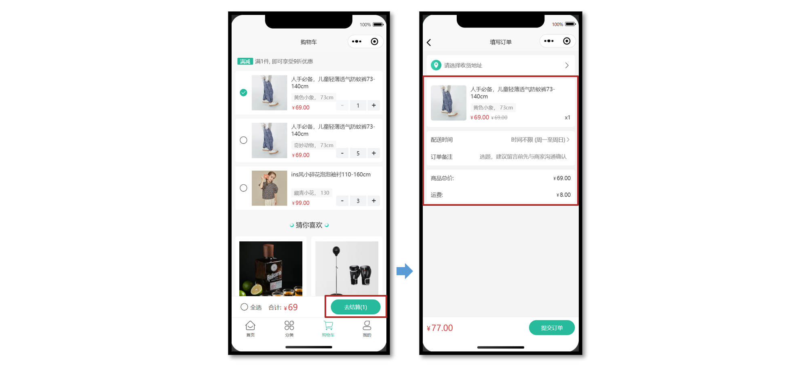
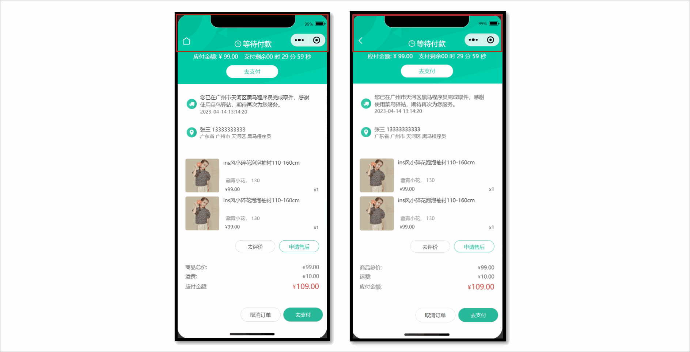
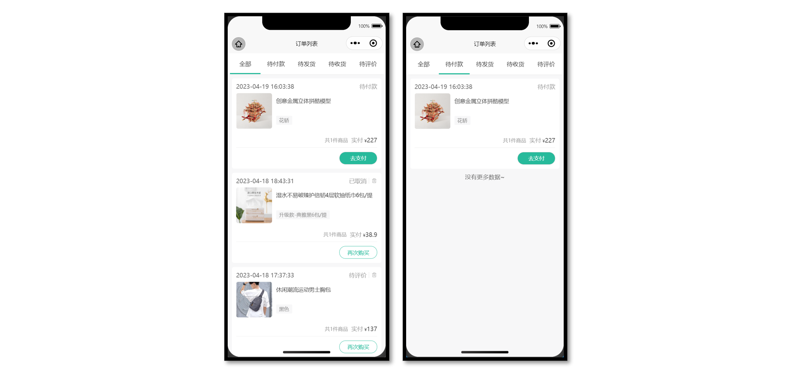

# 小兔鲜儿 - 订单模块

订单模块页面较多，建议用新的分包文件夹独立管理订单模块页面：填写订单页，支付订单页，订单详情页，订单列表页。

## 填写订单页

小兔鲜儿项目有三种方式可以生成订单信息，分别是：购物车结算、立即购买、再次购买。



### 静态结构

```vue
<script setup lang="ts">
import { computed, ref } from 'vue'

// 获取屏幕边界到安全区域距离
const { safeAreaInsets } = uni.getSystemInfoSync()
// 订单备注
const buyerMessage = ref('')
// 配送时间
const deliveryList = ref([
  { type: 1, text: '时间不限 (周一至周日)' },
  { type: 2, text: '工作日送 (周一至周五)' },
  { type: 3, text: '周末配送 (周六至周日)' },
])
// 当前配送时间下标
const activeIndex = ref(0)
// 当前配送时间
const activeDelivery = computed(() => deliveryList.value[activeIndex.value])
// 修改配送时间
const onChangeDelivery: UniHelper.SelectorPickerOnChange = (ev) => {
  activeIndex.value = ev.detail.value
}
</script>

<template>
  <scroll-view scroll-y class="viewport">
    <!-- 收货地址 -->
    <navigator
      v-if="false"
      class="shipment"
      hover-class="none"
      url="/pagesMember/address/address?from=order"
    >
      <view class="user"> 张三 13333333333 </view>
      <view class="address"> 广东省 广州市 天河区 黑马程序员3 </view>
      <text class="icon icon-right"></text>
    </navigator>
    <navigator
      v-else
      class="shipment"
      hover-class="none"
      url="/pagesMember/address/address?from=order"
    >
      <view class="address"> 请选择收货地址 </view>
      <text class="icon icon-right"></text>
    </navigator>

    <!-- 商品信息 -->
    <view class="goods">
      <navigator
        v-for="item in 2"
        :key="item"
        :url="`/pages/goods/goods?id=1`"
        class="item"
        hover-class="none"
      >
        <image
          class="picture"
          src="https://yanxuan-item.nosdn.127.net/c07edde1047fa1bd0b795bed136c2bb2.jpg"
        />
        <view class="meta">
          <view class="name ellipsis"> ins风小碎花泡泡袖衬110-160cm </view>
          <view class="attrs">藏青小花 130</view>
          <view class="prices">
            <view class="pay-price symbol">99.00</view>
            <view class="price symbol">99.00</view>
          </view>
          <view class="count">x5</view>
        </view>
      </navigator>
    </view>

    <!-- 配送及支付方式 -->
    <view class="related">
      <view class="item">
        <text class="text">配送时间</text>
        <picker :range="deliveryList" range-key="text" @change="onChangeDelivery">
          <view class="icon-fonts picker">{{ activeDelivery.text }}</view>
        </picker>
      </view>
      <view class="item">
        <text class="text">订单备注</text>
        <input
          class="input"
          :cursor-spacing="30"
          placeholder="选题，建议留言前先与商家沟通确认"
          v-model="buyerMessage"
        />
      </view>
    </view>

    <!-- 支付金额 -->
    <view class="settlement">
      <view class="item">
        <text class="text">商品总价: </text>
        <text class="number symbol">495.00</text>
      </view>
      <view class="item">
        <text class="text">运费: </text>
        <text class="number symbol">5.00</text>
      </view>
    </view>
  </scroll-view>

  <!-- 吸底工具栏 -->
  <view class="toolbar" :style="{ paddingBottom: safeAreaInsets?.bottom + 'px' }">
    <view class="total-pay symbol">
      <text class="number">99.00</text>
    </view>
    <view class="button" :class="{ disabled: true }"> 提交订单 </view>
  </view>
</template>

<style lang="scss">
page {
  display: flex;
  flex-direction: column;
  height: 100%;
  overflow: hidden;
  background-color: #f4f4f4;
}

.symbol::before {
  content: '¥';
  font-size: 80%;
  margin-right: 5rpx;
}

.shipment {
  margin: 20rpx;
  padding: 30rpx 30rpx 30rpx 84rpx;
  font-size: 26rpx;
  border-radius: 10rpx;
  background: url(https://pcapi-xiaotuxian-front-devtest.itheima.net/miniapp/images/locate.png)
    20rpx center / 50rpx no-repeat #fff;
  position: relative;

  .icon {
    font-size: 36rpx;
    color: #333;
    transform: translateY(-50%);
    position: absolute;
    top: 50%;
    right: 20rpx;
  }

  .user {
    color: #333;
    margin-bottom: 5rpx;
  }

  .address {
    color: #666;
  }
}

.goods {
  margin: 20rpx;
  padding: 0 20rpx;
  border-radius: 10rpx;
  background-color: #fff;

  .item {
    display: flex;
    padding: 30rpx 0;
    border-top: 1rpx solid #eee;

    &:first-child {
      border-top: none;
    }

    .picture {
      width: 170rpx;
      height: 170rpx;
      border-radius: 10rpx;
      margin-right: 20rpx;
    }

    .meta {
      flex: 1;
      display: flex;
      flex-direction: column;
      justify-content: center;
      position: relative;
    }

    .name {
      height: 80rpx;
      font-size: 26rpx;
      color: #444;
    }

    .attrs {
      line-height: 1.8;
      padding: 0 15rpx;
      margin-top: 6rpx;
      font-size: 24rpx;
      align-self: flex-start;
      border-radius: 4rpx;
      color: #888;
      background-color: #f7f7f8;
    }

    .prices {
      display: flex;
      align-items: baseline;
      margin-top: 6rpx;
      font-size: 28rpx;

      .pay-price {
        margin-right: 10rpx;
        color: #cf4444;
      }

      .price {
        font-size: 24rpx;
        color: #999;
        text-decoration: line-through;
      }
    }

    .count {
      position: absolute;
      bottom: 0;
      right: 0;
      font-size: 26rpx;
      color: #444;
    }
  }
}

.related {
  margin: 20rpx;
  padding: 0 20rpx;
  border-radius: 10rpx;
  background-color: #fff;

  .item {
    display: flex;
    justify-content: space-between;
    align-items: center;
    min-height: 80rpx;
    font-size: 26rpx;
    color: #333;
  }

  .input {
    flex: 1;
    text-align: right;
    margin: 20rpx 0;
    padding-right: 20rpx;
    font-size: 26rpx;
    color: #999;
  }

  .item .text {
    width: 125rpx;
  }

  .picker {
    color: #666;
  }

  .picker::after {
    content: '\e6c2';
  }
}

/* 结算清单 */
.settlement {
  margin: 20rpx;
  padding: 0 20rpx;
  border-radius: 10rpx;
  background-color: #fff;

  .item {
    display: flex;
    align-items: center;
    justify-content: space-between;
    height: 80rpx;
    font-size: 26rpx;
    color: #333;
  }

  .danger {
    color: #cf4444;
  }
}

/* 吸底工具栏 */
.toolbar {
  position: fixed;
  left: 0;
  right: 0;
  bottom: calc(var(--window-bottom));
  z-index: 1;

  background-color: #fff;
  height: 100rpx;
  padding: 0 20rpx;
  border-top: 1rpx solid #eaeaea;
  display: flex;
  justify-content: space-between;
  align-items: center;
  box-sizing: content-box;

  .total-pay {
    font-size: 40rpx;
    color: #cf4444;

    .decimal {
      font-size: 75%;
    }
  }

  .button {
    width: 220rpx;
    text-align: center;
    line-height: 72rpx;
    font-size: 26rpx;
    color: #fff;
    border-radius: 72rpx;
    background-color: #27ba9b;
  }

  .disabled {
    opacity: 0.6;
  }
}
</style>
```

### 购物车结算

在购物车点击去结算后，进入填写订单页，用户可以选择订单的收货地址或补充订单信息。

**接口详情**

接口地址：/member/order/pre

请求方式：GET

登录权限: **是**

请求参数：无

**接口封装**

`src/services/order.ts`

```ts
import type { OrderPreResult } from '@/types/order'
import { http } from '@/utils/http'
/**
 * 填写订单-获取预付订单
 */
export const getMemberOrderPreAPI = () => {
  return http<OrderPreResult>({
    method: 'GET',
    url: '/member/order/pre',
  })
}
```

**类型声明**

`src/services/order.d.ts`

```ts
import type { AddressItem } from './address'

/** 获取预付订单 返回信息 */
export type OrderPreResult = {
  /** 商品集合 [ 商品信息 ] */
  goods: OrderPreGoods[]
  /** 结算信息 */
  summary: {
    /** 商品总价 */
    totalPrice: number
    /** 邮费 */
    postFee: number
    /** 应付金额 */
    totalPayPrice: number
  }
  /** 用户地址列表 [ 地址信息 ] */
  userAddresses: AddressItem[]
}

/** 商品信息 */
export type OrderPreGoods = {
  /** 属性文字，例如“颜色:瓷白色 尺寸：8寸” */
  attrsText: string
  /** 数量 */
  count: number
  /** id */
  id: string
  /** 商品名称 */
  name: string
  /** 实付单价 */
  payPrice: string
  /** 图片 */
  picture: string
  /** 原单价 */
  price: string
  /** SKUID */
  skuId: string
  /** 实付价格小计 */
  totalPayPrice: string
  /** 小计总价 */
  totalPrice: string
}
```

将后端返回的预付订单数据，渲染到页面中。

### 立即购买

从商品详情页的 `SKU` 组件直接点击【立即购买按钮】跳转到填写订单页，需要传递页面参数。

**接口详情**

接口地址：/member/order/pre/now

请求方式：GET

登录权限: **是**

请求参数：

**Query**

| 字段名称  | 是否必须 | 默认值 | 备注        |
| --------- | -------- | ------ | ----------- |
| skuId     | 是       | 无     | 商品库存 ID |
| count     | 是       | 无     | 商品数量    |
| addressId | 否       | 无     | 收货地址 ID |

**接口封装**

```ts
/**
 * 填写订单-获取立即购买订单
 */
export const getMemberOrderPreNowAPI = (data: {
  skuId: string
  count: string
  addressId?: string
}) => {
  return http<OrderPreResult>({
    method: 'GET',
    url: '/member/order/pre/now',
    data,
  })
}
```

#### 页面传参

从商品详情页的【立即购买事件】中收集两个必要参数，跳转填写订单页并**传递页面参数**。

**商品详情页**

```vue {4,14}
<script setup lang="ts">
// 立即购买
const onBuyNow = (ev: SkuPopupEvent) => {
  uni.navigateTo({ url: `/pagesOrder/create/create?skuId=${ev._id}&count=${ev.buy_num}` })
}
</script>

<template>
  <!-- SKU弹窗组件 -->
  <vk-data-goods-sku-popup
    v-model="isShowSku"
    :localdata="localdata"
    @add-cart="onAddCart"
    @buy-now="onBuyNow"
  />
</template>
```

**填写订单页**

```vue {5-8,13-21}
<script setup lang="ts">
import { getMemberOrderPreAPI, getMemberOrderPreNowAPI } from '@/services/order'

// 页面参数
const query = defineProps<{
  skuId?: string
  count?: string
}>()

// 获取订单信息
const orderPre = ref<OrderPreResult>()
const getMemberOrderPreData = async () => {
  // 是否有立即购买参数
  if (query.count && query.skuId) {
    // 调用立即购买 API
    const res = await getMemberOrderPreNowAPI({
      count: query.count,
      skuId: query.skuId,
    })
    orderPre.value = res.result
  } else {
    // 调用预付订单 API
    const res = await getMemberOrderPreAPI()
    orderPre.value = res.result
  }
}
</script>
```

### 选择收货地址

收货地址在地址管理页面中选择，为了更好管理选中收货地址，创建独立 Store 维护。

**地址 Store**

`src/stores/modules/address.ts`

```ts
import type { AddressItem } from '@/types/address'
import { defineStore } from 'pinia'
import { ref } from 'vue'

export const useAddressStore = defineStore('address', () => {
  const selectedAddress = ref<AddressItem>()

  const changeSelectedAddress = (val: AddressItem) => {
    selectedAddress.value = val
  }

  return { selectedAddress, changeSelectedAddress }
})
```

**地址管理页**

修改选中收货地址，`<navigator>` 组件需要阻止事件冒泡。

`pagesMember/address/address.vue`

```vue {4-8,15,26}
<script setup lang="ts">
// 修改收货地址
const onChangeAddress = (item: AddressItem) => {
  // 修改选中收货地址
  const addressStore = useAddressStore()
  addressStore.changeSelectedAddress(item)
  // 返回上一页
  uni.navigateBack()
}
</script>

<template>
  <!-- 收货地址项 -->
  <uni-swipe-action-item class="item" v-for="item in addressList" :key="item.id">
    <view class="item-content" @tap="onChangeAddress(item)">
      <view class="user">
        {{ item.receiver }}
        <text class="contact">{{ item.contact }}</text>
        <text v-if="item.isDefault" class="badge">默认</text>
      </view>
      <view class="locate">{{ item.fullLocation }} {{ item.address }}</view>
      <navigator
        class="edit"
        hover-class="none"
        :url="`/pagesMember/address-form/address-form?id=${item.id}`"
        @tap.stop="() => {}"
      >
        修改
      </navigator>
    </view>
  </uni-swipe-action-item>
</template>
```

**订单填写页**

```vue {5,7-9,15,20-21}
<script setup lang="ts">
import { useAddressStore } from '@/stores/modules/address'
import { computed } from 'vue'

const addressStore = useAddressStore()
// 收货地址
const selecteAddress = computed(() => {
  return addressStore.selectedAddress || orderPre.value?.userAddresses.find((v) => v.isDefault)
})
</script>

<template>
  <!-- 收货地址 -->
  <navigator
    v-if="selecteAddress"
    class="shipment"
    hover-class="none"
    url="/pagesMember/address/address?from=order"
  >
    <view class="user"> {{ selecteAddress.receiver }} {{ selecteAddress.contact }} </view>
    <view class="address"> {{ selecteAddress.fullLocation }} {{ selecteAddress.address }} </view>
    <text class="icon icon-right"></text>
  </navigator>
</template>
```

### 提交订单

收集填写订单页的数据，点击页面底部的提交订单按钮，创建一个新的订单。

**接口详情**

接口地址：/member/order

请求方式：POST

登录权限: **是**

请求参数：

**Body**

| 字段名称         | 是否必须 | 默认值 | 备注                             |
| ---------------- | -------- | ------ | -------------------------------- |
| addressId        | 是       | 无     | 收货地址 ID                      |
| goods            | 是       | 无     | 订单商品                         |
| deliveryTimeType | 是       | 无     | 配送时间                         |
| buyerMessage     | 是       | 无     | 买家留言                         |
| payType          | 是       | 无     | 支付方式（小程序中固定在线支付） |
| payChannel       | 是       | 无     | 支付渠道（小程序中固定微信支付） |

**接口封装**

```ts
/**
 * 提交订单
 * @param data 请求参数
 */
export const postMemberOrderAPI = (data: OrderCreateParams) => {
  return http<{ id: string }>({
    method: 'POST',
    url: '/member/order',
    data,
  })
}
```

**类型声明**

```ts
/** 提交订单 请求参数 */
export type OrderCreateParams = {
  /** 所选地址Id */
  addressId: string
  /** 配送时间类型，1为不限，2为工作日，3为双休或假日 */
  deliveryTimeType: number
  /** 订单备注 */
  buyerMessage: string
  /** 商品集合[ 商品信息 ] */
  goods: {
    /** 数量 */
    count: number
    /** skuId */
    skuId: string
  }[]
  /** 支付渠道：支付渠道，1支付宝、2微信--支付方式为在线支付时，传值，为货到付款时，不传值 */
  payChannel: 1 | 2
  /** 支付方式，1为在线支付，2为货到付款 */
  payType: 1 | 2
}

/** 提交订单 返回信息 */
export type OrderCreateResult = {
  /** 订单Id */
  id: string
}
```

**参考代码**

点击提交订单按钮实现创建订单，订单创建成功后，跳转到订单详情并传递订单 id。

```vue
<script setup lang="ts">
// 提交订单
const onOrderSubmit = async () => {
  // 没有收货地址提醒
  if (!selecteAddress.value?.id) {
    return uni.showToast({ icon: 'none', title: '请选择收货地址' })
  }
  // 发送请求
  const res = await postMemberOrderAPI({
    addressId: selecteAddress.value?.id,
    buyerMessage: buyerMessage.value,
    deliveryTimeType: activeDelivery.value.type,
    goods: orderPre.value!.goods.map((v) => ({ count: v.count, skuId: v.skuId })),
    payChannel: 2,
    payType: 1,
  })
  // 关闭当前页面，跳转到订单详情，传递订单id
  uni.redirectTo({ url: `/pagesOrder/detail/detail?id=${res.result.id}` })
}
</script>

<template>
  <view class="button" :class="{ disabled: !selecteAddress?.id }" @tap="onOrderSubmit">
    提交订单
  </view>
</template>
```

订单提交成功后，接下来进入到订单详情页。

## 订单详情页

需要展示**多种订单状态** 并实现不同订单状态对应的业务。

### 静态结构

已完成通过页面参数获取到订单 id 等基础业务。

```vue
<script setup lang="ts">
import { useGuessList } from '@/composables'
import { ref } from 'vue'

// 获取屏幕边界到安全区域距离
const { safeAreaInsets } = uni.getSystemInfoSync()
// 猜你喜欢
const { guessRef, onScrolltolower } = useGuessList()
// 弹出层组件
const popup = ref<UniHelper.UniPopupInstance>()
// 取消原因列表
const reasonList = ref([
  '商品无货',
  '不想要了',
  '商品信息填错了',
  '地址信息填写错误',
  '商品降价',
  '其它',
])
// 订单取消原因
const reason = ref('')
// 复制内容
const onCopy = (id: string) => {
  // 设置系统剪贴板的内容
  uni.setClipboardData({ data: id })
}
// 获取页面参数
const query = defineProps<{
  id: string
}>()
</script>

<template>
  <!-- 自定义导航栏: 默认透明不可见, scroll-view 滚动到 50 时展示 -->
  <view class="navbar" :style="{ paddingTop: safeAreaInsets?.top + 'px' }">
    <view class="wrap">
      <navigator v-if="true" open-type="navigateBack" class="back icon-left"></navigator>
      <navigator v-else url="/pages/index/index" open-type="switchTab" class="back icon-home">
      </navigator>
      <view class="title">订单详情</view>
    </view>
  </view>
  <scroll-view scroll-y class="viewport" id="scroller" @scrolltolower="onScrolltolower">
    <template v-if="true">
      <!-- 订单状态 -->
      <view class="overview" :style="{ paddingTop: safeAreaInsets!.top + 20 + 'px' }">
        <!-- 待付款状态:展示去支付按钮和倒计时 -->
        <template v-if="true">
          <view class="status icon-clock">等待付款</view>
          <view class="tips">
            <text class="money">应付金额: ¥ 99.00</text>
            <text class="time">支付剩余</text>
            00 时 29 分 59 秒
          </view>
          <view class="button">去支付</view>
        </template>
        <!-- 其他订单状态:展示再次购买按钮 -->
        <template v-else>
          <!-- 订单状态文字 -->
          <view class="status"> 待付款 </view>
          <view class="button-group">
            <navigator
              class="button"
              :url="`/pagesOrder/create/create?orderId=${query.id}`"
              hover-class="none"
            >
              再次购买
            </navigator>
            <!-- 待发货状态：模拟发货,开发期间使用,用于修改订单状态为已发货 -->
            <view v-if="false" class="button"> 模拟发货 </view>
          </view>
        </template>
      </view>
      <!-- 配送状态 -->
      <view class="shipment">
        <!-- 订单物流信息 -->
        <view v-for="item in 1" :key="item" class="item">
          <view class="message">
            您已在广州市天河区黑马程序员完成取件，感谢使用菜鸟驿站，期待再次为您服务。
          </view>
          <view class="date"> 2023-04-14 13:14:20 </view>
        </view>
        <!-- 用户收货地址 -->
        <view class="locate">
          <view class="user"> 张三 13333333333 </view>
          <view class="address"> 广东省 广州市 天河区 黑马程序员 </view>
        </view>
      </view>

      <!-- 商品信息 -->
      <view class="goods">
        <view class="item">
          <navigator
            class="navigator"
            v-for="item in 2"
            :key="item"
            :url="`/pages/goods/goods?id=${item}`"
            hover-class="none"
          >
            <image
              class="cover"
              src="https://yanxuan-item.nosdn.127.net/c07edde1047fa1bd0b795bed136c2bb2.jpg"
            ></image>
            <view class="meta">
              <view class="name ellipsis">ins风小碎花泡泡袖衬110-160cm</view>
              <view class="type">藏青小花， 130</view>
              <view class="price">
                <view class="actual">
                  <text class="symbol">¥</text>
                  <text>99.00</text>
                </view>
              </view>
              <view class="quantity">x1</view>
            </view>
          </navigator>
          <!-- 待评价状态:展示按钮 -->
          <view class="action" v-if="true">
            <view class="button primary">申请售后</view>
            <navigator url="" class="button"> 去评价 </navigator>
          </view>
        </view>
        <!-- 合计 -->
        <view class="total">
          <view class="row">
            <view class="text">商品总价: </view>
            <view class="symbol">99.00</view>
          </view>
          <view class="row">
            <view class="text">运费: </view>
            <view class="symbol">10.00</view>
          </view>
          <view class="row">
            <view class="text">应付金额: </view>
            <view class="symbol primary">109.00</view>
          </view>
        </view>
      </view>

      <!-- 订单信息 -->
      <view class="detail">
        <view class="title">订单信息</view>
        <view class="row">
          <view class="item">
            订单编号: {{ query.id }} <text class="copy" @tap="onCopy(query.id)">复制</text>
          </view>
          <view class="item">下单时间: 2023-04-14 13:14:20</view>
        </view>
      </view>

      <!-- 猜你喜欢 -->
      <XtxGuess ref="guessRef" />

      <!-- 底部操作栏 -->
      <view class="toolbar-height" :style="{ paddingBottom: safeAreaInsets?.bottom + 'px' }"></view>
      <view class="toolbar" :style="{ paddingBottom: safeAreaInsets?.bottom + 'px' }">
        <!-- 待付款状态:展示支付按钮 -->
        <template v-if="true">
          <view class="button primary"> 去支付 </view>
          <view class="button" @tap="popup?.open?.()"> 取消订单 </view>
        </template>
        <!-- 其他订单状态:按需展示按钮 -->
        <template v-else>
          <navigator
            class="button secondary"
            :url="`/pagesOrder/create/create?orderId=${query.id}`"
            hover-class="none"
          >
            再次购买
          </navigator>
          <!-- 待收货状态: 展示确认收货 -->
          <view class="button primary"> 确认收货 </view>
          <!-- 待评价状态: 展示去评价 -->
          <view class="button"> 去评价 </view>
          <!-- 待评价/已完成/已取消 状态: 展示删除订单 -->
          <view class="button delete"> 删除订单 </view>
        </template>
      </view>
    </template>
    <template v-else>
      <!-- 骨架屏组件 -->
      <PageSkeleton />
    </template>
  </scroll-view>
  <!-- 取消订单弹窗 -->
  <uni-popup ref="popup" type="bottom" background-color="#fff">
    <view class="popup-root">
      <view class="title">订单取消</view>
      <view class="description">
        <view class="tips">请选择取消订单的原因：</view>
        <view class="cell" v-for="item in reasonList" :key="item" @tap="reason = item">
          <text class="text">{{ item }}</text>
          <text class="icon" :class="{ checked: item === reason }"></text>
        </view>
      </view>
      <view class="footer">
        <view class="button" @tap="popup?.close?.()">取消</view>
        <view class="button primary">确认</view>
      </view>
    </view>
  </uni-popup>
</template>

<style lang="scss">
page {
  display: flex;
  flex-direction: column;
  height: 100%;
  overflow: hidden;
}

.navbar {
  width: 750rpx;
  color: #000;
  position: fixed;
  top: 0;
  left: 0;
  z-index: 9;
  /* background-color: #f8f8f8; */
  background-color: transparent;

  .wrap {
    position: relative;

    .title {
      height: 44px;
      display: flex;
      justify-content: center;
      align-items: center;
      font-size: 32rpx;
      /* color: #000; */
      color: transparent;
    }

    .back {
      position: absolute;
      left: 0;
      height: 44px;
      width: 44px;
      font-size: 44rpx;
      display: flex;
      align-items: center;
      justify-content: center;
      /* color: #000; */
      color: #fff;
    }
  }
}

.viewport {
  background-color: #f7f7f8;
}

.overview {
  display: flex;
  flex-direction: column;
  align-items: center;

  line-height: 1;
  padding-bottom: 30rpx;
  color: #fff;
  background-image: url(https://pcapi-xiaotuxian-front-devtest.itheima.net/miniapp/images/order_bg.png);
  background-size: cover;

  .status {
    font-size: 36rpx;
  }

  .status::before {
    margin-right: 6rpx;
    font-weight: 500;
  }

  .tips {
    margin: 30rpx 0;
    display: flex;
    font-size: 14px;
    align-items: center;

    .money {
      margin-right: 30rpx;
    }
  }

  .button-group {
    margin-top: 30rpx;
    display: flex;
    justify-content: center;
    align-items: center;
  }

  .button {
    width: 260rpx;
    height: 64rpx;
    margin: 0 10rpx;
    text-align: center;
    line-height: 64rpx;
    font-size: 28rpx;
    color: #27ba9b;
    border-radius: 68rpx;
    background-color: #fff;
  }
}

.shipment {
  line-height: 1.4;
  padding: 0 20rpx;
  margin: 20rpx 20rpx 0;
  border-radius: 10rpx;
  background-color: #fff;

  .locate,
  .item {
    min-height: 120rpx;
    padding: 30rpx 30rpx 25rpx 75rpx;
    background-size: 50rpx;
    background-repeat: no-repeat;
    background-position: 6rpx center;
  }

  .locate {
    background-image: url(https://pcapi-xiaotuxian-front-devtest.itheima.net/miniapp/images/locate.png);

    .user {
      font-size: 26rpx;
      color: #444;
    }

    .address {
      font-size: 24rpx;
      color: #666;
    }
  }

  .item {
    background-image: url(https://pcapi-xiaotuxian-front-devtest.itheima.net/miniapp/images/car.png);
    border-bottom: 1rpx solid #eee;
    position: relative;

    .message {
      font-size: 26rpx;
      color: #444;
    }

    .date {
      font-size: 24rpx;
      color: #666;
    }
  }
}

.goods {
  margin: 20rpx 20rpx 0;
  padding: 0 20rpx;
  border-radius: 10rpx;
  background-color: #fff;

  .item {
    padding: 30rpx 0;
    border-bottom: 1rpx solid #eee;

    .navigator {
      display: flex;
      margin: 20rpx 0;
    }

    .cover {
      width: 170rpx;
      height: 170rpx;
      border-radius: 10rpx;
      margin-right: 20rpx;
    }

    .meta {
      flex: 1;
      display: flex;
      flex-direction: column;
      justify-content: center;
      position: relative;
    }

    .name {
      height: 80rpx;
      font-size: 26rpx;
      color: #444;
    }

    .type {
      line-height: 1.8;
      padding: 0 15rpx;
      margin-top: 6rpx;
      font-size: 24rpx;
      align-self: flex-start;
      border-radius: 4rpx;
      color: #888;
      background-color: #f7f7f8;
    }

    .price {
      display: flex;
      margin-top: 6rpx;
      font-size: 24rpx;
    }

    .symbol {
      font-size: 20rpx;
    }

    .original {
      color: #999;
      text-decoration: line-through;
    }

    .actual {
      margin-left: 10rpx;
      color: #444;
    }

    .text {
      font-size: 22rpx;
    }

    .quantity {
      position: absolute;
      bottom: 0;
      right: 0;
      font-size: 24rpx;
      color: #444;
    }

    .action {
      display: flex;
      flex-direction: row-reverse;
      justify-content: flex-start;
      padding: 30rpx 0 0;

      .button {
        width: 200rpx;
        height: 60rpx;
        text-align: center;
        justify-content: center;
        line-height: 60rpx;
        margin-left: 20rpx;
        border-radius: 60rpx;
        border: 1rpx solid #ccc;
        font-size: 26rpx;
        color: #444;
      }

      .primary {
        color: #27ba9b;
        border-color: #27ba9b;
      }
    }
  }

  .total {
    line-height: 1;
    font-size: 26rpx;
    padding: 20rpx 0;
    color: #666;

    .row {
      display: flex;
      align-items: center;
      justify-content: space-between;
      padding: 10rpx 0;
    }

    .symbol::before {
      content: '¥';
      font-size: 80%;
      margin-right: 3rpx;
    }

    .primary {
      color: #cf4444;
      font-size: 36rpx;
    }
  }
}

.detail {
  line-height: 1;
  padding: 30rpx 20rpx 0;
  margin: 20rpx 20rpx 0;
  font-size: 26rpx;
  color: #666;
  border-radius: 10rpx;
  background-color: #fff;

  .title {
    font-size: 30rpx;
    color: #444;
  }

  .row {
    padding: 20rpx 0;

    .item {
      padding: 10rpx 0;
      display: flex;
      align-items: center;
    }

    .copy {
      border-radius: 20rpx;
      font-size: 20rpx;
      border: 1px solid #ccc;
      padding: 5rpx 10rpx;
      margin-left: 10rpx;
    }
  }
}

.toolbar-height {
  height: 100rpx;
  box-sizing: content-box;
}

.toolbar {
  position: fixed;
  left: 0;
  right: 0;
  bottom: calc(var(--window-bottom));
  z-index: 1;

  height: 100rpx;
  padding: 0 20rpx;
  display: flex;
  align-items: center;
  flex-direction: row-reverse;
  border-top: 1rpx solid #ededed;
  border-bottom: 1rpx solid #ededed;
  background-color: #fff;
  box-sizing: content-box;

  .button {
    display: flex;
    justify-content: center;
    align-items: center;

    width: 200rpx;
    height: 72rpx;
    margin-left: 15rpx;
    font-size: 26rpx;
    border-radius: 72rpx;
    border: 1rpx solid #ccc;
    color: #444;
  }

  .delete {
    order: 4;
  }

  .button {
    order: 3;
  }

  .secondary {
    order: 2;
    color: #27ba9b;
    border-color: #27ba9b;
  }

  .primary {
    order: 1;
    color: #fff;
    background-color: #27ba9b;
  }
}

.popup-root {
  padding: 30rpx 30rpx 0;
  border-radius: 10rpx 10rpx 0 0;
  overflow: hidden;

  .title {
    font-size: 30rpx;
    text-align: center;
    margin-bottom: 30rpx;
  }

  .description {
    font-size: 28rpx;
    padding: 0 20rpx;

    .tips {
      color: #444;
      margin-bottom: 12rpx;
    }

    .cell {
      display: flex;
      justify-content: space-between;
      align-items: center;
      padding: 15rpx 0;
      color: #666;
    }

    .icon::before {
      content: '\e6cd';
      font-family: 'erabbit' !important;
      font-size: 38rpx;
      color: #999;
    }

    .icon.checked::before {
      content: '\e6cc';
      font-size: 38rpx;
      color: #27ba9b;
    }
  }

  .footer {
    display: flex;
    justify-content: space-between;
    padding: 30rpx 0 40rpx;
    font-size: 28rpx;
    color: #444;

    .button {
      flex: 1;
      height: 72rpx;
      text-align: center;
      line-height: 72rpx;
      margin: 0 20rpx;
      color: #444;
      border-radius: 72rpx;
      border: 1rpx solid #ccc;
    }

    .primary {
      color: #fff;
      background-color: #27ba9b;
      border: none;
    }
  }
}
</style>
```

### 自定义导航栏交互

1. 导航栏左上角按钮：[获取当前页面栈](https://developers.weixin.qq.com/miniprogram/dev/reference/api/getCurrentPages.html)，如果不能返回上一页，按钮变成返回首页。
2. 导航栏动画效果：[滚动驱动的动画](https://developers.weixin.qq.com/miniprogram/dev/framework/view/animation.html#%E6%BB%9A%E5%8A%A8%E9%A9%B1%E5%8A%A8%E7%9A%84%E5%8A%A8%E7%94%BB)，根据滚动位置而不断改变动画的进度。

::: warning 注意事项

滚动驱动的动画目前**仅支持微信小程序端**，暂不支持 H5 端、App 端，多端兼容时添加条件编译。

:::



**参考代码**

```vue {3,5,10-20,43,52}
<script setup lang="ts">
// 获取页面栈
const pages = getCurrentPages()
// 获取当前页面实例，数组最后一项
const pageInstance = pages.at(-1) as any

// 页面渲染完毕，绑定动画效果
onReady(() => {
  // 动画效果,导航栏背景色
  pageInstance.animate(
    '.navbar', // 选择器
    [{ backgroundColor: 'transparent' }, { backgroundColor: '#f8f8f8' }], // 关键帧信息
    1000, // 动画持续时长
    {
      scrollSource: '#scroller', // scroll-view 的选择器
      startScrollOffset: 0, // 开始滚动偏移量
      endScrollOffset: 50, // 停止滚动偏移量
      timeRange: 1000, // 时间长度
    },
  )
  // 动画效果,导航栏标题
  pageInstance.animate('.navbar .title', [{ color: 'transparent' }, { color: '#000' }], 1000, {
    scrollSource: '#scroller',
    timeRange: 1000,
    startScrollOffset: 0,
    endScrollOffset: 50,
  })
  // 动画效果,导航栏返回按钮
  pageInstance.animate('.navbar .back', [{ color: '#fff' }, { color: '#000' }], 1000, {
    scrollSource: '#scroller',
    timeRange: 1000,
    startScrollOffset: 0,
    endScrollOffset: 50,
  })
})
</script>

<template>
  <!-- 自定义导航栏: 默认透明不可见, scroll-view 滚动到 50 时展示 -->
  <view class="navbar" :style="{ paddingTop: safeAreaInsets?.top + 'px' }">
    <view class="wrap">
      <navigator
        v-if="pages.length > 1"
        open-type="navigateBack"
        class="back icon-left"
      ></navigator>
      <navigator v-else url="/pages/index/index" open-type="switchTab" class="back icon-home">
      </navigator>
      <view class="title">订单详情</view>
    </view>
  </view>
  <scroll-view class="viewport" scroll-y enable-back-to-top id="scroller">
    ...滚动容器
  </scroll-view>
</template>
```

::: warning 版本升级

- uni-app 不支持 `animate` 类型。
- 原生微信小程序 支持 [animate 类型](https://github.com/wechat-miniprogram/api-typings/blob/master/types/wx/lib.wx.component.d.ts#L241-L246) 。
- 当前需求可基于 原生微信小程序 的 [Page 实例类型](https://github.com/wechat-miniprogram/api-typings/blob/master/types/wx/lib.wx.page.d.ts#L161) 扩展 uni-app 的 Page 实例，参考代码 👇

```ts {2,3}
// 基于小程序的 Page 实例类型扩展 uni-app 的 Page
type PageInstance = Page.PageInstance & WechatMiniprogram.Page.InstanceMethods<any>
const pageInstance = pages.at(-1) as PageInstance

const pageInstance = pages.at(-1) as any // [!code --]
```

:::

### 获取订单详情

**请求封装**

```ts
/**
 * 获取订单详情
 * @param id 订单id
 */
export const getMemberOrderByIdAPI = (id: string) => {
  return http<OrderResult>({
    method: 'GET',
    url: `/member/order/${id}`,
  })
}
```

**类型声明**

```ts
/** 订单详情 返回信息 */
export type OrderResult = {
  /** 订单编号 */
  id: string
  /** 订单状态，1为待付款、2为待发货、3为待收货、4为待评价、5为已完成、6为已取消 */
  orderState: number
  /** 倒计时--剩余的秒数 -1 表示已经超时，正数表示倒计时未结束 */
  countdown: number
  /** 商品集合 [ 商品信息 ] */
  skus: OrderSkuItem[]
  /** 收货人 */
  receiverContact: string
  /** 收货人手机 */
  receiverMobile: string
  /** 收货人完整地址 */
  receiverAddress: string
  /** 下单时间 */
  createTime: string
  /** 商品总价 */
  totalMoney: number
  /** 运费 */
  postFee: number
  /** 应付金额 */
  payMoney: number
}

/** 商品信息 */
export type OrderSkuItem = {
  /** sku id */
  id: string
  /** 商品 id */
  spuId: string
  /** 商品名称 */
  name: string
  /** 商品属性文字 */
  attrsText: string
  /** 数量 */
  quantity: number
  /** 购买时单价 */
  curPrice: number
  /** 图片地址 */
  image: string
}
```

### 订单状态

在订单详情中除了展示订单信息外，还需要根据不同**订单状态**展示不同的内容。

| 订单状态（orderState） | 含义   |
| ---------------------- | ------ |
| 1                      | 待付款 |
| 2                      | 待发货 |
| 3                      | 待收货 |
| 4                      | 待评价 |
| 5                      | 已完成 |
| 6                      | 已取消 |

**订单状态常量**

枚举的作用：通过枚举来替代无意义的**订单状态**数字，提高程序的可读性。

`src/services/constants.ts`

```ts
/** 订单状态枚举 */
export enum OrderState {
  /** 待付款 */
  DaiFuKuan = 1,
  /** 待发货 */
  DaiFaHuo = 2,
  /** 待收货 */
  DaiShouHuo = 3,
  /** 待评价 */
  DaiPingJia = 4,
  /** 已完成 */
  YiWanCheng = 5,
  /** 已取消 */
  YiQuXiao = 6,
}

/** 订单状态列表 */
export const orderStateList = [
  { id: 0, text: '' },
  { id: 1, text: '待付款' },
  { id: 2, text: '待发货' },
  { id: 3, text: '待收货' },
  { id: 4, text: '待评价' },
  { id: 5, text: '已完成' },
  { id: 6, text: '已取消' },
]
```

根据后端返回的数据渲染订单详情。

```vue {2,20,32}
<script setup lang="ts">
import { OrderState, orderStateList } from '@/services/constants'

// 获取订单详情
const order = ref<OrderResult>()
const getMemberOrderByIdData = async () => {
  const res = await getMemberOrderByIdAPI(query.id)
  order.value = res.result
}

onLoad(() => {
  getMemberOrderByIdData()
})
</script>

<template>
  <!-- 订单状态 -->
  <view class="overview">
    <!-- 待付款状态:展示去支付按钮和倒计时 -->
    <template v-if="order.orderState === OrderState.DaiFuKuan">
      <view class="status icon-clock">等待付款</view>
      <view class="tips">
        <text class="money">应付金额: ¥ 99.00</text>
        <text class="time">支付剩余</text>
        00 时 29 分 59 秒
      </view>
      <view class="button">去支付</view>
    </template>
    <!-- 其他订单状态:展示再次购买按钮 -->
    <template v-else>
      <!-- 订单状态文字 -->
      <view class="status"> {{ orderStateList[order.orderState].text }} </view>
      <navigator
        class="button"
        :url="`/pagesOrder/create/create?orderId=${query.id}`"
        hover-class="none"
      >
        再次购买
      </navigator>
      <!-- 待发货状态：模拟发货,开发期间使用,用于修改订单状态为已发货 -->
      <view v-if="false" class="button"> 模拟发货 </view>
    </template>
  </view>
</template>
```

### 再次购买

现在是第三种生成订单信息，从订单详情页的【再次购买】按钮跳转到填写订单页，需要传递页面参数。

**接口封装**

```ts
/**
 * 填写订单-再次购买
 * @param id 订单id
 */
export const getMemberOrderRepurchaseByIdAPI = (id: string) => {
  return http<OrderPreResult>({
    method: 'GET',
    url: `/member/order/repurchase/${id}`,
  })
}
```

**参考代码**

订单详情页

```vue {5}
<template>
  <navigator
    class="button"
    hover-class="none"
    :url="`/pagesOrder/create/create?orderId=${query.id}`"
  >
    再次购买
  </navigator>
</template>
```

填写订单页

```vue {12,19-23,27}
<script setup lang="ts">
// 页面参数
const query = defineProps<{
  skuId?: string
  count?: string
  orderId?: string // [!code ++]
}>()

// 获取订单信息
const orderPre = ref<OrderPreResult>()
const getMemberOrderPreData = async () => {
  if (query.count && query.skuId) {
    // 立即购买
    const res = await getMemberOrderPreNowAPI({
      count: query.count,
      skuId: query.skuId,
    })
    orderPre.value = res.result
  } else if (query.orderId) {
    // 再次购买
    const res = await getMemberOrderRepurchaseByIdAPI(query.orderId)
    orderPre.value = res.result
  } else {
    // 预付订单
    const res = await getMemberOrderPreAPI()
    orderPre.value = res.result
  }
}
</script>
```

### 支付倒计时

通过 uni-ui 组件库的 [uni-countdown](https://uniapp.dcloud.net.cn/component/uniui/uni-countdown.html) 实现倒计时。

```vue {3-6,17-24}
<script setup lang="ts">
// 倒计时结束事件
const onTimeup = () => {
  // 修改订单状态为已取消
  order.value!.orderState = OrderState.YiQuXiao
}
</script>

<template>
  <!-- 待付款状态:展示去支付按钮和倒计时 -->
  <template v-if="order.orderState === OrderState.DaiFuKuan">
    <view class="status icon-clock">等待付款</view>
    <view class="tips">
      <text class="money">应付金额: ¥ 99.00</text>
      <text class="time">支付剩余</text>
      <!-- 倒计时组件 -->
      <uni-countdown
        :second="order.countdown"
        color="#fff"
        splitor-color="#fff"
        :show-day="false"
        :show-colon="false"
        @timeup="onTimeup"
      />
    </view>
    <view class="button">去支付</view>
  </template>
</template>
```

### 订单支付

订单支付其实就是根据订单号查询到支付信息，在小程序中调用微信支付的 API 而已。

#### 微信支付说明

1. 由于微信支付的限制，仅 **appid** 为 `wx26729f20b9efae3a` 的开发者才能调用该接口。此外，开发者还需要微信授权登录。
2. 对于其他开发者，可以使用**模拟支付接口**进行开发测试，调用后，订单状态将自动更新为已支付。

**调用接口**

- 生产环境：调用正式接口，获取微信支付参数 + 发起微信支付
- 开发环境：调用模拟接口，通过模拟支付，修改订单状态为已支付

```ts
import { http } from '@/utils/http'

/**
 * 获取微信支付参数
 * @param data orderId 订单id
 */
export const getPayWxPayMiniPayAPI = (data: { orderId: string }) => {
  return http<WechatMiniprogram.RequestPaymentOption>({
    method: 'GET',
    url: '/pay/wxPay/miniPay',
    data,
  })
}

/**
 * 模拟支付-内测版
 * @param data orderId 订单id
 */
export const getPayMockAPI = (data: { orderId: string }) => {
  return http({
    method: 'GET',
    url: '/pay/mock',
    data,
  })
}
```

#### 参考代码

通过[环境变量](https://cn.vitejs.dev/guide/env-and-mode.html)区分开发环境，调用不同接口。

```vue {7-14}
<script setup lang="ts">
import { getPayMockAPI, getPayWxPayMiniPayAPI } from '@/services/pay'

// 订单支付
const onOrderPay = async () => {
  // 通过环境变量区分开发环境
  if (import.meta.env.DEV) {
    // 开发环境：模拟支付，修改订单状态为已支付
    await getPayMockAPI({ orderId: query.id })
  } else {
    // 生产环境：获取支付参数 + 发起微信支付
    const res = await getPayWxPayMiniPayAPI({ orderId: query.id })
    await wx.requestPayment(res.result)
  }
  // 关闭当前页，再跳转支付结果页
  uni.redirectTo({ url: `/pagesOrder/payment/payment?id=${query.id}` })
}
</script>

<template>
  <view class="button" @tap="onOrderPay">去支付</view>
</template>
```

#### 支付成功页

主要用于展示支付结果。

`src/pagesOrder/payment/payment.vue`

```vue
<script setup lang="ts">
import { useGuessList } from '@/composables'

// 获取页面参数
const query = defineProps<{
  id: string
}>()

// 猜你喜欢
const { guessRef, onScrolltolower } = useGuessList()
</script>

<template>
  <scroll-view class="viewport" scroll-y @scrolltolower="onScrolltolower">
    <!-- 订单状态 -->
    <view class="overview">
      <view class="status icon-checked">支付成功</view>
      <view class="buttons">
        <navigator
          hover-class="none"
          class="button navigator"
          url="/pages/index/index"
          open-type="switchTab"
        >
          返回首页
        </navigator>
        <navigator
          hover-class="none"
          class="button navigator"
          :url="`/pagesOrder/detail/detail?id=${query.id}`"
          open-type="redirect"
        >
          查看订单
        </navigator>
      </view>
    </view>

    <!-- 猜你喜欢 -->
    <XtxGuess ref="guessRef" />
  </scroll-view>
</template>

<style lang="scss">
page {
  display: flex;
  flex-direction: column;
  height: 100%;
  overflow: hidden;
}

.viewport {
  background-color: #f7f7f8;
}

.overview {
  line-height: 1;
  padding: 50rpx 0;
  color: #fff;
  background-color: #27ba9b;

  .status {
    font-size: 36rpx;
    font-weight: 500;
    text-align: center;
  }

  .status::before {
    display: block;
    font-size: 110rpx;
    margin-bottom: 20rpx;
  }

  .buttons {
    height: 60rpx;
    line-height: 60rpx;
    display: flex;
    justify-content: center;
    align-items: center;
    margin-top: 60rpx;
  }

  .button {
    text-align: center;
    margin: 0 10rpx;
    font-size: 28rpx;
    color: #fff;

    &:first-child {
      width: 200rpx;
      border-radius: 64rpx;
      border: 1rpx solid #fff;
    }
  }
}
</style>
```

### 模拟发货

仅在订单状态为待发货时，可模拟发货，调用后订单状态修改为待收货，包含模拟物流。

**仅在开发期间使用**，项目上线后应该是由商家发货。

**接口封装**

```ts
/**
 * 模拟发货-内测版
 * @description 在DEV环境下使用，仅在订单状态为待发货时，可模拟发货，调用后订单状态修改为待收货，包含模拟物流。
 * @param id 订单id
 */
export const getMemberOrderConsignmentByIdAPI = (id: string) => {
  return http({
    method: 'GET',
    url: `/member/order/consignment/${id}`,
  })
}
```

**参考代码**

```vue
<script setup lang="ts">
// 是否为开发环境
const isDev = import.meta.env.DEV
// 模拟发货
const onOrderSend = async () => {
  if (isDev) {
    await getMemberOrderConsignmentByIdAPI(query.id)
    uni.showToast({ icon: 'success', title: '模拟发货完成' })
    // 主动更新订单状态
    order.value!.orderState = OrderState.DaiShouHuo
  }
}
</script>

<template>
  <!-- 待发货状态：模拟发货,开发期间使用,用于修改订单状态为已发货 -->
  <view v-if="isDev && order.orderState == OrderState.DaiFaHuo" @tap="onOrderSend" class="button">
    模拟发货
  </view>
</template>
```

### 确认收货

点击确认收货时需二次确认，提示文案：**为保障您的权益，请收到货并确认无误后，再确认收货**

**接口封装**

```ts
/**
 * 确认收货
 * @description 仅在订单状态为待收货时，可确认收货。
 * @param id 订单id
 */
export const putMemberOrderReceiptByIdAPI = (id: string) => {
  return http<OrderResult>({
    method: 'PUT',
    url: `/member/order/${id}/receipt`,
  })
}
```

**参考代码**

```vue
<script setup lang="ts">
// 确认收货
const onOrderConfirm = () => {
  // 二次确认弹窗
  uni.showModal({
    content: '为保障您的权益，请收到货并确认无误后，再确认收货',
    success: async (success) => {
      if (success.confirm) {
        const res = await putMemberOrderReceiptByIdAPI(query.id)
        // 更新订单状态
        order.value = res.result
      }
    },
  })
}
</script>

<template>
  <!-- 待收货状态: 展示确认收货按钮 -->
  <view v-if="order.orderState === OrderState.DaiShouHuo" @tap="onOrderConfirm" class="button">
    确认收货
  </view>
</template>
```

### 订单物流

仅在订单状态为**待收货，待评价，已完成**时，可获取物流信息。

**请求封装**

```ts
/**
 * 获取订单物流
 * @description 仅在订单状态为待收货，待评价，已完成时，可获取物流信息。
 * @param id 订单id
 */
export const getMemberOrderLogisticsByIdAPI = (id: string) => {
  return http<OrderLogisticResult>({
    method: 'GET',
    url: `/member/order/${id}/logistics`,
  })
}

/** 物流信息 返回值类型 */
export type OrderLogisticResult = {
  /** 快递公司 */
  company: {
    /** 公司名称 */
    name: string
    /** 快递编号 */
    number: string
    /** 联系电话 */
    tel: string
  }
  /** 商品件数 */
  count: number
  /** 物流日志 */
  list: LogisticItem[]
}

/** 物流日志 */
export type LogisticItem = {
  /** 信息ID */
  id: string
  /** 信息文字 */
  text: string
  /** 时间 */
  time: string
}
```

### 删除订单

仅在订单状态为**待评价，已完成，已取消**时，可删除订单。

**接口封装**

```ts
/**
 * 删除订单
 * @description 仅在订单状态为待评价，已完成，已取消时，可删除订单。
 * @param data ids 订单集合
 */
export const deleteMemberOrderAPI = (data: { ids: string[] }) => {
  return http({
    method: 'DELETE',
    url: `/member/order`,
    data,
  })
}
```

### 取消订单

仅在订单状态为**待付款**时，可取消订单。

**接口封装**

```ts
/**
 * 取消订单
 * @description 仅在订单状态为待付款时，可取消订单。
 * @param id 订单id
 * @param data cancelReason 取消理由
 */
export const getMemberOrderCancelByIdAPI = (id: string, data: { cancelReason: string }) => {
  return http<OrderResult>({
    method: 'PUT',
    url: `/member/order/${id}/cancel`,
    data,
  })
}
```

## 订单列表页

根据订单的不同状态展示订单列表，并实现多 Tabs 分页加载。



### 静态结构

```vue
<script setup lang="ts">
import { ref } from 'vue'

// 获取屏幕边界到安全区域距离
const { safeAreaInsets } = uni.getSystemInfoSync()
// tabs 数据
const orderTabs = ref([
  { orderState: 0, title: '全部' },
  { orderState: 1, title: '待付款' },
  { orderState: 2, title: '待发货' },
  { orderState: 3, title: '待收货' },
  { orderState: 4, title: '待评价' },
])
</script>

<template>
  <view class="viewport">
    <!-- tabs -->
    <view class="tabs">
      <text class="item" v-for="item in 5" :key="item"> 待付款 </text>
      <!-- 游标 -->
      <view class="cursor" :style="{ left: 0 * 20 + '%' }"></view>
    </view>
    <!-- 滑动容器 -->
    <swiper class="swiper">
      <!-- 滑动项 -->
      <swiper-item v-for="item in 5" :key="item">
        <!-- 订单列表 -->
        <scroll-view scroll-y class="orders">
          <view class="card" v-for="item in 2" :key="item">
            <!-- 订单信息 -->
            <view class="status">
              <text class="date">2023-04-14 13:14:20</text>
              <!-- 订单状态文字 -->
              <text>待付款</text>
              <!-- 待评价/已完成/已取消 状态: 展示删除订单 -->
              <text class="icon-delete"></text>
            </view>
            <!-- 商品信息，点击商品跳转到订单详情，不是商品详情 -->
            <navigator
              v-for="sku in 2"
              :key="sku"
              class="goods"
              :url="`/pagesOrder/detail/detail?id=1`"
              hover-class="none"
            >
              <view class="cover">
                <image
                  mode="aspectFit"
                  src="https://yanxuan-item.nosdn.127.net/c07edde1047fa1bd0b795bed136c2bb2.jpg"
                ></image>
              </view>
              <view class="meta">
                <view class="name ellipsis">ins风小碎花泡泡袖衬110-160cm</view>
                <view class="type">藏青小花 130</view>
              </view>
            </navigator>
            <!-- 支付信息 -->
            <view class="payment">
              <text class="quantity">共5件商品</text>
              <text>实付</text>
              <text class="amount"> <text class="symbol">¥</text>99</text>
            </view>
            <!-- 订单操作按钮 -->
            <view class="action">
              <!-- 待付款状态：显示去支付按钮 -->
              <template v-if="true">
                <view class="button primary">去支付</view>
              </template>
              <template v-else>
                <navigator
                  class="button secondary"
                  :url="`/pagesOrder/create/create?orderId=id`"
                  hover-class="none"
                >
                  再次购买
                </navigator>
                <!-- 待收货状态: 展示确认收货 -->
                <view v-if="false" class="button primary">确认收货</view>
              </template>
            </view>
          </view>
          <!-- 底部提示文字 -->
          <view class="loading-text" :style="{ paddingBottom: safeAreaInsets?.bottom + 'px' }">
            {{ true ? '没有更多数据~' : '正在加载...' }}
          </view>
        </scroll-view>
      </swiper-item>
    </swiper>
  </view>
</template>

<style lang="scss">
page {
  height: 100%;
  overflow: hidden;
}

.viewport {
  height: 100%;
  display: flex;
  flex-direction: column;
  background-color: #fff;
}

// tabs
.tabs {
  display: flex;
  justify-content: space-around;
  line-height: 60rpx;
  margin: 0 10rpx;
  background-color: #fff;
  box-shadow: 0 4rpx 6rpx rgba(240, 240, 240, 0.6);
  position: relative;
  z-index: 9;

  .item {
    flex: 1;
    text-align: center;
    padding: 20rpx;
    font-size: 28rpx;
    color: #262626;
  }

  .cursor {
    position: absolute;
    left: 0;
    bottom: 0;
    width: 20%;
    height: 6rpx;
    padding: 0 50rpx;
    background-color: #27ba9b;
    /* 过渡效果 */
    transition: all 0.4s;
  }
}

// swiper
.swiper {
  background-color: #f7f7f8;
}

// 订单列表
.orders {
  .card {
    min-height: 100rpx;
    padding: 20rpx;
    margin: 20rpx 20rpx 0;
    border-radius: 10rpx;
    background-color: #fff;

    &:last-child {
      padding-bottom: 40rpx;
    }
  }

  .status {
    display: flex;
    align-items: center;
    justify-content: space-between;
    font-size: 28rpx;
    color: #999;
    margin-bottom: 15rpx;

    .date {
      color: #666;
      flex: 1;
    }

    .primary {
      color: #ff9240;
    }

    .icon-delete {
      line-height: 1;
      margin-left: 10rpx;
      padding-left: 10rpx;
      border-left: 1rpx solid #e3e3e3;
    }
  }

  .goods {
    display: flex;
    margin-bottom: 20rpx;

    .cover {
      width: 170rpx;
      height: 170rpx;
      margin-right: 20rpx;
      border-radius: 10rpx;
      overflow: hidden;
      position: relative;
    }

    .quantity {
      position: absolute;
      bottom: 0;
      right: 0;
      line-height: 1;
      padding: 6rpx 4rpx 6rpx 8rpx;
      font-size: 24rpx;
      color: #fff;
      border-radius: 10rpx 0 0 0;
      background-color: rgba(0, 0, 0, 0.6);
    }

    .meta {
      flex: 1;
      display: flex;
      flex-direction: column;
      justify-content: center;
    }

    .name {
      height: 80rpx;
      font-size: 26rpx;
      color: #444;
    }

    .type {
      line-height: 1.8;
      padding: 0 15rpx;
      margin-top: 10rpx;
      font-size: 24rpx;
      align-self: flex-start;
      border-radius: 4rpx;
      color: #888;
      background-color: #f7f7f8;
    }

    .more {
      flex: 1;
      display: flex;
      align-items: center;
      justify-content: center;
      font-size: 22rpx;
      color: #333;
    }
  }

  .payment {
    display: flex;
    justify-content: flex-end;
    align-items: center;
    line-height: 1;
    padding: 20rpx 0;
    text-align: right;
    color: #999;
    font-size: 28rpx;
    border-bottom: 1rpx solid #eee;

    .quantity {
      font-size: 24rpx;
      margin-right: 16rpx;
    }

    .amount {
      color: #444;
      margin-left: 6rpx;
    }

    .symbol {
      font-size: 20rpx;
    }
  }

  .action {
    display: flex;
    justify-content: flex-end;
    align-items: center;
    padding-top: 20rpx;

    .button {
      width: 180rpx;
      height: 60rpx;
      display: flex;
      justify-content: center;
      align-items: center;
      margin-left: 20rpx;
      border-radius: 60rpx;
      border: 1rpx solid #ccc;
      font-size: 26rpx;
      color: #444;
    }

    .secondary {
      color: #27ba9b;
      border-color: #27ba9b;
    }

    .primary {
      color: #fff;
      background-color: #27ba9b;
    }
  }

  .loading-text {
    text-align: center;
    font-size: 28rpx;
    color: #666;
    padding: 20rpx 0;
  }
}
</style>
```

### Tabs 滑动切换

订单列表的 Tabs 支持滑动切换，从【我的】进入订单列表，能高亮对应的下标。

```vue {12-14,17,28,33,36}
<script setup lang="ts">
// tabs 数据
const orderTabs = ref([
  { orderState: 0, title: '全部' },
  { orderState: 1, title: '待付款' },
  { orderState: 2, title: '待发货' },
  { orderState: 3, title: '待收货' },
  { orderState: 4, title: '待评价' },
])

// 获取页面参数
const query = defineProps<{
  type: string
}>()

// 高亮下标
const activeIndex = ref(orderTabs.value.findIndex((v) => v.orderState === Number(query.type)))
</script>

<template>
  <view class="viewport">
    <!-- tabs -->
    <view class="tabs">
      <text
        class="item"
        v-for="(item, index) in orderTabs"
        :key="item.title"
        @tap="activeIndex = index"
      >
        {{ item.title }}
      </text>
      <!-- 游标 -->
      <view class="cursor" :style="{ left: activeIndex * 20 + '%' }"></view>
    </view>
    <!-- 滑动容器 -->
    <swiper class="swiper" :current="activeIndex" @change="activeIndex = $event.detail.current">
      <!-- 滑动项 -->
      <swiper-item v-for="item in orderTabs" :key="item.title">
        <!-- 订单列表 -->
        <scroll-view scroll-y class="orders">...省略</scroll-view>
      </swiper-item>
    </swiper>
  </view>
</template>
```

### 获取订单列表

当前页面是**多 Tabs 列表**的情况，每个 Tabs 都是独立的列表，并支持分页加载。

**接口信息**

接口地址：/member/order

请求方式：GET

**Query 参数：**

| 字段名称   | 是否必须 | 默认值 | 备注     |
| ---------- | -------- | ------ | -------- |
| page       | 可选     | 1      | 页码     |
| pageSize   | 可选     | 10     | 页容量   |
| orderState | 可选     | 0      | 订单状态 |

**接口封装**

```ts
/**
 * 获取订单列表
 * @param data orderState 订单状态
 */
export const getMemberOrderAPI = (data: OrderListParams) => {
  return http<OrderListResult>({
    method: 'GET',
    url: `/member/order`,
    data,
  })
}

import type { PageParams } from '@/types/global'
/** 订单列表参数 */
export type OrderListParams = PageParams & { orderState: number }

/** 订单列表 */
export type OrderListResult = {
  /** 总记录数 */
  counts: number
  /** 数据集合    [ 订单信息 ] */
  items: OrderItem[]
  /** 当前页码 */
  page: number
  /** 总页数 */
  pages: number
  /** 页尺寸 */
  pageSize: number
}

/** 订单列表项 */
export type OrderItem = OrderResult & {
  /** 总件数 */
  totalNum: number
}
```

### 订单列表渲染

为了更好维护**多 Tabs 列表**，把列表抽离成业务组件，在组件内部独立维护列表数据，包括分页，下拉刷新等业务。

**参考代码**

订单列表页，把订单状态传递给列表组件（父传子）。

```vue {3,12}
<script setup lang="ts">
// 导入列表组件
import OrderList from './components/OrderList.vue'
</script>

<template>
  <!-- 滑动容器 -->
  <swiper class="swiper" :current="activeIndex" @change="activeIndex = $event.detail.current">
    <!-- 滑动项 -->
    <swiper-item v-for="item in orderTabs" :key="item.title">
      <!-- 订单列表 -->
      <OrderList :order-state="item.orderState" />
    </swiper-item>
  </swiper>
</template>
```

列表组件

```vue
<script setup lang="ts">
import { OrderState } from '@/services/constants'
import { orderStateList } from '@/services/constants'
import { getMemberOrderAPI } from '@/services/order'
import type { OrderItem } from '@/types/order'
import type { OrderListParams } from '@/types/order'
import { onMounted, ref } from 'vue'

// 获取屏幕边界到安全区域距离
const { safeAreaInsets } = uni.getSystemInfoSync()

// 定义 porps
const props = defineProps<{
  orderState: number
}>()

// 请求参数
const queryParams: OrderListParams = {
  page: 1,
  pageSize: 5,
  orderState: props.orderState,
}

// 获取订单列表
const orderList = ref<OrderItem[]>([])
const getMemberOrderData = async () => {
  const res = await getMemberOrderAPI(queryParams)
  orderList.value = res.result.items
}

onMounted(() => {
  getMemberOrderData()
})
</script>

<template>
  <scroll-view scroll-y class="orders">
    <view class="card" v-for="order in orderList" :key="order.id">
      <!-- 订单信息 -->
      <view class="status">
        <text class="date">{{ order.createTime }}</text>
        <!-- 订单状态文字 -->
        <text>{{ orderStateList[order.orderState].text }}</text>
        <!-- 待评价/已完成/已取消 状态: 展示删除订单 -->
        <text v-if="order.orderState >= OrderState.DaiPingJia" class="icon-delete"></text>
      </view>
      <!-- 商品信息，点击商品跳转到订单详情，不是商品详情 -->
      <navigator
        v-for="item in order.skus"
        :key="item.id"
        class="goods"
        :url="`/pagesOrder/detail/detail?id=${order.id}`"
        hover-class="none"
      >
        <view class="cover">
          <image mode="aspectFit" :src="item.image"></image>
        </view>
        <view class="meta">
          <view class="name ellipsis">{{ item.name }}</view>
          <view class="type">{{ item.attrsText }}</view>
        </view>
      </navigator>
      <!-- 支付信息 -->
      <view class="payment">
        <text class="quantity">共{{ order.totalNum }}件商品</text>
        <text>实付</text>
        <text class="amount"> <text class="symbol">¥</text>{{ order.payMoney }}</text>
      </view>
      <!-- 订单操作按钮 -->
      <view class="action">
        <!-- 待付款状态：显示去支付按钮 -->
        <template v-if="order.orderState === OrderState.DaiFuKuan">
          <view class="button primary">去支付</view>
        </template>
        <template v-else>
          <navigator
            class="button secondary"
            :url="`/pagesOrder/create/create?orderId=id`"
            hover-class="none"
          >
            再次购买
          </navigator>
          <!-- 待收货状态: 展示确认收货 -->
          <view v-if="order.orderState === OrderState.DaiShouHuo" class="button primary"
            >确认收货</view
          >
        </template>
      </view>
    </view>
    <!-- 底部提示文字 -->
    <view class="loading-text" :style="{ paddingBottom: safeAreaInsets?.bottom + 'px' }">
      {{ true ? '没有更多数据~' : '正在加载...' }}
    </view>
  </scroll-view>
</template>
```

### 分页加载

分页加载的逻辑在之前我们已经学习过，本节就不再重复讲义的内容了，下拉刷新业务同理。

### 订单支付

订单支付功能之前我们已经学习过，也不再重复。

确认收货，删除订单等按钮的业务同理。
