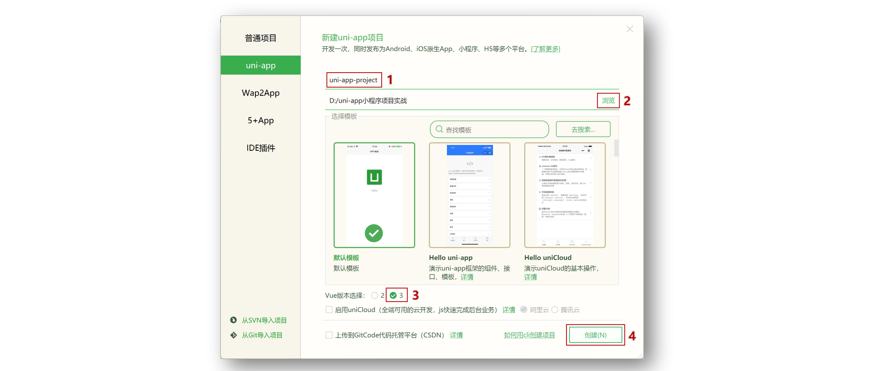
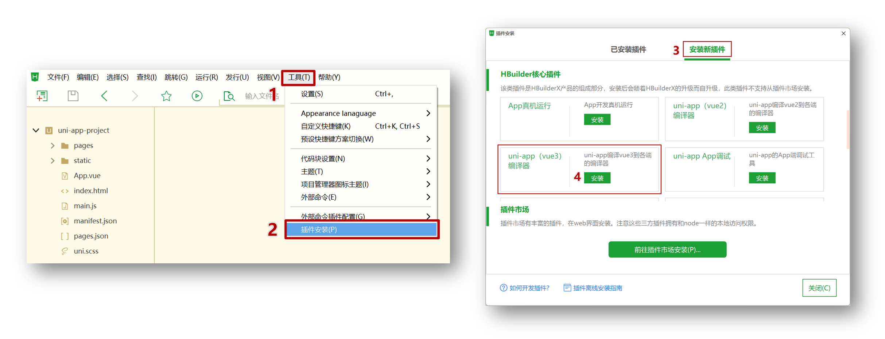
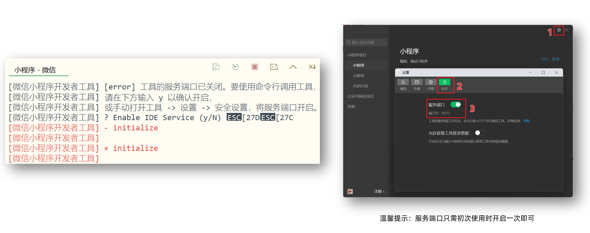
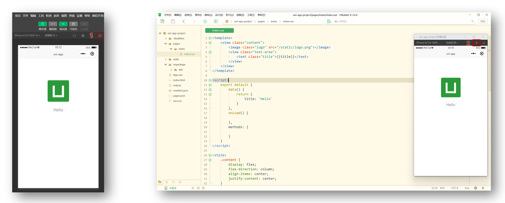
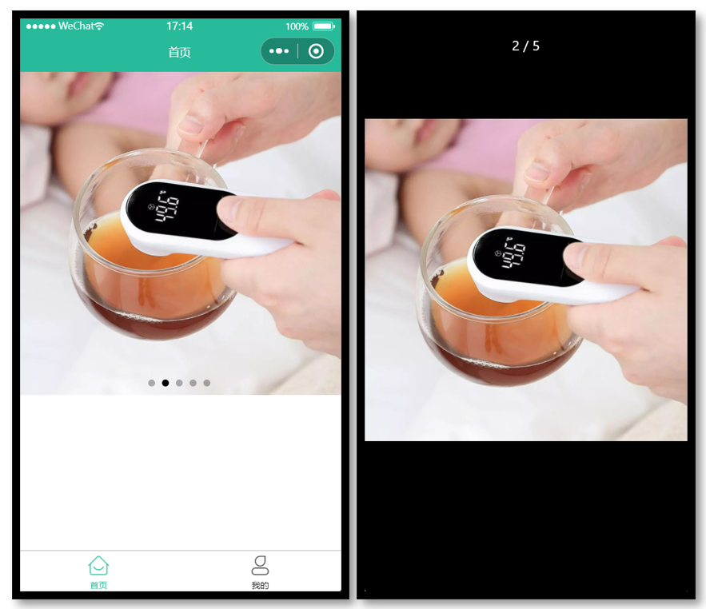

# uni-app 基础

## 创建 uni-app 项目方式

**uni-app 支持两种方式创建项目：**

1. 通过 HBuilderX 创建（需安装 HBuilderX 编辑器）

2. 通过命令行创建（需安装 NodeJS 环境）

## HBuilderX 创建 uni-app 项目

### 创建步骤

**1.下载安装 HbuilderX 编辑器**


**2.通过 HbuilderX 创建 uni-app vue3 项目**



**3.安装 uni-app vue3 编译器插件**



**4.编译成微信小程序端代码**


**5.开启服务端口**



**小技巧分享：模拟器窗口分离和置顶**



**HBuildeX 和 微信开发者工具 关系**


::: tip 温馨提示
[HBuildeX](https://www.dcloud.io/hbuilderx.html) 和 [uni-app](https://uniapp.dcloud.net.cn/) 都属于 [DCloud](https://dcloud.io) 公司的产品。
:::

## pages.json 和 tabBar 案例

### 目录结构

我们先来认识 uni-app 项目的目录结构。

```sh {1,4,9,10}
├─pages            业务页面文件存放的目录
│  └─index
│     └─index.vue  index页面
├─static           存放应用引用的本地静态资源的目录(注意：静态资源只能存放于此)
├─unpackage        非工程代码，一般存放运行或发行的编译结果
├─index.html       H5端页面
├─main.js          Vue初始化入口文件
├─App.vue          配置App全局样式、监听应用生命周期
├─pages.json       **配置页面路由、导航栏、tabBar等页面类信息**
├─manifest.json    **配置appid**、应用名称、logo、版本等打包信息
└─uni.scss         uni-app内置的常用样式变量
```

### 解读 pages.json

用于配置页面路由、导航栏、tabBar 等页面类信息

### 案例练习

**效果预览**


**参考代码**

```json
{
  // 页面路由
  "pages": [
    {
      "path": "pages/index/index",
      // 页面样式配置
      "style": {
        "navigationBarTitleText": "首页"
      }
    },
    {
      "path": "pages/my/my",
      "style": {
        "navigationBarTitleText": "我的"
      }
    }
  ],
  // 全局样式配置
  "globalStyle": {
    "navigationBarTextStyle": "white",
    "navigationBarTitleText": "uni-app",
    "navigationBarBackgroundColor": "#27BA9B",
    "backgroundColor": "#F8F8F8"
  },
  // tabBar 配置
  "tabBar": {
    "selectedColor": "#27BA9B",
    "list": [
      {
        "pagePath": "pages/index/index",
        "text": "首页",
        "iconPath": "static/tabs/home_default.png",
        "selectedIconPath": "static/tabs/home_selected.png"
      },
      {
        "pagePath": "pages/my/my",
        "text": "我的",
        "iconPath": "static/tabs/user_default.png",
        "selectedIconPath": "static/tabs/user_selected.png"
      }
    ]
  }
}
```

## uni-app 和原生小程序开发区别

### 开发区别

uni-app 项目每个页面是一个 `.vue` 文件，数据绑定及事件处理同 `Vue.js` 规范：

1. 属性绑定 `src="{ { url }}"` 升级成 `:src="url"`

2. 事件绑定 `bindtap="eventName"` 升级成 `@tap="eventName"`，**支持（）传参**

3. 支持 Vue 常用**指令** `v-for`、`v-if`、`v-show`、`v-model` 等

### 其他区别补充

1. 调用接口能力，**建议前缀** `wx` 替换为 `uni` ，养成好习惯，**支持多端开发**。
2. `<style>` 页面样式不需要写 `scoped`，小程序是多页面应用，**页面样式自动隔离**。
3. **生命周期分三部分**：应用生命周期(小程序)，页面生命周期(小程序)，组件生命周期(Vue)

### 案例练习

**主要功能**

1.  滑动轮播图
2.  点击大图预览

**效果预览**


**参考代码**

```vue
<template>
  <swiper class="banner" indicator-dots circular :autoplay="false">
    <swiper-item v-for="item in pictures" :key="item.id">
      <image @tap="onPreviewImage(item.url)" :src="item.url"></image>
    </swiper-item>
  </swiper>
</template>

<script>
export default {
  data() {
    return {
      // 轮播图数据
      pictures: [
        {
          id: '1',
          url: 'https://pcapi-xiaotuxian-front-devtest.itheima.net/miniapp/uploads/goods_preview_1.jpg',
        },
        {
          id: '2',
          url: 'https://pcapi-xiaotuxian-front-devtest.itheima.net/miniapp/uploads/goods_preview_2.jpg',
        },
        {
          id: '3',
          url: 'https://pcapi-xiaotuxian-front-devtest.itheima.net/miniapp/uploads/goods_preview_3.jpg',
        },
        {
          id: '4',
          url: 'https://pcapi-xiaotuxian-front-devtest.itheima.net/miniapp/uploads/goods_preview_4.jpg',
        },
        {
          id: '5',
          url: 'https://pcapi-xiaotuxian-front-devtest.itheima.net/miniapp/uploads/goods_preview_5.jpg',
        },
      ],
    }
  },
  methods: {
    onPreviewImage(url) {
      // 大图预览
      uni.previewImage({
        urls: this.pictures.map((v) => v.url),
        current: url,
      })
    },
  },
}
</script>

<style>
.banner,
.banner image {
  width: 750rpx;
  height: 750rpx;
}
</style>
```

## 命令行创建 uni-app 项目

**优势**

通过命令行创建 uni-app 项目，**不必依赖 HBuilderX**，TypeScript 类型支持友好。

**命令行创建** **uni-app** **项目：**

vue3 + ts 版

::: code-group

```sh [github]
# 通过 npx 从 github 下载
npx degit dcloudio/uni-preset-vue#vite-ts 项目名称
```

```sh [👉国内 gitee]
# 通过 git 从 gitee 克隆下载 (👉备用地址)
git clone -b vite-ts https://gitee.com/dcloud/uni-preset-vue.git
```

:::

创建其他版本可查看：[uni-app 官网](https://uniapp.dcloud.net.cn/quickstart-cli.html)

::: danger 常见问题

- 运行 `npx` 命令下载失败，请尝试换成**手机热点重试**
- 换手机热点依旧失败，请尝试从[国内备用地址下载](https://gitee.com/dcloud/uni-preset-vue/tree/vite-ts/)
- 在 `manifest.json` 文件添加 [小程序 AppID](https://mp.weixin.qq.com/) 用于真机预览
- 运行 `npx` 命令需依赖 NodeJS 环境，[NodeJS 下载地址](https://nodejs.org/zh-cn)
- 运行 `git` 命令需依赖 Git 环境，[Git 下载地址](https://git-scm.com/download/)

:::

### 编译和运行 uni-app 项目

1. 安装依赖 `pnpm install`
2. 编译成微信小程序 `pnpm dev:mp-weixin`
3. 导入微信开发者工具

::: tip 温馨提示
编译成 H5 端可运行 `pnpm dev:h5` 通过浏览器预览项目。
:::

## 用 VS Code 开发 uni-app 项目

### 为什么选择 VS Code？

- VS Code 对 **TS 类型支持友好**，前端开发者**主流的编辑器**
- HbuilderX 对 TS 类型支持暂不完善，期待官方完善 👀

### 用 VS Code 开发配置

- 👉 前置工作：安装 Vue3 插件，[点击查看官方文档](https://cn.vuejs.org/guide/typescript/overview.html#ide-support)
  - 安装 **Vue Language Features (Volar)** ：Vue3 语法提示插件
  - 安装 **TypeScript Vue Plugin (Volar)** ：Vue3+TS 插件
  - **工作区禁用** Vue2 的 Vetur 插件(Vue3 插件和 Vue2 冲突)
  - **工作区禁用** @builtin typescript 插件（禁用后开启 Vue3 的 TS 托管模式）
- 👉 安装 uni-app 开发插件
  - **uni-create-view** ：快速创建 uni-app 页面
  - **uni-helper uni-app** ：代码提示
  - **uniapp 小程序扩展** ：鼠标悬停查文档
- 👉 TS 类型校验
  - 安装 **类型声明文件** `pnpm i -D miniprogram-api-typings @uni-helper/uni-app-types`
  - 配置 `tsconfig.json`
- 👉 JSON 注释问题
  - 设置文件关联，把 `manifest.json` 和 `pages.json` 设置为 `jsonc`

`tsconfig.json` 参考

```json {11,12,14-15,18-22}
// tsconfig.json
{
  "extends": "@vue/tsconfig/tsconfig.json",
  "compilerOptions": {
    "sourceMap": true,
    "baseUrl": ".",
    "paths": {
      "@/*": ["./src/*"]
    },
    "lib": ["esnext", "dom"],
    // 类型声明文件
    "types": [
      "@dcloudio/types", // uni-app API 类型
      "miniprogram-api-typings", // 原生微信小程序类型
      "@uni-helper/uni-app-types" // uni-app 组件类型
    ]
  },
  // vue 编译器类型，校验标签类型
  "vueCompilerOptions": {
    // 原配置 `experimentalRuntimeMode` 现调整为 `nativeTags`
    "nativeTags": ["block", "component", "template", "slot"], // [!code ++]
    "experimentalRuntimeMode": "runtime-uni-app" // [!code --]
  },
  "include": ["src/**/*.ts", "src/**/*.d.ts", "src/**/*.tsx", "src/**/*.vue"]
}
```

**工作区设置参考**

```json
// .vscode/settings.json
{
  // 在保存时格式化文件
  "editor.formatOnSave": true,
  // 文件格式化配置
  "[json]": {
    "editor.defaultFormatter": "esbenp.prettier-vscode"
  },
  // 配置语言的文件关联
  "files.associations": {
    "pages.json": "jsonc", // pages.json 可以写注释
    "manifest.json": "jsonc" // manifest.json 可以写注释
  }
}
```

::: danger 版本升级

- 原依赖 `@types/wechat-miniprogram` 现调整为 [miniprogram-api-typings](https://github.com/wechat-miniprogram/api-typings)。
- 原配置 `experimentalRuntimeMode` 现调整为 `nativeTags`。

:::

这一步处理很关键，否则 TS 项目无法校验组件属性类型。

## 开发工具回顾

选择自己习惯的编辑器开发 uni-app 项目即可。

**HbuilderX 和 微信开发者工具 关系**


**VS Code 和 微信开发者工具 关系**


## 用 VS Code 开发课后练习

使用 `VS Code` 编辑器写代码，实现 tabBar 案例 + 轮播图案例。

::: tip 温馨提示

`VS Code` 可通过快捷键 `Ctrl + i` 唤起代码提示。

:::
